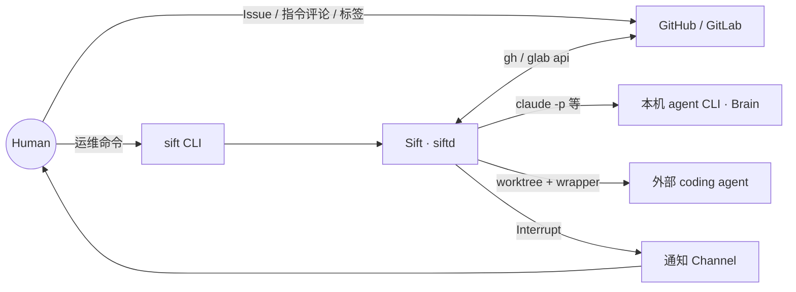
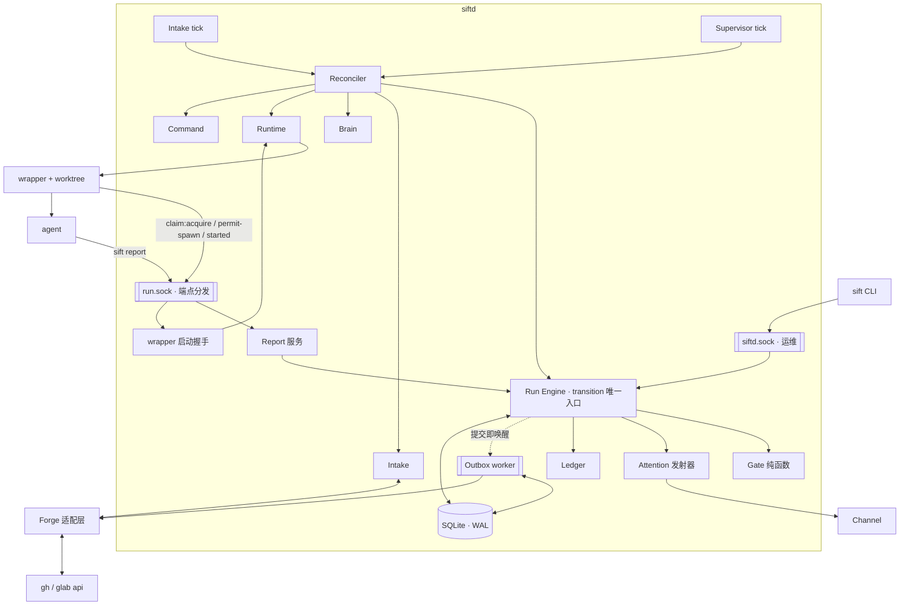

# Sift — 架构设计

> **版本：D0.10（对应 PRD V0.8）** | **日期：2026-07-28**
>
> **方案状态：已通过。** [review-18](reviews/2026-07-28-design-review-kimi-k3-06.md) 已独立核销 review-16 全部发现，允许进入 WBS；非阻断遗留见 §14.14。

本文档定义系统结构与**设计理由**（为什么这么架构）。字段级契约——数据表列、配置 schema、动词签名、Interrupt 渲染格式、指令语法——一律下沉到 `specs/`，本文只链接不复制（[docs/README.md](README.md) 的边界仲裁规则）。

需求与边界见 [PRD.md](PRD.md)。PRD §13.1 已拍板的六条架构约束本文只展开、不重议；PRD 留给 DESIGN 的自由度（技术栈、存储形态、进程模型、Channel 实现）与被提前的 §12 #13（TM6 收口）在本文结案。

---

## 1. 文档定位

| 项 | 内容 |
|----|------|
| 读者 | 项目所有者（评审）、AI 编码代理（实现时的结构性上下文） |
| 回答 | 进程与模块结构、执行模型、一致性边界、安全机制的承接点、失效与恢复、验证策略、交付顺序 |
| 不回答 | 字段级契约（→ `specs/`）、单个决策的完整取舍论证（→ `decisions/`）、里程碑与排期（→ `WBS.md`）、需求为什么这么定（→ `PRD.md`） |
| 评审输入 | `drafts/` 下四份独立设计提案，分歧仲裁见 §14.4；D0.1 / D0.2 评审处置见 §14.5–14.6；技术栈与启动协议演进见 §14.7–14.11；review-15 的两项原始遗留与 D0.9 `retry` 自查的来源更正见 §14.12；review-16 修订见 §14.13；review-18 通过结论与非阻断遗留见 §14.14 |

**本文的核心主张：这套系统的难度在约束的相互作用，不在任何单点技术。** PRD 中最值钱的几条约束（回放集与 Gate 同期、影子门禁 day-1 常驻、注意力配额不可借支、策略从 base 读、actor fail closed）都属于「实现阶段会被顺手简化掉」的类型。因此架构的首要任务不是描述模块，而是把这些约束变成**结构上无法绕过**的东西——靠「没有那个函数」保证，而不是靠 review 记得拦。

---

## 2. 架构驱动因素

### 2.1 约束（不可协商）

| # | 约束 | 来源 |
|---|------|------|
| C1 | 一切状态转移、门禁通断、合并动作、指令解析由确定性代码执行；LLM 只产出 recommendation | PRD A1 |
| C2 | Forge 是 Issue / Change / Checks 的事实源，本地只存运行时状态 | PRD A2 |
| C3 | 零监听端口，零公网暴露面 | PRD §9.3 |
| C4 | 单机、单实例、单用户；不做分布式与高可用（约束**单个安装**的形态，不约束安装数量，§11） | PRD §9.3、§2.1 |
| C5 | 进程重启不丢 Run 状态与轮询游标，不产生幽灵 running | PRD §9.3、§10.1 |
| C6 | 三类预算（token / forge API / 注意力）并存，注意力配额是硬约束且不可借支 | PRD §5.3、§5.5 |
| C7 | 策略从 base 分支读取；`.sift/**` 与 CI 配置为不可豁免硬护栏 | PRD §13.1、§5.4 |
| C8 | 驱动性事件必须解析 actor 并校验 allowlist，取不到即忽略 | PRD §9.2 |
| C9 | 最快闭环优先于架构完备 | PRD A4 |
| **C10** | **三个同版本、自包含原生二进制组成单归档，macOS / Linux × arm64 / amd64；目标机不装语言运行时** | PRD §9.3 兼容性 / 分发 |

### 2.2 质量属性场景

这些是架构的验收依据，逐条在 §12 有对应验证手段。

| # | 场景 | 判据 |
|---|------|------|
| Q1 | 任意时刻 `kill -9 siftd`，重启后系统对世界的认知完全由 DB + 外部实况（forge / 进程）重建 | 无幽灵 running、游标不回退、无重复裁定 |
| Q2 | 同一份 Gate 输入在任意时间重跑得到同一 verdict | 回放集可离线重跑并量化漏放/误拦变化 |
| Q3 | GitHub 与 GitLab 从第一天共享领域语义 | 双平台适配器跑同一套契约测试 |
| Q4 | ≥3 Run 并发时打扰不突破注意力配额 | 配额是运行时机制而非验收时的侥幸 |
| Q5 | 任何写库成功的动作，其外部副作用不会被静默遗忘；**已定义幂等协议的副作用 effectively-once，其余至少一次且重复可识别** | 逐类副作用有明示的投递语义（§6.4），无一类靠「通用 outbox」推导 |
| Q6 | 未闭合的安全边界在诊断输出里如实可见 | 不把 worktree 描述成沙箱；不把「某条路径上没有能力」写成「系统没有这个能力」 |
| Q7a | **端点与凭据性质**：run token 调不动任何状态转移动词，也调不动 wrapper 的三个 handoff 动词（它们要求 agent 侧不存在的 session / permit）——V0 必须拒绝 | §8.9 的授权三层 + V10a |
| Q7b | **agent 进程整体的能力边界**：V0 **不成立**——同 UID agent 可读 `operator.token` 走运维 socket 调 `kill` / `retry`；该暴露面必须在 TM6 清单与 `sift doctor` 中如实可见，攻击复现必须成功 | §9.1 TM6 + V10b（沙箱后端落地后翻转为拒绝） |

### 2.3 由驱动因素导出的架构原则

1. **结构性保证优先于纪律性保证。** 想禁止的事，做法是让实现它的函数不存在（唯一转移入口、不读 worktree 策略、MCP/Report 工具集无写状态能力），而不是写进注释。
2. **纯函数化一切裁定。** Gate 判定与 severity 映射无 IO、无时钟，输入冻结成快照。可测、可缓存、可回放三件事同时白拿（§6.5、§8.5）。
3. **副作用与状态在两个事务里，用 outbox 缝合。** 外部世界不可回滚，所以只允许「先落库、再由 worker 至少一次地执行、靠幂等收敛」（§6.4）。
4. **归一在边界完成。** 平台差异、LLM 输出、配置文件在进入领域层前全部 schema 校验并转为中性类型；领域层不存在 `mergeable_state` 这种字符串。
5. **诚实优于漂亮。** 无法确定的事实（可合并性、actor、进程身份）显式表达为 `unknown` 并转 HITL 或 fail closed，不猜。

---

## 3. 架构总览

### 3.1 上下文



Sift 不持有 forge 凭证（由 `gh` / `glab` 自身持有），不监听端口，不提供 UI；人机决策面全部寄生在 forge 上（PRD §7）。

### 3.2 进程拓扑

只有三类进程：

| 进程 | 性质 | 说明 |
|------|------|------|
| `siftd` | 常驻，单实例 | 承载全部模块；**唯一的状态写入者** |
| `sift` | 一次性 | 薄客户端，经运维 socket 与 siftd 通话，不直连数据库 |
| `sift-agent-wrapper` | 每 attempt 一个 | 由 Runtime 启动（`tmux` 后端下是在 pane 里启动），再由它启动真实 agent——**agent 由 wrapper 直接 spawn 进其进程组；持续留组是受支持 Agent 的执行契约，与后端无关**（§8.4）；负责 session 绑定的 spawn handoff、启动证据落盘、进程组回收。**同样不直连数据库** |

**两个 socket，两类能力**（不是一个 socket 上放两种权限）：

| socket | 谁连 | 能力 | 凭据 |
|--------|------|------|------|
| `~/.sift/siftd.sock` | 人（`sift` CLI） | 运维 RPC：`ps` / `logs` / `kill` / `retry` / `doctor` … | operator capability（`~/.sift/operator.token`，0600，启动期读入） |
| `~/.sift/run.sock` | agent（`sift report`）与 wrapper | **上报动词** + wrapper 的启动协议动词；run token 无改 `runs.status` 的能力，wrapper session 只能推进本 attempt 的启动阶段 | 上报凭 attempt 作用域 run token；启动握手凭 bootstrap nonce，后续凭 wrapper session + 一次性 spawn permit（§8.4） |

端点分离不是为了整洁，是为了让边界**可被沙箱一次关掉**：沙箱的挂载集是「`run.sock` + 本 attempt 自己的 run dir」，deny 其余 `~/.sift/`（DB、`config.yaml`、`operator.token`、其他 Run 的 run dir），运维面即自然不可达。

**挂载集必须把 run dir 写进去。** D0.2 把它写成「只挂 `run.sock`、deny read `~/.sift/`」，而 run token 就在本 attempt 的 run dir 下 `control.json`（§8.9；最终路径见 `specs/config.md`）——按那句话字面执行，关掉的不只是运维面，上报面会一起消失，「闭合」出一个 agent 无法上报的系统。这是端点分离全部收益所依赖的一句话，必须精确。

V0 不实施沙箱，因此**同属主 agent 仍可读 operator token 并连运维 socket——这条暴露面如实列入 §9.1 TM6 清单**。

Unix domain socket 是文件系统对象，不是网络端口，因此 C3「暴露面为零」成立——但 C3 说的是**网络**暴露面为零，不等于本地控制面已隔离。

### 3.3 分层与模块



图里的**两个端点**与**三组步频**（Intake tick / Supervisor tick / 提交唤醒的 Outbox worker）不是画法细节，是 §3.2 与 §6.1 的结构性主张；把它们画成单节点会传递与正文相反的拓扑。

三层，依赖方向单向向内：

| 层 | 内容 | 规则 |
|----|------|------|
| **领域层** | Run 状态机、Gate 判定、severity 映射、Interrupt 生命周期、预算规则、鉴权规则 | 无 IO、无时钟、无网络 |
| **应用层** | Reconciler、命令处理、恢复、事务协调、outbox 编排 | 只有它能开事务 |
| **适配层** | SQLite、`gh`/`glab`、agent CLI（Brain）、wrapper/tmux、Channel、socket | 可替换；不得渗入领域层 |

模块与 PRD §8 一一对应，不新增模块（PRD V0.3 已将 **MCP** 模块改名 **Report**，取舍见 §8.9）。

---

## 4. 关键架构决策摘要

决策的完整取舍论证（含放弃了什么、退出与证伪条件）在 ADR 中，本文不重复：

| # | 议题 | 结论 | 展开 | ADR |
|---|------|------|------|-----|
| D1 | 技术栈（PRD §12 #15） | **Go**（`CGO_ENABLED=0`），单模块三二进制，SQLite(WAL) 单库；取代原 Bun + TypeScript 决策 | §5 | [009](decisions/009-tech-stack-go.md) 取代 [001](decisions/001-tech-stack-bun-typescript.md) |
| D2 | 调度形态 | 控制循环（reconciler + tick），非事件回调链 | §6.1 | [002](decisions/002-reconciler-and-single-transition-entry.md) |
| D3 | 状态一致性 | 唯一 `transition()` 入口 + CAS + 状态/事件同事务 | §6.2–6.3 | [002](decisions/002-reconciler-and-single-transition-entry.md) |
| D4 | 外部副作用 | transactional outbox + 稳定 operation key + 至少一次 + 幂等收敛；merge 另加远端 expected-head CAS，agent 启动另用 operation lease + spawn handoff | §6.4 | [003](decisions/003-transactional-outbox.md)、[010](decisions/010-attempt-spawn-handoff.md)、[011](decisions/011-merge-requires-expected-head-cas.md) |
| D5 | Gate 形态 | 纯函数 + 冻结输入快照；影子门禁与回放集是其副产品 | §8.5 | [004](decisions/004-gate-as-pure-function.md) |
| D6 | Agent 宿主 | `ExecutionBackend` 抽象；wrapper 契约是裁定与恢复依据；claim 由 daemon 建立，启动经 session 绑定的一次性 `spawning` handoff；后端只决定 wrapper 跑在哪里；V0 的消失证明只覆盖遵守进程组契约的 Agent | §8.4 | [005](decisions/005-execution-backend-and-wrapper-contract.md)、[010](decisions/010-attempt-spawn-handoff.md)、[012](decisions/012-process-group-supervision-boundary.md) |
| D7 | Layer 1 上报通道 | `sift report` CLI（Run 作用域 token），MCP 降为未来可选前端 | §8.9 | [006](decisions/006-report-via-cli-not-mcp.md) |
| D8 | TM6 收口（PRD §12 #13） | 方向定为最小凭证沙箱；**V0 不实施沙箱**，只留 launcher 接缝、前置凭证形态 spike、如实声明 | §9.1 | [007](decisions/007-tm6-minimal-credential-sandbox-direction.md) |
| D9 | 三类预算 | 每类只有一个收费口；注意力配额收在 Interrupt 发射器 | §9.2 | — |
| D10 | 本地控制面 | 运维 / Report 两个 socket 两类能力；agent 越权在 V0 未闭合，如实声明并纳入诊断 | §3.2、§8.9–8.10 | [008](decisions/008-control-plane-endpoints-and-capabilities.md) |
| D11 | 合并线性化 | merge 请求由 forge 原子校验 Gate 裁定的 expected head；旧 operation 不得合并新 head | §6.4、§8.1 | [011](decisions/011-merge-requires-expected-head-cas.md) |
| D12 | 进程监督边界 | 进程组消失证明以 Agent 不主动脱组为契约；未验证组合保持隔离并转人工 | §8.4、§9.1、§10.1 | [012](decisions/012-process-group-supervision-boundary.md) |
| D13 | `startup_stall` 收敛 | 仅显式 reject 终局；retry 探测成功以单事务回 `queued` 并创建新 attempt | §10.1 | [013](decisions/013-startup-stall-retry-convergence.md) |

---

## 5. 技术选型

### 5.1 结论与依据

工作负载画像：无一处 CPU 密集，全部是拉起子进程、解析异构 JSON、写 SQLite、按时钟轮询；并发个位数 Run。**性能与并发模型因此不构成选型依据**，能分出差别的只有三点：

| 依据 | 说明 |
|------|------|
| 分发与多平台 | PRD §9.3 要求 macOS / Linux × arm64 / amd64 的自包含原生二进制套件，目标机不装语言 runtime。`CGO_ENABLED=0` 的交叉编译是 Go 工具链的默认行为，发布链（归档、校验和、Homebrew tap）成熟。**这是本次选型区分度最大的一项** |
| 进程监督与信号 | 对外动作只有三类：`gh/glab api`、`claude -p`、启动 agent 进程。进程组（`SysProcAttr{Setpgid}`）、按 `-pgid` 回收、`signal.NotifyContext` 的取消传播都是标准库能力，而 wrapper 契约（§8.4）恰好全在这条轴上 |
| 边界校验成本 | 强制三处 schema 校验（策略文件、LLM 触点输出、forge 双平台 payload）。**这一项 Go 是劣势**，且 Go 的默认反序列化行为对 fail closed 是敌对的，因此需要 §5.2 的结构性补偿 |

选型清单：

| 层 | 选择 |
|----|------|
| 语言 | Go（当前稳定版），`CGO_ENABLED=0`；单模块、三个二进制（`siftd` / `sift` / `sift-agent-wrapper`） |
| 持久化 | SQLite via **`modernc.org/sqlite`（纯 Go）**，WAL + foreign_keys + `busy_timeout`；**写连接池上限 1**；手写 SQL + 版本化迁移文件，不引 ORM |
| 边界校验 | 结构体为唯一定义 → 反射生成 JSON Schema（入 git）；同一份 schema 用于运行时校验与 LLM 触点的结构化输出约束 |
| 配置解析 | YAML → JSON 后进入同一个 decode gateway，并显式选择 `closed` 策略；与 Forge 共用入口，不共用 unknown-field 策略 |
| 控制面 | Unix socket 上手写 JSON-lines RPC；不引 gRPC |
| CLI | 手写参数解析或轻量库；指令语法解析器手写（C1，不得用 LLM） |
| 日志 | 结构化 JSON（系统日志，`log/slog`）+ 每 Run 原始字节流（agent 日志） |
| 测试 | 标准 `testing` + 属性测试库 + 子进程崩溃注入 |
| 构建分发 | 交叉编译三个同版本自包含二进制 + GoReleaser（单归档 / manifest / 校验和 / Homebrew tap）；launchd user agent（macOS）/ systemd user unit（Linux） |

放弃：**Bun + TypeScript**（[ADR-001](decisions/001-tech-stack-bun-typescript.md)，前提失效见下）；Node LTS（无法稳定产出等价的自包含原生可执行套件）；Rust（风险面不匹配——本项目难点是事务、恢复、fencing、外部 CLI 与权限边界，不是内存安全或性能）；Python（分发依赖解释器）。完整取舍见 [ADR-009](decisions/009-tech-stack-go.md)。

**为什么推翻 D0.3 之前的 Bun + TypeScript：** 触发因素是需求变化。原决策拒绝 Go 的前提是「PRD 不做对外分发」，而 PRD V0.4 已把分发与多平台列为非功能需求。更要紧的是原决策的风险对冲随之失效：它承担 Bun 长跑不确定性的方式是「触发退出条件即切 Node LTS」，而 Node 不能稳定产出等价的自包含原生可执行套件——**对冲与分发需求互斥**。加上此刻尚无代码（现在换是三处文档，有实现后换是全部实现且无渐进路径），三条合并即构成推翻。

### 5.2 四条附加约束

Go 的风险不在长跑，在**边界解码**：`encoding/json` 缺失字段给零值、未知字段静默忽略，与 PRD §5.2「取不到就是 `unknown`」、§5.3「schema 校验即兜底触发器」正好相反。前三条约束把这个风险变回结构保证，与决策同等效力。这里必须区分**缺少必需语义**与**多出无关字段**：前者始终 fail closed；后者只在配置、LLM 输出与 socket 请求这类封闭契约中拒绝，Forge raw payload 属开放世界输入，允许上游增加本适配器不消费的字段。

1. **单一 decode gateway，两种显式策略**：全部外部输入仍经同一个函数入域，但调用方必须选择 `closed` 或 `open-envelope`。配置、LLM 输出、socket 请求用 `closed`：schema 校验 + `DisallowUnknownFields`；Forge raw payload 用 `open-envelope`：允许额外字段，但适配器实际消费的字段仍做必填、类型、枚举与 actor 校验。两种策略都用指针字段区分「缺失」与「零值」，领域层不存在第二个反序列化入口。
2. **结构体是唯一定义**，JSON Schema 由它生成并入 git（可 review、可 diff）。zod 那份「一处定义、三处使用」的性质靠代码生成保留；代价是多一个构建步骤，且该步骤必须进 CI，否则 schema 会与结构体漂移。
3. **每个边界类型一对 golden test**：封闭契约断言额外字段与必填缺失均被拒；Forge 契约断言无关新增字段被接受、必需字段缺失或变型被拒。fail closed 与前向兼容因此同时成为被测性质——**这条是前两条的执行保障，缺了它前两条就只是约定**。
4. **禁止把定时器当调度器**：唯一的时间驱动来源是 §6.1 的三组 tick，不得散落零散 ticker。

**监督权威仍不在 runtime API 上**（进程存活、退出码、完成证据一律取自 wrapper 落盘文件，§8.4）。这条从 D0.3 继承，但**理由已经变了**：原先它兼任「对冲 runtime bug」，现在它的唯一理由是 `siftd` 重启后必须能判断上一次 agent 是死是活——那与语言无关，因此 [ADR-005](decisions/005-execution-backend-and-wrapper-contract.md) 不因换语言而失效。

**退出条件（触发即追加 ADR，但都不换语言）**：`modernc.org/sqlite` 在长生命周期 + WAL 下出现正确性问题 → 切 CGO 驱动并接受交叉编译成本（影响面限于存储模块与发布链）；反射生成的 schema 无法表达某个边界契约 → 改为手写 schema 为唯一定义、结构体由其生成（校验语义不变）；某平台常驻托管无法稳定 → 缩减支持矩阵并在 PRD §9.3 如实降级。**三条逃生舱都在 Go 内部且各自隔离在一个模块**——这与 ADR-001「切 Node」那条跨 runtime 的退路是本质区别。

---

## 6. 执行模型

### 6.1 控制循环：为什么不是事件回调

webhook 被砍掉、事实源在 forge（C2）之后，形态已经确定：这是一个 reconciler。每一轮做同一件事——读取「forge 事实 + 本地 Run 状态 + 进程实况」，计算差量，**对每个待处理对象各执行一步转移**，落库，结束。不写「轮询发现变化 → 回调链 → 回调里触发下一步」。

**「一步」的粒度是「每个对象一步」，不是「每 tick 全局一步」。** 这句必须写死：若字面取全局一步，则 ≥3 Run 并发（Q4 场景）时转移吞吐与轮询间隔直接耦合，最坏延迟等于 Run 数 × tick 间隔，与 PRD §9.3「打标 → agent 启动 P50 < 60s」在非空闲状态下直接冲突。正确语义是：**每个阶段内遍历该阶段的全部待处理对象，每个对象推进一步（或有界 N 步）**；单个对象的转移仍是串行的一步一转移，可测性不受影响。

收益不是风格偏好：

- **崩溃恢复是结构性质，不是额外设计。** 重启后第一个 tick 自然发现「DB 说 running 但进程实况不符」并按既有规则收敛。Q1 的「幽灵 running」被结构排除。
- **反向同步（PRD §4.5）不需要专门通道。** forge 侧的事实在下一个 tick 就是普通输入，与正向流程走同一段代码。
- **一步一转移让状态机可测。** 每个 tick 是纯粹的 `(观测, 状态) → 转移决策`，可喂固定观测跑单测。

#### 三组步频，不是一个主循环

单一主循环 + 固定优先级有两个后果：forge 限流导致 intake 降速时会连带拖慢 HITL 超时扫描；outbox 排在最后则可能被前面持续有活的阶段永久饿死——已提交的评论、通知、合并因此无限延期，而 Q5 的「最终生效」正是靠它。因此拆三组，各自独立步频：

| 调度器 | 步频 | 负责 |
|--------|------|------|
| **Intake tick** | 自适应 60 / 15 / 10s（PRD §5.2） | forge 轮询、反向同步、Checks 跟进 |
| **Supervisor tick** | 固定高频（秒级） | HITL 超时与升级扫描、attempt 存活与 heartbeat 核对、重试退避到期 |
| **Outbox worker** | 事务提交即唤醒 + 指数退避重试 | 副作用推进 |

三条公平性与时限约束：

- **outbox 由提交唤醒**，不等下一个 tick——这是「Interrupt 发布延迟」的主要决定因素；
- 每个调度器内部按类别设**每轮有界配额**（加权轮转），任何类别都不允许在一轮内独占；
- **定义 outbox 最大推进延迟目标**（配置项），并在 V8 负载测试中作为断言，而不是希望它自然不发生。

「唯一的时间驱动来源是 tick」（§5.2 约束 4）依然成立：三组调度器是三个具名步频，不是散落各处的 ticker 与 goroutine。间隔状态与游标、预算计数同库持久化。LLM 触点是 Intake tick 派发的异步任务，结果回流仍经 `transition`，无旁路。

### 6.2 唯一转移入口

```
transition(runId, event, expected) → Transition | Rejected
```

内含合法转移表（PRD §4.1 的 5 状态）。非法转移**抛错而非静默忽略**。代码层面不存在第二个能写 `runs.status` 的函数——这是靠「没有这个函数」保证的（原则 1）。

命令必须携带期望状态或版本号，更新走 compare-and-set：过期命令成为可审计的 no-op，不覆盖新状态。这解决轮询系统的固有竞态——同一条 forge 观测可能被两个 tick 看到，或人的指令与超时升级同时抵达。

领域类型显式区分三者，杜绝 C1 被绕过：

```
Recommendation --不能直接执行--> DomainCommand --状态机校验--> Transition
```

### 6.3 事务边界

耗时 IO 不得持有事务。一次转移的事务内只做四件事：

```
条件更新当前投影（CAS）
+ append-only 事件
+ 必要的 outbox operation
+ 预算 / 游标 / 幂等记录
```

事件表只追加，业务代码不存在 update/delete 入口。

### 6.4 Transactional outbox

forge 评论、打标、创建 Change、合并、通知推送、启动 agent 都是不能与 SQLite 共事务的副作用。应用层先在事务里写 outbox，再由 worker 执行——这解决的是「库写成功但外部调用失败」这个必然发生的场景。

每项副作用有稳定 operation key，例如 `run:{run_id}:create-change`、`interrupt:{interrupt_id}:publish`、`command:{forge_event_id}:ack`、`run:{run_id}:merge:{head_sha}`。

#### outbox 只给「至少一次」，恰好一次是逐类挣来的

**必须写明这条边界，否则 Q5 就是一句无法兑现的话。** outbox 保证「提交后不被静默遗忘」，但它本身只提供至少一次尝试；「先查询远端证据再动作」仍留两个窗口：查询确认未执行后与重试并发执行；远端已成功而本地记账前崩溃。**只有存在可无歧义查询、且与动作绑定的远端证据，具体动作才能收敛为 effectively-once。** 因此逐类给出协议，没有证据的类别如实降级为至少一次：

| 副作用 | 远端幂等证据 | 语义 |
|--------|-------------|------|
| 打标 / 移除标签 | 标签集合是幂等的 set 语义 | effectively-once（天然） |
| 发评论（简报 / 回执 / 告警） | 评论正文内嵌不可见 marker（`run_id + nonce + op_key`），执行前按 marker 搜索 | effectively-once |
| 创建 Change | Change body 内嵌 `op_key` marker，经 Forge 端口**跨开启 / 关闭 / 已合并全状态**搜索；成功后持久化远端 Change ID，此后按 ID 收敛（见下） | effectively-once |
| 合并 Change | operation 携 Gate 裁定的 `expected_head_sha`；merge 请求由 forge **原子比较 head 后再合并**。预读不等或远端 CAS 失败时旧 operation 收敛为 stale，并对新 head 重新过 Gate | effectively-once，且旧 Gate 结论不能作用于新 head |
| **Channel 推送** | **无可靠证据**（webhook 类端点通常不可查询） | **至少一次**；消息体携带可见去重标识，重复对人可辨认 |
| **启动 agent** | **不靠远端查询**：启动 operation 先 CAS + lease 认领；wrapper session 绑定一次性 spawn permit；进入 `spawning` 后 claim 不得换代，直到旧 wrapper 与进程组已确认消失（§8.4） | effectively-once：每个 attempt 至多签发一个 spawn permit；单 writer 保证限于遵守进程组契约的 Agent（ADR-012） |

启动 agent 是这张表里唯一一个「重复执行会产生两个并行写同一 worktree 的进程」的动作，所以它不能只依赖幂等收敛，必须有**会话内 operation 认领 + 跨崩溃 handoff**。worker 只有以 CAS 将 operation 从 `pending/retryable` 认领为带 lease 的 `executing` 后才可写 bootstrap / spawn wrapper；同一 operation 的第二个执行者拿不到 lease。daemon 重启时先跑 §10.1 attempt 恢复，再决定过期 lease 的 operation 是收敛、重发还是作废，禁止 outbox worker 抢在恢复前直接重放。

#### 创建 Change 的证据必须唯一定位 operation

D0.2 写的「按 `(base, head branch)` 查是否已存在**开启的** Change」不足以支撑 effectively-once，三个反例都可达：

1. 远端创建成功、本地记账前崩溃，期间人把该 Change 关掉 → 重试只查开启状态，认为没建过，于是再建一个；
2. 同一 base/head 上人已手工建过 Change → Sift 把**别人的对象**当成自己这次 operation 的结果接管；
3. 分支被复用（重试、rebase 后重推）时，`(base, head)` 无法区分两次逻辑 operation。

因此协议改为「marker 定位 + ID 收敛」：

| 步 | 规则 |
|----|------|
| 1 | 创建时在 Change body 内嵌 `op_key` marker（与评论 marker 同一机制，同一份实现） |
| 2 | 重试前按 marker 搜索，**覆盖开启 / 关闭 / 已合并三种状态**，不只查开启 |
| 3 | 创建成功后持久化远端 Change ID；此后该 operation 的一切对账按 ID，不再按 base/head |
| 4 | marker 命中但对象已关闭或已合并 → 按 forge 外部事实收敛（PRD §4.5），**不重新创建** |
| 5 | 同 base/head 有 Change 但 marker 缺失或不符 → 判 `SemanticConflict` 转 HITL，**绝不接管** |

第 5 条是「诚实优于漂亮」（原则 5）在这里的具体形态：无法证明这个对象是自己创建的，就不假设它是。全状态 marker 搜索与同 base/head 冲突检测必须经 Forge 适配层的 `findChangeForCreateOperation` 能力完成，outbox worker 不得绕过适配层直调平台 API。

#### 合并必须由远端对 expected head 做 CAS

本地 operation key 带 `head_sha` 只能判重，不能约束 forge 实际合并的对象。协议因此是：Gate 放行 head `A` → operation 固化 `expected_head_sha=A` → 适配器在**同一个远端 merge 请求**中比较当前 head 与 A。执行前预读只用于尽早发现 stale，不能替代远端条件请求；发现 head 已变或 CAS 失败时，旧 operation 终止为 stale/no-op，新 head 必须重新冻结输入并过 Gate。两平台适配器若无法兑现该语义，自动合并能力探测失败，不得退化为无条件 merge（ADR-011）。

#### 推送失败的兜底告警（V0 内闭合）

推送失败不改变「Run 已进入 `waiting_human`」这个事实，但必须持续重试并告警——否则一个静默失败的 Interrupt 等于把 Run 挂死（A3）。PRD §7.3 规定 V0 只实现一个 Channel，因此**不能把兜底寄托在「备用通道」上**：那是个 V0 里不存在的部件。V0 的兜底路径用已有的第二渲染面：

**Channel 推送连续失败 N 次 → 以高优先级 outbox operation 在对应 Issue / Change 下发一条告警评论（forge 是与 Channel 完全独立的通路），并在 `sift ps` / `sift doctor` 中标记推送故障。** 这条不依赖 PRD §12 #7 的裁决，因此不会随 Channel 选型悬空。

### 6.5 幂等键汇总

| 场景 | 键 |
|------|-----|
| Issue 摄入 | `(forge, project, issue_id)`（PRD §5.2） |
| 指令执行 | `run_id + nonce` 且必须匹配当前待决 Interrupt（PRD §7.1） |
| forge 事件处理 | forge 事件 id（评论 / 标签事件） |
| Gate 判定缓存 | `(gate_input_hash, gate_version)`——`gate_input_hash` 是**整份冻结输入快照**的规范化序列化摘要，不是维度枚举；理由见 §8.5 |
| 外部副作用 | operation key（§6.4），逐类另有远端证据或本地互斥 |
| **agent 启动互斥** | operation lease + `attempt_claim(run_id, attempt_no)` 唯一约束 + wrapper session + 一次性 spawn permit + **fencing 代次**；`spawning` handoff 未收敛前禁止换代（§8.4） |
| **Interrupt 生成**（不是指令去重） | 每类故障一个带 domain/version/reason 的稳定生成键 + 唯一约束；`startup_stall` 为 `(run_id, attempt_no, generation, cause=startup_stall)`，诊断分类不拆键。防的是并发发现者各建一条打扰（§8.7） |
| **人工态与迟到事实的仲裁** | `attempt_resolution` marker 的 CAS：启动事实先到则事实生效；`reject` 或 retry 成功结果先落定则吸收旧 attempt 的后续事实（§10.1） |

---

## 7. 数据架构

单库 `~/.sift/sift.db`（WAL）。单进程即单写者，因此**写连接池上限显式钉为 1**——不是为了省资源，是从根上排除驱动内部并发导致的 `SQLITE_BUSY`，而不是靠 `busy_timeout` 兜。不需要面向 Postgres 的抽象层。所有 SQL 只出现在存储模块——这同时是 §5.2 驱动逃生舱（纯 Go → CGO）的隔离点。

| 数据组 | 性质 | 内容 |
|--------|------|------|
| 当前投影 | 快照 | `runs`、`interrupts`、预算余额 |
| **执行 attempt** | 快照 | 每次执行的**生命周期阶段**（`pending / starting / spawning / running / finished / orphaned`）、claim（含 bootstrap nonce、wrapper session、spawn permit 与 fencing 代次）、wrapper / Agent 进程身份、后端、worktree（§8.4）；人工态下另有不可逆的 `attempt_resolution` marker 与**隔离标记**（隔离期间 worktree 不回收、不被任何新 attempt 复用，§10.1） |
| 事件流 | **只追加** | 状态转移、agent 上报、Gate 结果、人工指令、配额消耗、恢复动作、安全事件 |
| Intake | 快照 | 每项目游标、已处理 forge 事件、幂等键 |
| 副作用 | 快照 + 历史 | outbox operation、尝试次数、下次执行时间、结果证据 |
| 校准 | 只追加 | 影子门禁预判与人类结果、富特征 Ledger、语义原料 |
| **认证投影** | 快照（可重算） | 按任务类别聚合的 `auto_merge` 证据认证结果 + `certification_version`（§8.5） |
| 配置快照 | 快照 | 启动期有效配置、base 策略版本与 blob hash、有效策略 hash、指纹 |

**attempt 生命周期与 Run 状态机是两件事，不是第二套 Run 状态机**（PRD §1.5 禁止后者）：attempt 阶段只是**被观测的执行事实**，它不裁定 Run 结局——Run 的转移仍只经 `transition()`，attempt 阶段是其输入之一。分开建模的理由见 §10.1：不分开，「启动到一半崩溃」这个窗口在数据模型里根本无法表达。

**不采用纯事件溯源。** 当前投影直接服务调度与恢复（也是 CLI 的读取面），事件流服务审计、指标与回放；两者同事务提交，避免异步投影漂移。重建成本不值得为纯粹性支付。

迁移只能前向执行，`schema_version` 表 + 顺序脚本；遇到比自己新的库版本**拒绝启动**，不尝试兼容。

本地目录（最终路径写入 `specs/config.md`）。**两个平台使用同一个约定 `~/.sift/`，可由 `SIFT_HOME` 覆盖**；Linux 侧不拆 XDG 的 config / state / runtime 三处，理由是那会把沙箱挂载集（§3.2）与 TM6 暴露清单（§9.1）从「一个目录」拆成三处，两份推理都要跟着分叉，而 V0 换不到任何用户可见收益：

```
~/.sift/
  sift.db            config.yaml         operator.token（0600）
  siftd.sock（运维）  run.sock（上报 + 启动握手）
  logs/              worktrees/
  runs/<run_id>/attempts/<attempt_no>/
                     task.json  control.json  heartbeat  result.json  agent.log
                     bootstrap.json（0600，wrapper 读后立即 unlink，§8.4）
```

**回放集导出 = 从校准表 `SELECT → JSONL`**，读的是当时冻结的输入快照，不重新拼接已漂移的当前数据。这是 PRD §10.3「回放集与 Gate 同期落地」在数据层的兑现方式（另一半在 §8.5）。

**回放集含两类可重跑对象，不止 Gate 快照**：

| 对象 | 内容 | 支撑的 PRD 要求 |
|------|------|----------------|
| Gate 输入快照 | 冻结的 `changeFacts` / 有效策略 / riskScore + `gate_input_hash` | §5.6「同一输入重跑得同一 verdict」、量化策略改动 |
| Brain 触点 trace | 各触点的输入、原始输出、提示词与 schema 版本、是否走了兜底；各触点身份域见 [`specs/storage.md`](specs/storage.md) §10.1 | §5.6「量化**提示词改动**带来的漏放变化」——只存 Gate 快照无法把差异归因到提示词 |

**关联不是强制一一对应。** 缓存条目、影子 Gate 记录与 Gate 回放共用同一个 `gate_input_snapshot_id`；Brain trace 以自身调用身份独立存在，只有该次输出确实参与 Gate 输入组装时才通过不可变多对多关系关联一份或多份 snapshot。同一 T3/T5 结果可在 head 不变而 Checks/review 等事实变化时被多份快照复用，且 call 先终结、snapshot 后创建，故不得把单个可空 FK 回写到 terminal call。T1/T2/T6/T7 不需要伪造 Gate 关联，T3/T5 仍能回答「这次放行是策略变松了还是提示词变松了」。

---

## 8. 模块设计

每个模块给出职责、对外端口、关键机制与下沉的 spec。字段级契约不在本节。

### 8.1 Forge 适配层

**职责**：把 `gh api` / `glab api`（plumbing，PRD §13.1）封装为 PRD §5.2 的最小动词集，输出中性领域类型。

- **归一在边界完成**：平台字段（`number`/`iid`、`mergeable_state`/`detailed_merge_status`、Checks vs Pipelines、Draft 前缀）不允许泄漏到上层。PRD §5.2 差异清单逐条对应一个归一函数。两平台无法都给出确定性答案时，归一结果是显式 `unknown`，由上层转 HITL——**不允许适配器猜**。
- **actor 是类型的一部分**：`listLabelEvents` / `listIssueComments` / `listChangeComments` 返回类型中 actor 为必填字段；取不到 actor 的事件在适配器内即被丢弃。C8 的 fail closed 因此是类型系统的结果，不是每个调用点都要记得的检查。
- **副作用对账也是端口能力**：`findChangeForCreateOperation` 跨全状态返回 marker 唯一命中 / 未命中 / 同 base-head 冲突；`mergeChange` 必须接受 expected head 并映射到平台的远端条件合并。二者都不得由 outbox worker 用 raw API 旁路实现。
- **进程调用安全**：一律 argv 数组启动，禁止 shell 拼接。
- **错误分类**（对上层暴露的唯一错误语义）：`Transient`（退避重试）、`RateLimited`（尊重远端 reset 并联动 API 预算降速）、`AuthOrCapability`（停止该项目摄入 + 一次告警，不循环轰炸）、`ContractViolation`（保留响应摘要，fail closed）、`SemanticConflict`（重读事实源后重判）。
- **契约测试 + fixture 录制**：用真实 CLI 输出录成 fixture，双平台跑同一套契约测试，覆盖分页、actor 缺失、限流、平台差异。这把 Q3「双平台对称」从口号变成 CI 能验的东西，且录制成本近零——开发时本来就在敲这些命令。
- 能力探测只探测**已配置项目实际引用到的** forge，失败即拒启，不做运行时降级。

→ `specs/forge.md`

### 8.2 Intake

**职责**：自适应轮询、游标推进、幂等去重、反向同步。

每项目独立调度、共享全局并发上限（避免单个大项目饿死其他项目）。游标**只在一批事件全部持久化后**推进，保证 Q1 的「不回退不丢事件」。使用 ETag / `since` 类条件请求减少全量重扫。

**当前标签状态不能直接触发动作**：驱动性事件必须经 events / timeline 回溯 actor 并过 allowlist 后才生成领域命令（C8）。Issue / Change 的关闭与合并属于**事实观测**，按 PRD §4.5 直接收敛，不套 actor 闸门——对观测施加鉴权会导致与事实源脱同步。

**事实与 Gate 结论冲突时，事实优先，Gate 结论降为属性。** PRD V0.3 已裁决 `done` 只表示「Change 已合并」（PRD §4.1）：人在 forge 上手工合并一个门禁未过或未跑完的 Change 时，reconciler 照常收敛 `done`，同时写 `gate_bypassed` 审计属性与一条安全事件。三条配套口径：

- 该 Run **不计入**误放行率分母（那条指标只衡量 Sift 自己发起的合并），单独进「门禁绕过率」（PRD §10.2）；
- Gate 若已产出预判，影子门禁记录照常保留——人的这次「决定」就是手工合并本身，它是有效的校准样本；
- Sift **不尝试对抗**：不 revert、不重开 Change。越权合并属 forge 侧权限问题，应在 forge 上收敛（PRD §4.5 同一逻辑）。

### 8.3 Brain

**职责**：T1–T7 七个 LLM 触点，经统一调用壳。走本机 agent CLI（PRD §12 #1，如 `claude -p --output-format json`）。

- **统一调用壳**：`调用 → 经 decode gateway 按 schema 校验（§5.2）→ 失败重试一次（同 prompt 不改）→ 再失败即走该触点的确定性兜底`。绝不「尽力解析」。schema 校验即兜底触发器，兜底路径逐触点落实 PRD §5.3 表。**触点的 schema 与结构体是同一份定义**，因此「喂给 LLM 的输出约束」和「校验它是否遵守」不可能对不上。
- 输入经 stdin 或临时文件传递，避免命令行长度与转义问题；原始输出进受限日志，只有合法结构进领域层。
- **token 记账白送**：agent CLI 的 JSON 输出含 usage，直接进预算表，不需自己估算。
- **提示词是可版本化资产**：提示词与 schema 同文件、进 git；回放集重跑时记录提示词版本，否则「量化改动带来的漏放变化」无从归因。
- 硬护栏（LLM 不可越过）在调用壳之外由 Run Engine 执行：`max_concurrent`、项目互斥、未知 agent 名拒启。

→ `specs/brain.md`

### 8.4 Runtime

**职责**：worktree 生命周期、agent 启动与监督、超时与重试、Change 创建触发。

**ExecutionBackend 抽象**，V0 两个实现：`process`（默认）与 `tmux`（可选的**持久宿主**，提供 attach 与人工查看）。**tmux 不是事实源，也不参与裁定**——权威日志是 `agent.log`，结构化时间线在 SQLite，完成依据是 wrapper 的 `result.json` 加 Gate。这条区分是本模块最重要的边界：把会话表当成裁定依据，会让恢复逻辑依赖一个外部工具的状态。

**后端只决定 wrapper 跑在哪里，永不插到 wrapper 与 agent 之间。** agent **由 wrapper 直接 spawn 到 wrapper 自己的进程组，且受支持组合承诺执行期不主动脱组**，两个后端同码同拓扑：`process` 后端由 Runtime 直接 spawn wrapper，`tmux` 后端在 pane 里 spawn wrapper，wrapper 再 spawn agent。

这条必须裁死，因为**整条 `spawning` 证据链只挂在一个观测原语上——「已登记 wrapper 仍活着，或其进程组仍存在」**。若 tmux 后端让 agent 成为 tmux server 的子进程，该原语在 tmux 下失效：wrapper 崩溃后进程组不存在、Agent 身份缺失，恢复会按 §10.1 判 `orphaned` 并新开 attempt，而会话里的 agent 还活着——本轮协议消灭的双写窗口换个后端就复活了。同时 wrapper 契约第 7 条（以进程组回收子进程）与下面启动协议第 7 步（spawn 到已记录的进程组）对该后端也一并不成立。**裁决拓扑比新增一个后端中性的「执行句柄」更小**：前者让原语天然后端中性，后者要求恢复矩阵维护两套观测语义，而其中一套（按会话名探测）正是本模块开头拒绝依赖的东西。

代价如实写：**真 PTY 由 wrapper 分配**（自建 pty，中继到 pane 与 `agent.log`），不靠继承 tmux 的 pane tty。于是 PTY 与后端选择解耦——`tmux` 的价值收窄为 attach 与「siftd 重启后仍有一个可见的宿主」两项，不再是「需要真 PTY 才选它」（ADR-005 已同步改写这条理由）。

**进程组证据有明确适用前提**：Agent 及会继续写 worktree 的后代不得主动 `setsid` / 二次 fork 脱离 wrapper 进程组。直接父子关系只保证 spawn 时刻，不是永久的 OS 强制边界。V0 对恶意同 UID 逃逸不闭合（归 TM6）；对正常支持组合，必须按 agent CLI + 版本跑拓扑资格测试并由 `sift doctor` 报告。未验证或已观察到脱组的组合标为 `process-group-unverified`，旧执行体身份含糊时不得自动 retry，只能保持隔离并转人工（ADR-012）。

wrapper 契约：

1. 生成本进程的 `wrapper_instance_id`，**读 bootstrap 凭据并立即 unlink**，经 `run.sock` 调 `claim:acquire` 绑定 wrapper session。**失败即立即退出，绝不启动 agent**；
2. 写入 `control.json` 的 wrapper 部分：run/attempt、wrapper PID / 启动时间 / 可执行路径、进程组、worktree、control nonce、**run token**；Agent 身份此时必须为空；
3. 携 wrapper session 调 `claim:permit-spawn`，取得本 attempt 唯一的 spawn permit；
4. spawn 真实 Agent 到已记录的进程组，成功后原子补写 Agent PID / 启动时间 / 可执行路径，再调 `claim:started`；只有该确认成功，attempt 与 Run 才进入 `running`；
5. stdout/stderr 原样追加到 `agent.log`，同时可转发到 pane；
6. 定期原子更新 `heartbeat`；
7. 转发终止信号，以**进程组**为单位回收子进程；
8. Agent 结束后原子写 `result.json`：退出码、信号、时间、最终 head SHA，以及与 `control.json` 中 Agent 身份一致的引用 / 摘要，使“spawn 后极快退出、started 尚未落库”仍有可核验证据。

控制文件一律「写临时文件 + fsync + rename」，避免崩溃留下半个 JSON；`control.json` 含 run token，权限 0600（§8.9）。

#### attempt 启动协议：session 绑定的一次性 spawn handoff

claim 仍由 daemon 在 attempt 事务内建立，wrapper 从不写 DB；但 **D0.4 的“两次同凭据 `claim:confirm` + spawn 前查代次”不能提供一次性 spawn 权**：第一次 RPC 的重放会被误认成第二次，预建 claim 的唯一约束也无法区分两个拿到同一 bootstrap 的 wrapper；更关键的是，查代次与操作系统 `spawn` 不原子。D0.5 把协议改为三个语义不同、可幂等重放的动词，并增加不可换代的 `spawning` handoff（完整取舍见 [ADR-010](decisions/010-attempt-spawn-handoff.md)）：

| 步 | 谁 | 内容 |
|----|----|------|
| 1 | daemon（attempt 事务） | 建 attempt(`pending`) + `attempt_claim(run_id, attempt_no)` 行，写 bootstrap nonce 与 **fencing 代次**，生成 run token，并写与 claim 一一绑定的启动 operation |
| 2 | outbox worker | 以 CAS + lease 原子认领 operation，生成 `dispatch_id`；只有 lease owner 可写 `bootstrap.json`（0600，含 bootstrap nonce / 代次 / run token / dispatch id）并 spawn wrapper |
| 3 | wrapper | 生成 `wrapper_instance_id`，读 bootstrap 后立即 unlink；调用 `claim:acquire`（bootstrap nonce + 代次 + dispatch id + wrapper instance + wrapper 进程身份） |
| 4 | daemon | CAS `pending → starting`，持久化 wrapper instance，签发 **wrapper session**；同一 instance 的 RPC 重放返回同一 session，其他 instance 一律拒绝 |
| 5 | wrapper | 写 `control.json` 的 wrapper 身份与进程组（含 run token，0600；Agent 身份为空） |
| 6 | wrapper → daemon | `claim:permit-spawn(session, generation)`；daemon 验证 control 与 owner 后 CAS `starting → spawning`，持久化并返回**唯一 spawn permit**。同 session 重放返回同一 permit，不再推进阶段 |
| 7 | wrapper | 用该 permit 经进程内 one-shot guard **至多调用一次** `spawn`；成功后原子补写 Agent PID / 启动时间 / 可执行路径，立即调用 `claim:started(session, permit, agent_identity)`；permit 响应重放不得重新进入 spawn 路径 |
| 8 | daemon | 校验 session / permit / 代次与 Agent 启动证据，CAS `spawning → running`，并经唯一 `transition()` 推进 Run `queued → running`；同一 started 重放幂等返回既有结果。通常证据是仍存活的进程身份；若 Agent 已极快退出，则接受 wrapper 原子写入且身份一致的 `result.json` 作为“确实启动并结束”的证据，随后立即按结果推进。**Run 的前置状态不一定是 `queued`**：若该 attempt 期间已因受控终止失败进入人工态，Run 可能是 `waiting_human`，此时按 §10.1 的迟到事实仲裁表处理（事实优先或被决定吸收），不得假设 `queued` 存在 |

五条性质，缺一条协议就不成立：

- **wrapper 从不写 DB。** operation 认领、claim、session、permit 与阶段推进都由 daemon 落库；wrapper 只写 attempt 自己的原子控制文件并调用带凭据 RPC，单写者模型不破。
- **三个动词不靠当前状态猜调用语义。** `wrapper_instance_id` 让 acquire 的响应丢失可安全重放；session 让竞争 wrapper 无法请求 permit；permit 的唯一约束让同一 session 不能获得第二个 spawn 权。
- **`spawning` 是不可换代的所有权交接。** permit 发出后，只要已登记 wrapper 仍活着或其进程组仍存在，daemon、恢复流程与人工 `retry/kill` 都不得释放/替换 claim 或启动新 owner。要换代，必须先经 §10.1 的**受控终止流程**终止身份确认过的 wrapper / 进程组并确认其消失；确认不了就冻结并打扰人，绝不猜。于是“校验后、spawn 前”即使 wrapper 暂停，也不会有新 owner 与它并存；代价是这一窗口宁可挂住，所以挂住必须可见（§10.1）。
- **`running` 只承认 Agent 启动证据。** `control.json` 在 spawn 前只能证明 wrapper 存在；只有 spawn 成功后写入的 Agent 身份 + `claim:started` 才能推进 attempt / Run。若 wrapper 在 spawn 成功后、写 Agent 身份前崩溃，恢复把仍存在的进程组视为“可能已启动”，先终止并确认消失，再将本 attempt `orphaned`；绝不在证据不全时补 `running` 或重放同一 operation。
- **bootstrap nonce、wrapper session 与 run token 生命周期分离。** bootstrap nonce 只用于 acquire；session / permit 只在 wrapper 内存与 daemon DB；run token 写进 `control.json` 给 Agent 上报。Agent 拿不到启动凭据，run token 也调用不了三个启动动词。

凭据不经环境变量与 argv 下发（理由同 §8.9：`ps e` 与 `/proc/<pid>/environ` 可读）。用文件而非继承 fd，是因为**后端可能夹在 siftd 与 wrapper 之间**（`tmux` 在 pane 里重开会话，fd 不保证传递）；代价是凭据在磁盘上存在一个短窗口，由 0600 + 读后立即 unlink + 一次性代次三者限制。注意方向：后端在 wrapper 之上，不在 wrapper 与 agent 之间（见本节拓扑裁决）。

#### attempt 生命周期

```
pending --（claim:acquire 绑定 session）--> starting --（一次性 permit）--> spawning --（Agent 身份已验证）--> running

pending  --（operation lease 失效且无 owner）--------------> pending（代次 +1 后重发）
starting --（session owner 已死、进程组不存在）-----------> pending（代次 +1 后重发）
spawning --（owner 已死、进程组不存在但 permit 已签发）----> orphaned（新开 attempt，不复用 permit）
spawning --（进程组存在但启动证据不全）-------------------> orphaned（先终止并确认消失，再新开 attempt）
running  --（result.json 落盘）----------------------------> finished
running  --（claim 在、进程与结果都不在）-----------------> orphaned
```

`spawning` 不是第二套 Run 状态，只是“spawn 权已经交给某个仍可执行的 wrapper”的执行事实。它存在的目的正是禁止 daemon 在这一窗口换 owner；没有它，fencing 校验与 OS spawn 之间没有可命名、可恢复的 handoff。

**Run 的 `queued → running` 只以「Agent 身份已原子落盘且 `claim:started` 验证成功」为依据**，不以 operation 已派发、wrapper 存在或 spawn permit 已签发为依据。于是不会有“`running` 但 Agent 从未启动”；而 spawn 成功、started 尚未落库时仍有 session / permit / process-group 记录，恢复扫描能看到且不会启动第二个 owner。

attempt 阶段只是观测事实，不裁定 Run 结局（§7）。

其余机制：

- **策略从 base 分支读取**（PRD §13.1）：实现为 `git show <base>:.sift/policy.yaml`。代码中**不存在**读 worktree 内策略的函数——TM2 靠「没有这个函数」保证。
- **`.sift/context.md` 与策略同源，也从 base 读**（`git show <base>:.sift/context.md`）。理由不是对称美：context 直接注入 Task Spec 进而进入提示词（PRD §5.7），从 worktree 读等于给 agent 开一条**改自己提示词**的通路——它不构成门禁绕过（`.sift/**` 是硬护栏，改动会在 Gate 被拦），但属于 TM1 的间接通路，而防御纵深的价值恰恰在于不给「只是间接」留口子。代价如实说：改 context 必须提交到 base 分支才生效，单次任务的临时说明走 `/sift ask` 而不是改文件。
- **Sift 自己的 git 调用一律显式带 `-c core.hooksPath=/dev/null`**。命令行 `-c` 覆盖 `.git/config`，因此 agent 改配置或重指向 hooksPath 都伤不到 Sift 的 git 操作。这比指纹校验更强：指纹是事后检测且覆盖面难保证，覆盖是事前失效。指纹保留为审计信号，是第二道而非唯一防线。
- **Change 由 Sift 创建**（PRD §13.1）：只有 wrapper 的成功 `result.json` 已校验、最终 head 已冻结且分支至少有一个提交时，reconciler 才写 `createChange` operation；运行中的中间提交与失败 attempt 的提交都不触发创建，agent 全程不接触 forge 动词。
- **Launcher 间接层**：启动 agent 只经单一 launcher 函数，V0 为恒等实现。将来包 `sandbox-exec` / 容器只改这一处（§9.1）。Agent 启动参数不得假设「与 daemon 同环境」。

### 8.5 Gate

**职责**：护栏 → Checks（T5 分诊）→ 风险评分（T3）→ review 策略 → auto_merge 判定，并产出影子门禁记录。

```
gate(changeFacts, policy, riskScore) → verdict
```

**纯函数：无 IO、无时钟、无网络、不读文件。** 所有输入由 reconciler 预先取好并冻结成快照。这是 PRD §10.3 在架构上的唯一表达式——影子门禁记录的就是这个函数的输入快照与输出 verdict，于是「离线回放集」不是需要额外排期的导出功能，而是「把库里的输入快照重新喂给同一个函数」。反过来说，只要 Gate 里出现一行 `await forge.getChecks()`，回放集就会在实现阶段自然死亡，T7 随之退化成凭感觉提建议。

推论四条：

- **影子门禁记录器挂在 Gate 调用点上，每次调用都记，无开关**（PRD §3.4 的 day-1 常驻）。
- **`auto_merge` 的证据门槛在 Gate 之外判定**：Gate 只看**有效策略**，不知道「证据」这回事。有效策略如何算出见下。
- 判定结果按 §6.5 缓存，缓存键是**整份输入快照的摘要**，见下。
- **风险评分（T3）作为输入传入，Gate 不调用 Brain。** 这与 PRD §5.4 把 T3 写在 Gate 判定顺序之中不矛盾——PRD 该处明示是「逻辑顺序，实现可等价」，把 T3 提到 Gate 之外求值是保持 Gate 纯函数的必要条件，判定顺序在语义上不变。此处记录该 refine 以免被读成静默偏离（对应评审 R7-P2-5）。

#### 缓存键必须是整份输入快照的摘要，不是维度枚举

D0.2 的缓存键是 `(run_id, head_sha, gate_version, effective_policy_hash, certification_version)`——**枚举式的键假装自己捕获了全部失效维度，实际漏掉了一半输入**。`head_sha` 只代表代码内容，同一个 SHA 之下这些事实都会变：

| 会变的输入 | 后果 |
|-----------|------|
| Checks 从 pending 变 success 或 failed；CI rerun 让已成功的 Checks 再次失败 | **复用旧的放行 verdict**——这是漏放，不是延迟 |
| review / approval 状态变化 | 已撤回的批准仍被当作有效 |
| mergeability 从 `unknown` / conflicted 变化 | `unknown` 期的 pending verdict 被永久复用，Run 卡死 |
| riskScore 及其提示词 / schema 版本（含 T3 失败后的确定性兜底） | T3 一次失败即把 Run 永久锁在兜底裁定上，Brain 恢复也不重判 |

因此键改为**单一摘要**：

```
gate_input_hash = 规范化序列化(整份冻结输入快照) 的摘要
缓存键 = (gate_input_hash, gate_version)
```

这不是多加几个维度，是换掉键的构造方式。差别在于**完备性从人工维护变成结构保证**：新增一个输入字段会自动改变摘要，而枚举式的键需要有人记得同步——D0.2 漏掉 riskScore 正是这个失败模式的实例。输入快照必须显式记录 riskScore 的来源与版本（T3 正常输出 vs 确定性兜底），于是兜底裁定与 Brain 恢复后的裁定天然落在不同键上。

**缓存条目、影子门禁记录、回放集三者引用同一个 `gate_input_snapshot_id`**，杜绝「回放集存一份快照、缓存按另一份判」。V6 因此增加一条断言：同一 `head_sha` 下 Checks / review / mergeability / riskScore 任一变化必须 cache miss。

#### 影子预判必须与 Interrupt 生成同事务

PRD §5.6 要求预判写在人做决定**之前**。实现约束：**当 reconciler 判定需要转 HITL 时，必须在「生成 Interrupt + 写发布 operation」的同一事务里调用 Gate 并落下输入快照与预判**。严禁延迟到人回复评论时再补算——那时 Checks 或 base 分支可能已经漂移，补算出的快照与人当时看到的不是同一个世界，整条校准数据就成了噪声。

#### 认证投影：`auto_merge` 证据门槛的合法数据流

原稿有一处自相矛盾：一边要求策略加载期按影子门禁证据剔除 `auto_merge`，一边规定账本读取面只有 T7 与指标两个消费者——那么「某类任务是否已认证」这个计算无处安放。补第三个**确定性**消费者：

| 项 | 规则 |
|----|------|
| 形态 | `certification` 投影：从校准数据按**任务类别**聚合，产出「该类是否通过 §5.6 双向不对称门槛」+ `certification_version`（含统计窗口与阈值版本） |
| 计算 | 纯确定性统计，无 LLM；输入是账本，输出只有类别级布尔与证据摘要 |
| 与 A7 的关系 | **只允许影响类别级的策略资格，绝不允许影响单条判断。** A7 禁止的是「你以前都批所以这次替你批」，而按类别认证一个门禁能否自动放行、且仍受 §5.6 硬门槛约束，正是 PRD §5.9 明示允许的「聚合层」用途 |
| 时效 | 认证随样本增长而变，因此**不是启动时算一次**：投影随校准写入增量更新；有效策略在每次 Gate 输入组装时读取当前认证快照 |
| 事务 | **投影的增量更新与校准写入在同一事务内完成**，属 §6.3 事务四件事中的「预算 / 游标 / 幂等记录」一类。纯确定性统计不含 IO，因此不违反「耗时 IO 不得持有事务」。同事务的意义是不留「校准已写、投影未更新」的窗口——虽然该窗口不致命（下次组装仍读到最新投影），但把它留着就等于要求每个读取点自己防御 |
| 冻结 | 组装出的**有效策略 hash 与 `certification_version` 一同进入 Gate 输入快照并留存**，因此回放时能解释「当时为什么允许/禁止自动合并」；两者也是 `gate_input_hash` 的组成部分 |
| 失效 | 认证版本变化即改变输入快照，摘要随之改变，旧 Gate 缓存自动失效（§6.5） |

这样「配置里写了 `auto_merge` 也不生效」（PRD §5.7）仍是策略层的事实，而它的依据从此有出处、有版本、可回放。

→ `specs/gate.md`（输入快照结构、判定顺序、默认硬护栏路径清单）、`specs/ledger.md`（认证投影的聚合口径）

### 8.6 Ledger

**职责**：校准账本（PRD §5.9）——影子门禁记录的超集，含触碰路径与文件类型、命中护栏、Issue 作者、打扰特征、以及 `/sift reject` `/sift ask` 携带的**自然语言原料**。

只追加。账本的读取面**只有三个消费者**，且都在 A7 防火墙的允许侧：

| 消费者 | 输出 | 为什么合法 |
|--------|------|-----------|
| T7 提案生成 | policy 提案 / context 草稿，**只提案不生效**，两类都要人批 | PRD §5.9 明示允许 |
| 指标计算 | §9.3 的观测指标 | 同上 |
| **认证投影**（§8.5） | **类别级** `auto_merge` 资格 + 版本，仍受 §5.6 硬门槛约束 | 同上「聚合层的 policy 提案」一类；它决定的是「这类任务的门禁能否自动放行」，不是「这一条要不要放行」 |

**防火墙的判据是粒度，不是数据流向。** 禁止的是任何能影响**单条**门禁或抑制**单条** HITL 的路径——代码里不存在这样的函数。三个消费者全部只产出类别级或聚合级结论；认证投影额外受「只输出布尔与证据摘要、不接触单条 Run 特征」的签名约束。

「人的响应间隔」字段仅作调度特征，**不得**用作 PRD §10.2 的注意力成本口径（PRD §5.9 已明确否定）。

→ `specs/ledger.md`

### 8.7 Attention

**职责**：Interrupt 生成、调度、推送、超时与升级、注意力配额。

**单一发射器**：生成 Interrupt 的路径只有一个函数入口，配额记账、critical 熔断、severity 映射、去重、结构校验（options ≤4、headline 可朗读、表达不出 ≤4 选项即拒绝发出）全在里面。

- **注意力配额必须收在发射器，不在 T6。** PRD §5.3 规定配额凌驾于任何触点兜底之上——T6 挂掉走兜底时照样要撞到这道墙。收费口只有一个，「不允许借支」才谈得上是机制而非自觉。
- **critical 熔断同样实现在发射器内**：它防的是 severity 映射表自己的 bug 与门禁病态循环，所以不能和被它保护的逻辑放在同一层。
- **severity 是纯函数**：`(reason, gate 阶段, 护栏等级, 已升级次数) → severity`，达 `max_escalations` 后封顶。LLM 的建议只作为**降级**输入参与——函数签名上就不接受升级请求，这样「凡能解除约束的字段必须确定性」不靠自觉。
- **渲染在发射之后**：Interrupt → renderer（forge 评论 markdown / Channel 卡片）。renderer 只读 Interrupt，不反向影响是否发射。未来 TTS renderer 的 `min_modality: visual` 红线必须实现在 renderer 入口；V0 不交付 `sift speak`，避免在托管 / 沙箱之外引入第三处分叉的平台 TTS 依赖（PRD §11）。
- 超时与升级由 Supervisor tick 扫描驱动，升级次数与终态按 PRD §4.2；`escalate` 不重复计配额。升级投递使用当前 Channel 的强提醒档位；Channel 不支持优先级时在同一通道重推，V0 不假设存在第二 Channel。
- **推送故障可见且有兜底**：Channel 推送连续失败 N 次即走 §6.4 的 forge 告警评论路径，并在 `sift ps` / `sift doctor` 标记。Interrupt 的「已生成」与「已送达」是两个字段，不许混为一谈——混了就会出现「系统认为已通知、人从未收到」。
- **恢复流程是发射器的合法调用方之一。** attempt 启动交接卡住、进程身份无法确认这类停滞（§10.1 的受控终止流程人工分支）必须以 Interrupt 呈现，走同一道配额、同一个 severity 纯函数，不得另开一条「运维告警」旁路——否则系统里就有了两种「需要人」的表达，而其中一种不计配额也不会超时升级。
- **「单一入口」不等于「同一故障只生成一条」，生成必须有稳定键。** 入口唯一只防「有第二个地方能发打扰」，防不住同一故障被多个发现者并发发现：启动超时扫描、恢复扫描、并发的 `kill` / `retry`、进程观测回调都能同时看见同一个停滞。因此发射器对每类故障要求一个带 domain/version/reason 的**生成去重键**并加唯一约束；`startup_stall` 的键是 `(run_id, attempt_no, generation, cause=startup_stall)`，`process_identity_unknown` 等仅为诊断分类，不得拆成多条。键已存在时返回既有 Interrupt，不新建、不重复扣配额。注意区分三个键的职责：生成键防重复生成，`run_id + nonce`（PRD §7.1）防指令重放，M3 `comment:interrupt:<interrupt_id>:1` 防 forge 评论重试；M5 `interrupt:{id}:publish:<escalation_no>` 才防 Channel 推送——后两者都以「已经选定了同一个 Interrupt」为前提，替代不了第一个。
- **一次打扰的五件事同事务提交**：Run 转移、Interrupt 行（含生成键）、注意力配额记账、事件、发布 operation。这是 §6.3 那四件事的一个实例，写在这里是因为它最容易被拆开——拆开就会留下「有状态无 Interrupt」「重复扣费」「有 Interrupt 无推送」三种崩溃窗口，而它们各自都能让人永远收不到这条打扰。

→ `specs/interrupt.md`

### 8.8 Command

**职责**：forge 驱动性事件（`/sift *` 评论、审批标签）的确定性处理。

四步在同一事务内推进：**actor 鉴权 → 严格语法解析 → nonce 匹配当前待决 Interrupt → 提交转移请求 + 写回执 outbox**。解析器手写、零 LLM（C1）；解析失败回一条「语法错误 + 可用指令」评论。

标签路径（`sift:approved`）与评论路径**共用同一个鉴权与幂等实现**——PRD §9.2 要求统一规则，实现上就该是同一个函数，不是两处相似代码。指令执行只是向状态机提交一次转移请求，不直接改状态。

→ `specs/command.md`

### 8.9 Report

**职责**：Layer 1 上报（进度 / goal / blocker / 完成声明）+ 确定性限流去重。

**结论：V0 的上报通道是 `sift report` CLI，不是 MCP。**

链路与凭据：Sift 只向 agent 环境注入**非机密的** `SIFT_RUN_DIR`；run token 存在该目录下的 `control.json`（0600），由 `sift report` 读取。**token 不进环境变量**——环境变量会出现在 `ps e` 与 `/proc/<pid>/environ` 里，是一条白送出去的暴露面。`sift report` 只连 `run.sock`（§3.2），siftd 校验 token 属于当前 attempt。attempt 已 `running` 才接收报告；若该 attempt 仍是已签 permit 的 `spawning`，服务端返回可识别的 `not_ready`，CLI 在有界时限内退避重试，以覆盖 Agent 刚启动而 `claim:started` 尚未提交的瞬间竞态；跨 Run、过期 attempt 或进入其他阶段一律不可重试地拒绝。

理由：目标用户是 coding agent，跑 shell 命令是其本职（与 `git` / `gh` 同），`--help` 自带文档；与 PRD §5.2「CLI 即已鉴权传输层」、§3.2「不绑定 harness」是同一集成哲学——对外集成面统一为 CLI，无第二种协议。反过来，各 harness 的 MCP 配置形态互不相同（`--mcp-config` / 配置文件 / 内置注册），**为 MCP 做适配本身就是一种 harness 绑定**，且多一个 shim 进程与一条 JSON-RPC 转发链。

限流、去重、每 Run 的 Interrupt 子配额（PRD §5.8 / TM5）用库里的令牌桶确定性执行，不经 LLM；触顶本身是异常信号，转一次 HITL 或直接 `failed`。

#### 「Layer 1 永不越权」是端点性质，不是 agent 能力边界

原稿在这里有一处过度声明，必须收窄。准确的表述分两层：

| 层 | 声明 | 强度 | §2.2 场景 |
|----|------|------|----------|
| Report 动词集 | 以 run token 授权的动词中**不存在**能写 `runs.status` 的操作，「agent 声明完成」只是一条 event（PRD §5.8）；同一 `run.sock` 上另有 wrapper 启动动词，不能把端点整体说成只读 | **结构性成立**（能力按凭据分派） | Q7a |
| run token 能力 | `run.sock` 上的启动动词（§8.4）分别要求 bootstrap nonce 或 wrapper session + spawn permit，run token 出示不了；这些凭据均不进入 Agent 环境与 `control.json` | **结构性成立**（凭据不同，且 Agent 侧不存在启动凭据） | Q7a |
| agent 进程整体 | agent 以同一 UID 运行且会跑 shell，**V0 下它可以读 `~/.sift/operator.token` 并连运维 socket 去调 `sift kill` / `sift retry`** | **未闭合**，属 TM6，见 §9.1 | Q7b |

也就是说：**Layer 1 不越权是通道的性质；agent 不越权在 V0 并不成立。** 二者混淆会让人以为 prompt injection 进不了本地控制面，而事实是它能。缓解只有三条，都不闭合：端点分离使沙箱一挂即闭合（§3.2）、operator token 使越权需要一次显式读取而非顺手调用、以及所有运维 RPC 记安全事件因而事后可查。**沙箱之外无强制**（同 A5 与 TM6 的立场）。

MCP 保留为未来某 harness 明显受益时的第二种前端，接入点是 Report 服务而非新通道；上述授权模型对两种前端一致。

→ `specs/report.md`

### 8.10 CLI

`sift ps / logs / kill / retry / worktree / doctor`（PRD §7.2）走**运维 socket**，全部要求 operator capability；`sift report` 是唯一走 `run.sock` 的用户子命令，不接受 operator token，也拿不到运维动词（`run.sock` 上的另一个调用方是 wrapper，按阶段出示 bootstrap nonce / wrapper session / spawn permit，§8.4）。**服务端按「端点 + 凭据」授权，不按子命令名**——客户端可以伪造任何请求，能力必须由它连的端点与它出示的凭据决定。

**`kill` / `retry` 对处于 `spawning`（以及执行者可能仍存活）的 attempt 不是立即生效的。** 这两个动词此时被降级为「已受理」：服务端进入 §10.1 的受控终止流程，确认旧 wrapper 与进程组消失后才收敛，确认不了就冻结并转成一次 Interrupt。CLI 必须如实回「已受理，待确认旧执行者消失」而不是「已终止」——否则人会以为命令没生效而重复敲，而重复敲在这个阶段恰恰是不能被满足的（ADR-010）。**两个动词的结局不同**，服务端按 §10.1 的路径表区分：`retry` 终止本 attempt 后新开一个，`kill` 终止后不新开、Run 转 `failed`。「kill 之后又冒出一个新 attempt」是这里唯一不可接受的结果。

默认经 daemon 获取一致视图；daemon 不可用时只提供**明确标记为离线**的只读诊断，绝不直接改数据库。

`sift doctor` 检查：runtime、SQLite、agent CLI 及其**进程组监督资格**、**相关** forge CLI 的登录与版本、tmux（仅当配置使用）、项目策略 schema 与漂移横向对比、hooks 指纹、目录与 socket 权限、outbox 积压与推送故障、**执行后端的安全姿态（V0 恒为 `unsafe-local`，并逐条列出未闭合暴露面，§9.1）**。`sift ps` 显示今日注意力配额余量与 attempt 阶段。退出码规范（0 健康 / 1 含 warning / 2 含 error，供 CI 与脚本作门禁）下沉 `specs/config.md`。

---

## 9. 横切关注点

### 9.1 安全

#### 威胁承接矩阵

| 威胁 | 承接机制 | 落点 |
|------|----------|------|
| TM1 prompt injection | 触发标签为信任闸门（仅可信 actor 打标才入系统）；worktree 隔离；硬护栏不可豁免；非 allowlist 作者强制 `hitl_before_start` | §8.2、§8.5 |
| TM2 agent 改写自己的门禁 | `.sift/**` 默认硬护栏 + **策略只从 base 读（无读 worktree 的函数）** | §8.4、§8.5 |
| TM3 agent 改写 CI 定义 | CI 配置路径列入默认硬护栏，不可软豁免 | §8.5 |
| TM4 审批绕过 | 标签与评论共用同一 actor 鉴权实现；actor 取不到即忽略 | §8.8 |
| TM5 注意力耗尽 | Report 入口确定性限流去重 + 每 Run Interrupt 子配额 + 发射器侧总配额与 critical 熔断 | §8.7、§8.9 |
| TM6 worktree 之外无保护（**含本地控制面**） | **V0 不闭合**，见下 | 本节 |

补充机制：敏感配置（allowlist、配额、agent 定义、全局缺省策略）启动期一次性读入 + 指纹校验，运行期不热加载（PRD §13.1）——**改这些配置必须重启 `siftd`，这是设计不是 bug**（PRD §9.1 已预警实现阶段会有人来「修」它）。

**全局配置「重启生效」与项目策略「每次评估从 base 重读」的不对称是刻意的，不是待定项**（评审 R7-P2-3）。两者服从同一条原则——**提权必须留痕**——只是留痕的方式不同：全局敏感配置是本地文件，热加载等于把「改一个文件就扩大 allowlist / 提高配额」变成一条无人复核的提权路径，所以代价定为一次显式重启；项目策略走 git，改动到 base 才生效，本身就有 diff、有作者、有历史，留痕由版本控制提供，因此可以每次重读。TM2 的语义正建立在后半句上：策略读取源是 base（§8.4），worktree 里的改动无论何时重读都不生效。指纹对象是**解析后的有效 hooks 配置**：`core.hooksPath` 的取值、其最终指向目录的内容、以及 `.git/config` 本身；每次 agent 结束后复核，发现变更即记安全事件并按严重度停 Run 或转 HITL。

#### TM6 收口（PRD §12 #13 结案）

**方向采纳「最小凭证沙箱」，否决完全沙箱；V0 不实施沙箱，只留接缝并如实声明。**

采纳第三方评审（`reviews/2026-07-27-prd-review-third-party.md` §三）否定二元框架的意见：沙箱要切断的是 agent 到 `~/.sift/`、forge CLI 鉴权、共享 `.git` 的通路，而「复用你已订阅的算力」只需把 **agent CLI 自身凭证**挂进沙箱、**forge 凭证不挂**。价值主张与威胁模型并非不可两全。

V0 不实施的理由（三条，缺一不可）：

1. macOS 上唯一低成本手段 `sandbox-exec` 已 deprecated，把 V0 押在它上面是把一个未闭合的边界换成一个会在系统升级时消失的边界。**多平台改变了这条的结论形状但不改变 V0 决定**：Linux 侧有 user namespaces / bubblewrap / seccomp 这类正经手段，因此收口将来大概率**先在 Linux 落地、macOS 滞后**，两平台的安全姿态会不同——`sift doctor` 必须按平台如实报告，不允许用「已支持沙箱」一句话盖住平台差异（Q6）；
2. 它**不闭合共享 `.git`**——而彻底切 `.git` 等于放弃 worktree、改为完整 clone + 双向同步，会动 A5，不该在 PoC 阶段付这个代价；
3. C9：TM6 是结构性缺口而非在途事故，PRD 已把它列入 Backlog 并给出立项信号。

V0 实际执行的：

| 暴露路径 | V0 处置 | 性质 |
|---------|---------|------|
| `~/.sift/`（allowlist、配额、agent 定义、DB） | 权限收紧到仅属主 + 启动期读入 + 指纹校验 | **未闭合**（防别的用户，防不了同属主的 agent 进程） |
| 已登录的 `gh` / `glab` | 无对策；Sift 不主动传递凭证 ≠ agent 取不到 | **未闭合** |
| **运维 socket `~/.sift/siftd.sock` + `operator.token`** | 端点分离（agent 只需 `run.sock`）+ operator capability + 运维 RPC 记安全事件 | **未闭合**：同属主 agent 可读 token 并调 `sift kill` / `sift retry`。**沙箱一挂即闭合**——挂载集为 `run.sock` + 本 attempt 的 run dir，deny 其余 `~/.sift/`（§3.2；挂载集必须含 run dir，否则上报面一并被关掉） |
| 共享 `.git`（hooks 投毒） | `git -c core.hooksPath=/dev/null` + 指纹审计 | 对 **Sift 自身**的 git 操作闭合 |
| 共享 `.git`（其余写入）、其他 Run 的 worktree | V0 不切 | 未闭合 |
| Agent / 后代主动脱离 wrapper 进程组 | 支持组合做拓扑资格测试；未验证组合在身份含糊时禁止自动 retry | **未闭合**：正常 Agent 以契约约束，恶意同 UID 逃逸归 TM6（ADR-012） |
| run token 泄露面 | 已从环境变量移入 `control.json`（0600），不再出现在 `ps e` / `/proc/<pid>/environ` | **收窄但未闭合**（同属主可读该文件） |
| attempt bootstrap 凭据 | 0600 + wrapper 读后立即 unlink + dispatch / 代次绑定；acquire 后换成 wrapper session，spawn permit 只签发一次 | **收窄但未闭合**：unlink 前有一个短窗口，同属主的**其他** Run 的 agent 可读；但竞争者还必须赢得 `claim:acquire` 的 wrapper-instance CAS，且凭据只作用于对应 attempt，不产生跨 Run 能力 |

四条实现约束：

1. **执行后端命名与 `sift doctor` 输出必须如实显示 `unsafe-local`**，不得把 worktree 描述为系统沙箱（Q6）。
2. **「零凭证管理」（PRD §5.2）加星号，且星号只指 forge 侧**：Sift 不落盘 forge 凭证成立；「agent 取不到 forge 凭证」在沙箱生效后才成立。
3. **前置 spike（排入 WBS）**：逐个实证各目标 agent 的凭证存储形态——文件形式可挂载，绑 keychain / 设备指纹挂不进去。若首批（`claude`、`codex`）全为 keychain-only，则最小凭证沙箱方向在起点即不成立，需回到本分叉重议。**这是「方向已定」的证伪条件，且它现在按平台分别判定**：keychain 是 macOS 特有形态，Linux 侧凭证多为文件，因此「macOS 上不成立」不再等于「方向不成立」，只等于「macOS 上收不了口」。spike 的结论必须写成两行而不是一行。
4. **进程监督姿态单列**：按 agent CLI + 版本记录 `process-group-verified` / `process-group-unverified`；后者不得把“进程组消失”显示为“执行体已确认消失”（ADR-012）。

未来收口以新增 `sandbox-clone` 后端实现：沙箱内完整 clone（不共享宿主 `.git`）、只注入 agent 凭证、Sift 在宿主侧执行 forge 动作并同步提交对象。**不实现「共享 `.git` 的半沙箱」**——它增加复杂度却保留最关键的越界通路。

### 9.2 三类预算：各只有一个收费口

| 预算 | 收费口 | 超限行为 |
|------|--------|----------|
| 每日 token | Brain 调用壳 | 全触点走确定性兜底 + 通知 |
| 每小时 forge API | Forge 适配层 | 降级慢轮询 + 告警级通知 |
| **每日注意力** | **Interrupt 发射器** | 非 critical 合批为每日摘要；不可借支 |

方向冲突时的优先级（PRD §5.3）：注意力配额是硬约束，凌驾于任何触点兜底之上；token 超限时 T6 的兜底是「按 severity 确定性阈值打断、其余合批」，不是无差别立即打断。只有注意力配额触发**降级打扰行为**，另两类触发**降级系统行为**。

### 9.3 可观测性

三类信息分开存放，避免互相污染：

| 类别 | 形态 | 用途 |
|------|------|------|
| 系统日志 | 结构化 JSON，带 run / attempt / operation / project 关联 id | 排障 |
| Agent 日志 | 每 Run 原始字节流，轮转，不依赖 tmux scrollback | 现场回看 |
| 领域事件 | append-only、低基数 | 时间线、指标、审计、回放 |

PRD §10.2 的全部指标（当前九项）均从事件流与账本派生，V0 就打点。北极星采用**加权打扰次数 / 已合并 Change**，权重表是配置项（人工标定），真实分钟数作为人工抽样校准项——不得用「推送→回复」时间差。

### 9.4 配置体系

| 项 | 决定 |
|----|------|
| 格式 | YAML（需要注释）；转 JSON 后经 §5.2 的 decode gateway `closed` 策略校验；与 Forge 共用入口，但不共用 unknown-field 策略 |
| 位置 | 全局 `~/.sift/config.yaml`（缺省 + 敏感配置）；项目 `{repo}/.sift/policy.yaml`（随仓库版本控制） |
| 合并 | 全局只给缺省，不覆盖仓库内显式声明 |
| 校验 | 启动期 schema 校验，不通过即**拒绝接入该项目**（其余项目照常运行，分级见 §11），不静默套默认值 |
| 有效策略 | = base 分支策略 ∪ 全局缺省，再经证据门槛剔除未达标的提权项（§8.5） |
| 漂移 | `sift doctor` 输出各项目策略横向对比，标出偏离默认值项 |

→ `specs/config.md`、`specs/policy.md`

---

## 10. 失效模式与恢复

### 10.1 启动期恢复矩阵

`siftd` 启动后**先停止新摄入并暂停 outbox 重放**，然后扫描**全部非终态 attempt 与全部未完成的启动 operation**——不是只扫 `running` 的 Run。attempt 恢复先于 operation lease 回收：否则 worker 可能在 daemon 尚未识别旧 wrapper / 进程组时重放启动 operation，亲手制造第二个 owner。

| attempt 阶段 | 观测 | 恢复动作 |
|-------------|------|----------|
| `pending` | operation 未派发或 lease 过期、无 wrapper、无 `control.json` | **递增 fencing 代次**，作废旧 dispatch 后重新入队 |
| `pending` | bootstrap 已读 / acquire 在途，wrapper 身份匹配、无 `control.json` | 递增代次并作废旧 dispatch；旧 wrapper 的 acquire 必被拒。可确认身份时通知其退出，不等待它才能重发——它尚无 session / permit，不具备 spawn 能力 |
| `starting` | session owner 身份匹配，`control.json` 的 wrapper 部分在，尚无 permit | 恢复 session，等待 owner 调 `claim:permit-spawn`；超时进入**受控终止流程**（见下），确认消失后递增代次重发 |
| `starting` | session owner 不存在、进程组不存在 | 作废 session，递增代次后重新入队；不得复用旧 session |
| `spawning` | session owner 身份匹配，Agent 身份尚未落盘 | **冻结 claim，不换代、不重发**；有界等待 owner 完成 spawn / started，超时进入**受控终止流程**（见下）：确认消失即判 `orphaned` 并按重试策略新开 attempt；无法确认消失则打扰人 |
| `spawning` | Agent 身份已落盘且进程匹配，started 未提交或响应丢失 | 以既有 session / permit 补齐 `spawning → running` 与 Run 的对应回边（`queued → running`，若已进人工态则按下文仲裁表走 `waiting_human → running`），接管监督 |
| `spawning` | Agent 身份已落盘、进程已退出、`result.json` 与该身份一致 | 以 result 证明 Agent 确实启动并结束；先补齐 started 与 Run 回边（前置状态同上行），再按退出结果推进，绝不把极快退出误判为“从未启动”或重发 operation |
| `spawning` | Agent 身份已落盘、进程与 result 都不在 | wrapper 仍在则限时等待其落 result；wrapper 也不在则判 `orphaned`，新开 attempt 或转 `failed`，不重放本 attempt |
| `spawning` | wrapper 已死、进程组存在、Agent 身份缺失或不可信 | 视为“可能已 spawn”：终止经身份确认的进程组并等待消失，attempt 判 `orphaned`；按重试策略**新开 attempt**，绝不重放本 attempt 的 spawn operation |
| `spawning` | wrapper 已死、进程组也不存在，且无 Agent 身份 | attempt 判 `orphaned`；permit 已签发即不复用，按重试策略新开 attempt 或转 `failed` |
| `running` | `result.json` 存在且成功 | 校验提交与 head SHA，继续创建 Change / 进 Gate |
| `running` | `result.json` 存在且失败 | 进入有限退避重试或 `failed` |
| `running` | 进程身份匹配且 heartbeat 新鲜 | 重新接管监督 |
| `running` | 进程存在但 heartbeat 过期 | 标记异常，限时探测后 fail closed |
| `running` | 后端会话在、wrapper 不在 | 先经**受控终止流程**确认 wrapper 进程组已消失（agent 在该组内，§8.4 拓扑），再判 `orphaned`、记失败、保留现场；确认不了走人工分支 |
| `running` | wrapper 在、后端会话不在 | 以 wrapper 为准继续监督并告警 |
| 任意 | **进程身份无法确认** | **不向不确定的 PID 发信号**，直接走受控终止流程的人工分支：冻结该 attempt 并发一次 Interrupt |
| 任意 | 多个 wrapper 竞争同一 attempt | operation lease 只允许一个 dispatch；即使重复 wrapper 已存在，只有 `claim:acquire` CAS 记录的 `wrapper_instance_id` 能取得 session，其他实例拒绝并记安全事件 |
| 任意 | **旧 generation 的 wrapper 苏醒** | acquire / permit-spawn / started 均因 generation 或 session 不符被拒；若旧 owner 已取得 permit，则按 `spawning` 纪律在证明它与进程组消失前根本不允许换代 |

三条判定纪律：

- **释放或替换 claim 必须递增 fencing 代次**，且递增与释放同事务；但 `spawning` claim 的前置条件更强：必须先证明旧 wrapper 与进程组已消失。代次校验不能替代这一证明，因为 OS `spawn` 不消费 fencing token。
- **进程身份不能只比 PID**：至少组合启动时间、可执行路径与 control nonce，避免 PID 复用误杀无关进程。
- **每一行的收敛动作唯一且确定**，不存在「视情况而定」。恢复流程本身也是纯逻辑：`(attempt 记录, 文件系统观测, 进程观测) → 恢复动作`，因此可以喂固定观测跑单测（V4）。这里的“进程组消失 ⇒ 执行体消失”只对 `process-group-verified` Agent 成立；未验证组合不能据此自动新开 attempt，必须保持隔离并转人工（ADR-012）。
- **「转人工」必须是一次可见的打扰，不是一个未定义动作。** 上表引用的**受控终止流程**只有一条实现，且被恢复、`sift kill` / `retry` 与超时三条路径复用：`身份确认（启动时间 + 可执行路径 + control nonce）→ 向进程组按有界升级序列发信号 → 复核消失`。它的适用面不限于 `spawning`：**凡在执行者可能仍存活时判 `orphaned` 的行都必须先走它**，否则 §6.4 的“进程组契约内单 writer”在 `running` 阶段就漏了——一个未经确认的 `orphaned` 加一次人工 `retry`，等于在同一 worktree 上放第二个 agent。
- **确认消失之后的结局按触发路径分开，不是一律新开 attempt**：

| 触发路径 | 确认执行者消失后 |
|---------|-----------------|
| 恢复（崩溃 / 超时） | attempt 判 `orphaned`，按重试策略新开 attempt 或转 `failed` |
| `sift retry` | 本 attempt 终止，新开 attempt（Run 不变或按 §4.1 从 `failed` 回 `queued`） |
| `sift kill` | 本 attempt 终止且**不新开**，Run 经唯一 `transition()` 转 `failed`（PRD §4.1 的「人工关闭」）——人要求终止的任务不得被系统自动续命 |

  确认不了消失（身份无法确认，或有界升级后进程组仍在）则三条路径同一收敛：**经 §8.7 的单一发射器生成一次 `startup_stall` Interrupt**（PRD §4.3），Run 转 `waiting_human`、attempt 保持冻结，`sift ps` / `doctor` 同步标记需人工处置。PRD §4.4 已为此加了「启停监督不打扰、但无法证明旧执行体消失必须打扰」的例外条款。

#### 人工分支：可执行的动作、隔离语义与迟到事实的仲裁

**这条 Interrupt 的特殊之处是它发出时系统已经承认「证明不了」，因此选项里不能有一个「再跑一次同样的流程」。** 动作集用 PRD §7.1 的既有指令动词表达，不新增 verb，语义按 reason 收窄（PRD §7.1 已规定指令必须属于 `options[]`）：

| 动作 | 这个 subtype 下的含义 | 是否终局 | 新证据来自哪里 |
|------|---------------------|---------|---------------|
| `/sift retry` | **人已在系统外处置**（手工杀掉那个进程、修好挂住的挂载 / 会话），请求重新探测；确认消失后按重试策略新开 attempt | **否**（只是一次探测请求） | 人在 Sift 之外的动作——这是唯一能改变「证明不了」的输入 |
| `/sift reject` | **放弃并保持隔离**：Run 转 `failed`，但 attempt 保持冻结、worktree 既不清理也不被任何新 attempt 复用 | **是** | 不需要——它明确不主张执行体已消失 |
| `/sift hold 4h` | 继续等，顺延 `expires_at`，隔离照旧 | 否 | 不需要 |
| ~~`approve`~~ | **不在 options 内**：approve 会把 Run 推回 `running`，而「Agent 在跑」正是此刻无法保证的事实 | — | — |

**「放弃」不等于「执行体已消失」。** Run 进终态只表示人不再管这个 Run；隔离标记独立存在，`sift doctor` 持续报告它，worktree 回收要等到执行体被证明消失或人显式强制清理（后者记安全事件）。把终态当成「已停」是这一整节最容易犯的错，它会让下一次 retry 在一个可能仍被写的 worktree 上开工，直接破掉 §6.4 的“进程组契约内单 writer”保证。

**请求段与结果段必须分开。** 人的显式 `reject` 立即关闭 Interrupt；`retry` 请求本身不关闭，只有后续探测成功的结果事务才关闭。否则「探测失败按 escalate 计一次」无处落：

| 类别 | 动作 / 结果 | 对 `attempt_resolution` marker | 对 Interrupt |
|------|-------------|------------------------------|-------------|
| **终局决定** | 人显式 `reject` | 写入 `reject`，不可逆 | 关闭 |
| **非终局请求 / 自动处置** | `retry` 请求、`hold`、`escalate`、达到 `max_escalations` 后封顶为 `hold` | **不写** | **保持待决**；按动作顺延 `expires_at`、轮换 nonce 并记事件 |
| **探测成功结果** | retry probe 证明旧执行体已消失 | 结果事务写入 `retry_after_absence`，不可逆 | 与 Run→`queued`、新 attempt/outbox 同事务关闭 |

于是 `retry` 是两段而不是一段：**请求段**只启动一次受控终止再探测，Run 保持 `waiting_human`、Interrupt 保持同一条待决记录；探测仍失败时，同一条 Interrupt 按 `escalate` 计一次并受 `max_escalations` 封顶，达上限只落 `hold`，**不会产生终局决定**。全程只有一条 Interrupt，生成键 `(run_id, attempt_no, generation, cause=startup_stall)` 始终有效。

**探测成功的结果段是一笔 CAS 事务**（ADR-013）：以当前 Run 版本、attempt generation、待决 Interrupt 与 probe operation 为前置，一次提交消失证据摘要、旧 attempt 的终结事实与 `attempt_resolution=retry_after_absence`、隔离解除、Interrupt 关闭、Run `waiting_human → queued`、新 `pending` attempt + claim、启动 operation、指令回执 operation 与事件。任一前置变化则整笔拒绝并重算；不存在“Interrupt 已关但没有新 attempt”或“Run 已 queued 但启动未入 outbox”的中间提交。新 attempt 只能在该事务提交后被 worker 派发。

两条配套约束：**探测在途时该 Interrupt 不接受新指令**（服务端回「已在探测中」，避免人连点 retry 变成并发探测）；**每次升级重新签发 nonce** 并随升级推送下发，否则升级后的第二次 `retry` 与第一次的重放在服务端不可区分（PRD §7.1 的 nonce 防重放要求于是仍然成立）。字段与渲染细节下沉 `specs/interrupt.md` / `specs/storage.md`。

**迟到的启动事实与 attempt 的落定结果，谁先落库谁生效。** 冻结纪律故意不作废旧 session / permit（作废也不安全——OS `spawn` 不消费 fencing token），因此「旧执行体醒过来、提交一条完全合法的 `claim:started`」不是异常输入，而是这条分支必须建模的**正常输入**：人工态成立的前提就是它可能还活着。仲裁点是单一的 **`attempt_resolution` marker**，CAS 写入且不可逆；它取代 ADR-010 早期使用的 `attempt_decision` 名称，因为 retry 的探测成功是结果而非人的决定：

| 先落库的一方 | 收敛动作（同一事务，不允许只做一部分） |
|-------------|--------------------------------------|
| **启动事实**（合法 `claim:started`，或身份一致的迟到 `result.json`） | attempt `spawning → running`（result 路径继续按结果推进）+ Run `waiting_human → running`（PRD §4.1 的回边）+ 当前 `startup_stall` Interrupt 标 `superseded_by_fact` 并关闭 + 接管监督。已消耗的注意力配额**不退**——打扰确实发生过 |
| **attempt 已落定**（`attempt_resolution = reject` 或 `retry_after_absence`；自动 `escalate` / 封顶 `hold` 不在此列） | 迟到的合法 `started` / `result` **不推进旧 Run 路径**，但必须被吸收并回 wrapper `superseded_by_decision`。`reject` 分支登记身份并继续受控终止、Run 保持 `failed`；`retry_after_absence` 分支保持已提交的 Run `queued` + 新 attempt，旧身份记安全事件且不得接管新 worktree |

第二行是这套规则真正的收益：**迟到的 started 恰好携带确切的 Agent 身份，把「证明不了」变成「可执行的终止」。** 所以它绝不能被简单拒绝——拒绝 RPC 而放任 Agent 存活，是把唯一一次拿到身份的机会扔掉。

**探测在途期间没有 marker，因此事实优先照常适用**：若此时旧执行体自证存活并提交合法 `started`，按第一行收敛（Run 回 `running`、Interrupt 标 `superseded_by_fact`），人那次 `retry` 请求随之作废——它的前提「执行体已经没了」被事实推翻了。必须给人一条回执评论说明作废原因（PRD §7.1 的指令回执），否则人只会看到自己的指令没有效果。想强制换掉一个活着的 Agent，用的是终局动作（`reject` 或 `sift kill`），不是 `retry`。

**四个入口共享同一套 CAS 前置与幂等结果**：`claim:started`、恢复补 started、迟到 `result.json` 的吸收、Interrupt 指令。实现上它们是同一个函数的四个调用点，不是四段相似代码——这条与 §6.2 的「唯一转移入口」同源，也是 V2/V4 能把交错写成确定性测试的前提。

**冻结不允许表现为 Run 静默停在 `queued`。** 这是 D0.5 的直接后账：`running` 改为只认启动证据后，卡住的 attempt 不再产生任何 Run 状态变化，而 §6.4 已经写明「一个不可见的停滞等于把 Run 挂死」（A3）。因此换来的「绝不双起」必须配一条出口——停滞落进注意力系统、按 §9.2 计入配额、由人决定 kill 还是放弃。等待与升级的时限是配置项而非硬编码（§14.2）。

### 10.2 崩溃窗口

事件与投影同事务、outbox 与状态同事务，因此最坏情况只丢「已落库但尚未执行的副作用」——它们在重启后由 outbox worker 继续推进（至少一次 + 逐类收敛，§6.4）。已裁定的结果不会重复裁定；未裁定的动作重启后重新裁定。轮询游标只在整批持久化后推进，故不丢事件、不回退。

**唯一需要单独设计的窗口是 agent 启动**，因为它是表里唯一「重复执行 = 两个进程并行写同一 worktree」的副作用。D0.5 的闭合点不是一句“有 fencing”而是三层：operation lease 挡同会话双派发；wrapper session + 唯一 permit 挡 RPC 重放与同代竞争；`spawning` 期间禁止换代，直到旧 owner / 进程组消失，挡校验后再换 owner 的先后竞态。`claim:started` 只负责状态真实性——它不参与互斥，但保证 `running` 必有 Agent 启动证据。

---

## 11. 部署与运维

**单机单实例，但可分发给多台机器各自单实例**——PRD §9.3 的「单机单实例」约束的是一个安装内的形态，不是安装数量；C4（不做分布式）因此不受分发影响，两个实例之间没有任何协调关系。

交叉编译出三个同版本、自包含原生二进制（`siftd` / `sift` / `sift-agent-wrapper`，`CGO_ENABLED=0`），以**一个带 manifest 与校验和的归档**发布，目标机不装语言 runtime。`siftd` 只从自己的安装目录解析同版本 wrapper，不从 `PATH` 猜；CLI / daemon / wrapper 的协议握手均带版本，主版本不一致拒绝执行并由 `sift doctor` 报错。日志落 `~/.sift/logs/`。无监听端口；控制面是两个属主 only 的 Unix socket（运维 / 上报，§3.2）。

| 项 | macOS | Linux |
|----|-------|-------|
| 常驻托管 | launchd **user agent**（非 system daemon——它必须以用户身份跑才能用得上用户的 `gh` / agent CLI 登录态） | systemd **user unit**（同理，非 system service；需 `loginctl enable-linger` 才能在未登录时常驻）；无 systemd 的发行版仍支持 `siftd --foreground`，但 V0 不承诺自动常驻 |
| 架构 | arm64 / amd64 | amd64 / arm64 |
| 安装 | Homebrew tap / Release 归档 | Release 归档（包管理器按需后补） |

**平台差异只允许出现在两处**：托管单元的生成与探测，以及沙箱后端（§9.1）。其余一切——路径（统一 `~/.sift/`，§7）、socket、文件契约、恢复逻辑——两平台同码同行为，因此 §10.1 的恢复矩阵不按平台分叉。

**升级以整套三二进制为原子单位**：先把同一 manifest 的三文件安装到版本目录，校验完成后原子切换 `current`（Homebrew 由 Cellar 链接承担），再重启托管单元；禁止逐文件覆盖正在使用的安装。迁移只能前向执行，daemon 自带迁移脚本，遇到比自己新的库版本拒绝启动（§7）。这条在自用时无所谓，在分发后是硬要求——用户会跳版本升级。

**启动期探测分两级。** D0.2 把「项目策略」和 SQLite 等全局能力一起列入「任一失败即拒绝启动」，与 §9.4 的「拒绝接入该项目」矛盾——按前者实现，一个坏仓库会停掉全部健康项目，也与 §8.2 每项目独立调度的方向相反：

| 级别 | 对象 | 失败行为 |
|------|------|----------|
| **进程级** | SQLite 打开与迁移（含库版本比自己新）、全局配置 schema 与指纹、agent CLI、可选 tmux（仅当配置使用）、**被已配置项目引用到的 forge CLI 登录与版本** | **拒绝启动 daemon**，不静默降级 |
| **项目级** | 单项目 `.sift/policy.yaml` 的 schema 校验；运行期该项目的 `AuthOrCapability` 失效 | **只隔离该项目**（拒绝接入 / 停止摄入 + 一次告警 + `sift doctor` 标记），其余项目照常调度 |

forge CLI 探测留在进程级不是本文的取舍，是 PRD §9.3 的明文要求（被引用到的 forge CLI 探测不通过即拒绝启动）；项目级只收 policy 校验与运行期的能力失效，后者与 §8.1 的 `AuthOrCapability` 分类口径一致。`sift doctor` 按同一分级呈现，不把项目级问题报成进程级。

---

## 12. 验证策略

测试按风险分配，不按模块平均分配。每项对应 §2.2 的质量属性场景：

| # | 测试类别 | 覆盖 | 场景 |
|---|---------|------|------|
| V1 | 状态机属性测试 | 所有非法转移被拒；终态不可复活；recommendation 无法直接改状态 | C1 |
| V2 | 事务与崩溃注入 | 在状态/事件/outbox 每个边界注入崩溃；attempt 启动覆盖 lease、acquire、permit、spawn、started 与极快退出；人工态打扰事务逐点崩溃；**retry 探测成功事务**逐点断言消失证据、旧 attempt、隔离、Interrupt、Run `waiting_human→queued`、新 attempt/claim、启动与回执 operation、事件要么全有要么全无 | Q1、Q5 |
| V3 | Forge 契约测试 | 双平台同一套断言；覆盖分页、actor 缺失、限流、平台差异、Change marker 跨全状态唯一查找与同 base/head 冲突、merge 的远端 expected-head CAS | Q3 |
| V4 | Runtime 故障注入 | 杀 siftd / wrapper / Agent / 后端会话；恢复矩阵逐行断言；确定性交错覆盖同代双 wrapper、acquire/permit/started 重放、**permit 响应重放时 spawn adapter 调用计数仍为 1**、permit 后暂停旧 owner、`spawning` 中人工 retry/kill、spawn 后证据缺失与进程组残留；断言新 owner 只在旧 wrapper / 组消失后出现，并覆盖 PID/PGID 复用防护；**构造「进程组拒绝消失」与「进程身份不可确认」两例，断言受控终止流程有界收敛为一次 Interrupt + Run `waiting_human`，不允许 Run 静默停在 `queued`**；**两个后端跑同一套断言**，并断言 `tmux` 下 agent 仍是 wrapper 的直接子进程且在其进程组内（拓扑一旦被实现改坏，`spawning` 证据链在该后端失效）；`kill` 后不得出现新 attempt、`retry` 后必须出现；**人工态四组交错**——打扰事务提交前 / 后收到合法 `started`、人的决定提交前 / 后收到 `started`，以及对迟到 `result.json` 重放同一组，断言不出现活着但无人监督的 Agent、悬空 Interrupt、部分投影提交或第二个 owner；**`retry` 两段式**：探测失败后仍是同一条待决 Interrupt、升级计数 +1、nonce 已轮换、无第二条打扰，达上限后落 `hold`、不写 marker、不关闭事实窗口，迟到 `started` 仍事实优先；探测成功则原子回 `queued` 并创建且仅创建一个新 attempt；探测在途收到合法 `started` 则按事实优先收敛并给出作废回执；**进程拓扑资格**覆盖每个真实 agent CLI / 版本，构造脱组后代时必须标 `process-group-unverified` 且禁止自动 retry；**四个发现者（超时扫描 / 恢复扫描 / `kill` / `retry`）并发**时始终只有一条待决 Interrupt、一次配额消耗、一条可重放的发布 operation | Q1、A3 |
| V5 | Gate 安全测试 | `.sift/**`、CI 配置、base 策略与 context 读取源、head SHA 变化必须 fail closed | C7 |
| V6 | Gate 回放测试 | 同一输入快照重跑得同一 verdict；导出→重跑闭环；**同一 `head_sha` 下 Checks / review / mergeability / riskScore 任一变化必须 cache miss**；认证版本变化后旧缓存失效；缓存与回放集引用同一快照 ID | Q2 |
| V7 | 幂等测试 | 逐类副作用按 §6.4 断言；创建 Change 覆盖跨全状态 marker 命中与冲突；**Gate(A) 写 merge(A) 后 head 变 B，旧 operation 必须 stale/no-op，远端 CAS 必须拒绝，B 只有重新过 Gate 才能合并** | Q5 |
| V8 | 预算与调度测试 | 并发下配额不被突破，超额降级为合批；**outbox 在持续高负载下的推进延迟有界**；多 Run 并发下每 Run 的推进不被他人饿死 | Q4、C6 |
| V9 | 端到端 | fake Forge/Agent 快速全链；真实 GitHub/GitLab 各一条低频验收链 | §3.1 |
| **V10a** | **端点与凭据授权** | 无 operator capability 的运维 RPC 必须被拒；`run.sock` 上不存在运维动词；持 run token 调 acquire / permit-spawn / started 全部拒绝；不同 wrapper instance / session / permit / generation 交叉使用全部拒绝；同 attempt 的 `spawning` 报告返回可重试 `not_ready` 并在 started 后成功，过期 attempt 永不重试；指令不在当前 Interrupt `options[]` 内必须被拒（如对 `startup_stall` 发 `approve`） | Q7a |
| **V10b** | **未闭合暴露面如实可见** | 以 agent 身份复现「读 `operator.token` 调 `sift kill`」，**V0 预期成功**；该用例断言的是 `sift doctor` 必须逐条报告未闭合暴露面。沙箱后端落地后同一用例翻转为「访问必须失败」——它是收口进度的刻度，不是安全保证 | Q7b、Q6 |
| **V11** | **手工合并冲突** | 门禁未过时外部合并 → `done` + `gate_bypassed`，且不计入误放行率分母 | PRD §4.1 |
| **V12** | **零配置启动** | 不提供任何可选配置项时 daemon 必须能启动并正常调度——§14.2 保持开放的每个数值都必须有确定性默认值，缺一即在此暴露 | §14.2、PRD §10.1 |
| **V13** | **critical 熔断** | 构造 CI 事故式的 critical 洪水（PRD §5.5 点名场景）：熔断必须在发射器内生效、非 critical 合批为摘要、配额不被借支 | C6、Q4 |
| **V14** | **边界解码 fail closed + 前向兼容** | `closed` 类型断言额外字段 / 必填缺失均拒绝；Forge `open-envelope` 类型断言无关新增字段接受、必需字段缺失/变型拒绝；生成 JSON Schema 与结构体/策略不一致时 CI 失败 | C1、Q3、PRD §5.2/§5.3 |
| **V15** | **跨平台与发布矩阵** | darwin/linux × arm64/amd64 四套产物全部构建；每个组合在原生 runner 或架构仿真上跑安装、manifest/版本握手、SQLite、socket、wrapper handoff 冒烟；完整闭环与恢复矩阵至少每 OS 一次；launchd / systemd user 安装与崩溃自启、foreground fallback、原子升级及 `sift doctor` 姿态如实 | PRD §9.3 分发 |

V10b 的写法是有意的：**一个诚实的测试套件不应该假装未闭合的边界已经闭合**。它现在锁定的是「暴露面被如实报告」，等沙箱后端落地，同一个用例翻转为「访问必须失败」——测试本身成为收口进度的刻度。

V12 存在的理由与 §14.2 相关：那批开放数值的处置是「都有确定性默认值」，但这句承诺在文档里无法验证，只有一个零配置启动的测试能让「漏了一个默认值」在 CI 里暴露，而不是等用户零配置启动时撞上「拒绝启动」。

#### PoC 验收分两组，不能全称为「自动化门禁」

PRD §10.1 的成功标准里有依赖真实设备与人的项目，把它们混进自动化门禁，WBS 会只生成测试任务而漏掉人工验收记录：

| 组 | 内容 | 形式 |
|----|------|------|
| **自动化门禁** | 状态机、硬护栏、预算与配额、恢复矩阵与 fencing、控制面授权、逐类投递语义、回放闭环、零配置启动、边界解码、跨平台构建 | V1–V8、V10a/V10b–V15，CI 内跑 |
| **人工验收证据** | **手机端审批走通一次**（PRD §10.1 明文）、真实 GitHub / GitLab 各一条低频链、真实 agent 闭环、真实 HITL 审批往返、**在干净的 macOS 与 systemd Linux 机器上分别按发布归档安装并跑通一次** | 一次性验收记录，留存于 WBS 验收项 |

两组都是发布条件，缺任一组都不算 PoC 通过；区别只在于后一组不可能、也不应该假装成自动化断言。

---

## 13. 交付切片

纵向切片交付，**双平台骨架与事件流从第一片就存在**；**影子门禁记录器随 Gate 于第 4 片落地，自此常驻无开关**（PRD §3.4 / §10.3）。Brain 触点随消费者分片，不另设横向阶段。启动恢复与第 4 片 Gate 都需要在第 5 片完整 Attention 之前产生合法 HITL，因此第 3 片先交付支持全部 reason 的**泛型确定性 Interrupt 发射核心**；第 5 片只增智能简报/调度、Channel、熔断与 Command，不建立第二入口。

> 这里要说准：影子记录器挂在 Gate 调用点上（§8.5），Gate 不存在时它无从记录。PRD §3.4「第一天就开始记录」的真实含义是「Gate 上线之日即常驻、不是某个后续阶段才补」，不是「代码第一片就要有」。把它写成第 1 片会给 WBS 传递一条无法执行的约束。

| 片 | 内容 |
|----|------|
| 1 | SQLite + 状态机 + 事件/outbox（含逐类幂等协议骨架）+ **decode gateway 与 schema 生成** + Brain 调用壳/T1/T2 + fake Forge/Agent 跑通骨架闭环 |
| 2 | GitHub / GitLab 最小动词适配（含 Change operation 全状态查找与 merge expected-head CAS）、Intake、actor 鉴权 |
| 3 | `process` 后端、wrapper、**operation lease + wrapper session + `spawning` handoff + started 证据协议**、worktree、启动期恢复矩阵 + **泛型确定性 Interrupt 发射核心** |
| 4 | Brain T3/T5 + Gate + 影子门禁 + **认证投影** + 回放集导出 + Change 创建（后五者**同片，不拆**） |
| 5 | Brain T4/T6/T7 + Interrupt 智能化/调度、Command、Report、首个 Channel + **推送失败的 forge 兜底告警**、三类预算集成、超时与升级 |
| 6 | `tmux` 后端（**只换 wrapper 的宿主，不引入第二条证据链**，§8.4 拓扑裁决）、attach、故障注入验证（V2 / V4 全矩阵，两个后端同一套断言） |
| 7 | 真实 agent、双平台 PoC 验收、凭证形态 spike（按 OS）与进程组拓扑资格测试（按 agent CLI + 版本） |
| 8 | **发布链**：三二进制单归档、四组合构建/冒烟、版本握手与原子升级、托管单元（launchd / systemd user）、foreground fallback、Homebrew tap、干净机安装验收（V15） |

第 4 片的五项**必须同片交付**——这是 PRD §10.3「回放集不得延后」的排期表达，认证投影加入其中的理由见 §8.5（没有它，`auto_merge` 的证据门槛没有数据来源）。tmux 不阻塞首个闭环；若首个 agent 的非交互模式不稳定，把第 6 片提前到第 3 片，但 wrapper 契约不变。

**发布链排在第 8 片，但交叉编译必须从第 1 片起就在 CI 里跑**（V15 的构建部分）。理由与控制面授权同类：`CGO_ENABLED=0` 这条约束一旦被某个依赖破坏，越晚发现越贵——它会以「某个库要 CGO」的形式悄悄进来，而那时候换库的代价已经不是改一行 import。第 8 片做的是托管单元、打包与干净机验收，不是「补上交叉编译」。

控制面授权（operator capability 与端点分离，§3.2）属第 1 片：它决定 socket 协议形状，事后拆分比一开始就分贵得多。**`run.sock` 上「凭据决定动词子集」这条也在第 1 片定形**（即使 acquire / permit-spawn / started 要到第 3 片实现）——若第 1 片写成「一个端点一套凭据」，第 3 片就得回来改鉴权层，而那正是最不该返工的地方。

---

## 14. 追溯与对账

### 14.1 PRD 需求 → 架构落点

| PRD | 落点 |
|-----|------|
| A1 / C1 | §6.2 类型分离、§8.5 Gate 纯函数、§8.7 severity 纯函数、§8.8 手写解析器 |
| A2 | §7 数据边界、§8.2 反向同步 |
| A5 / 隔离 | §8.4 worktree + wrapper；边界如实声明见 §9.1 |
| A6 | §8.7 结构校验与 renderer 红线 |
| A7 | §8.6 账本三个消费者全部只产出聚合级结论、无影响单条判断的路径 |
| §4.1 状态机与 `done` 语义 | §6.2；事实与 Gate 冲突的口径见 §8.2 |
| §4.2 超时升级 | §8.7 + tick 扫描 |
| §5.2 Forge | §8.1 |
| §5.3 触点与兜底 | §8.3、§9.2 |
| §5.4 Gate | §8.5 |
| §5.5 Interrupt / 注意力 | §8.7、§9.2 |
| §5.6 影子门禁 + 回放集 | §8.5、§7、§13 第 4 片 |
| §5.7 策略漂移 | §9.4、§8.4 |
| §5.8 双层上报 | §8.9 |
| §5.9 账本 | §8.6 |
| §7 零 UI | §3.1、§8.7 renderer、§8.10 |
| §9.1 TM1–TM6 | §9.1 承接矩阵 |
| §9.3 非功能 | §3.2（零端口）、§10（持久化与恢复）、§11（部署、两平台托管、分发与升级）、§9.2（成本）、§5（C10 对选型的决定作用） |
| §10.1 PoC 标准 | §12 |
| §10.2 指标 | §9.3 |

### 14.2 PRD §12 开放问题处置

| # | 问题 | 处置 |
|---|------|------|
| 13 | TM6 收口 | **结案**：§9.1（方向定、V0 不实施、含证伪条件） |
| 15 | 技术栈 | **结案**：§5 |
| 5 | 策略 schema 与漂移口径 | 部分：格式与校验时机定于 §9.4，字段集下沉 `specs/policy.md` |
| 7 | Channel 实现 | 未定。§8.7 已保证 Channel 是 renderer，换实现不动架构；**推送失败的兜底告警走 forge 评论（§6.4），不依赖本条裁决** |
| 10 | 硬护栏 CI 路径清单 | 下沉 `specs/gate.md`，与 Gate 同片 |
| 3 / 4 / 6 / 8 / 9 / 11 / 12 / 14 | 数值与命名类 | 保持开放。架构不替它们选值，但要求每一项都是**配置项而非硬编码**，且在 `specs/config.md` 的默认值表中有一个确定性默认值 |

最后一行是本文对这批开放问题的实质贡献：选错了改配置就行。

**这条纪律同样约束本文自己新引入的时限**，它们不在 PRD §12 的名单里，因此必须在这里点名，否则会以硬编码形式落地：启动 operation 的 lease TTL、`starting` 等待 `claim:permit-spawn` 的超时、`spawning` 冻结的有界等待与终止升级序列的时限、受控终止流程转 Interrupt 前的复核次数、Report 在 `spawning` 期间 `not_ready` 的退避上限（§8.4、§8.9、§10.1）。全部进 `specs/config.md` 的默认值表，且 V12 的零配置启动必须覆盖它们——注意 V12 只能证明「有默认值」，证明不了「值合理」，后者靠 V4 的确定性交错。

**但「都有确定性默认值」在 D0.2 里是一句无法验证的承诺**（评审 R7-P1-3）。补两条：数值表落在 `specs/config.md` 而非本文——选一个具体数字不是结构决策，写进 DESIGN 会与本节自己的立场冲突；可验证性由 **V12「零配置启动」测试**承担，它让「漏了一个默认值」在 CI 里失败，而不是在用户零配置启动时表现为「拒绝启动」。这是部分采纳：评审建议在此处补表，本文选择补规则 + 补测试，理由如上。

### 14.3 已回写 PRD 的修订

DESIGN 不单方面改 PRD。以下修订经 PRD 侧确认后已落实，两份文档现无已知不一致：

| 位置 | 修订 | 依据 |
|------|------|------|
| §5.8、§8 模块表 | Layer 1「Agent → MCP」改为「Agent → `sift report` CLI（Run 作用域 token）」；模块 **MCP** 改名 **Report**；限流去重要求不变 | §8.9 / ADR-006 |
| §5.2 收益表 | 「零凭证管理」加星号：只指 forge 侧，不等于 agent 取不到凭证 | §9.1 / ADR-007 |
| §12 #13、#15 | 标记结案并指向本文与对应 ADR | §9.1、§5 |
| **§4.1 / §4.5 / §10.1 / §10.2（PRD V0.3）** | **`done` 语义裁决**：只表示「Change 已合并」，门禁结论降为 `gate_bypassed` 审计属性；门禁验收行限定为「Sift 发起的合并」；误放行率分母限定 + 新增门禁绕过率 | 评审 F6 / §8.2 |
| **§2.1 / §9.3 / §12 #15（PRD V0.4）** | 新增**兼容性**与**分发**两行非功能需求；澄清「单用户单机」约束的是单个安装的形态而非安装数量（C4 不受影响）；#15 改指向 ADR-009 | §5、§11、§14.7 / [ADR-009](decisions/009-tech-stack-go.md) |
| **§2.1 / §9.3 / §10.1 / §13（PRD V0.5）** | 产品侧补足对外分发动机；“单文件”裁决为三同版本自包含二进制组成单归档；四组合从构建要求升级为运行证据，并补 systemd / foreground 边界与发布验收；文档地图指向 D0.5 处置节 | §5、§11、§12、§14.8 / [ADR-009](decisions/009-tech-stack-go.md) |
| **§4.1 / §4.4（PRD V0.6）** | 状态图补 `queued → waiting_human`（开工前审批与启动停滞都需要它，原图只画了链式路径）；§4.4 为「Agent 启停监督不打扰人」加例外——无法证明上一个执行体已消失时必须打扰 | §10.1、§8.7、§14.9 / [ADR-010](decisions/010-attempt-spawn-handoff.md) |
| **§4.1 / §4.2 / §4.3 / §4.4 / §7.1（PRD V0.7）** | 新增 HITL reason **`startup_stall`**（`text`；禁用 `auto_reject`，达升级上限落 `hold` 不进终态——终态表达不了「执行体可能仍在跑」）；`waiting_human` 回边补「迟到的执行事实」并声明 `waiting_human` ≠ 执行体已停；§7.1 增加「指令必须属于当前 Interrupt 的 `options[]`」校验，`approve` 不适用于该 reason | §10.1、§8.7、§14.11 / [ADR-010](decisions/010-attempt-spawn-handoff.md) 决策 6 |
| **§4.2 / §5.1 / §5.2 / §7.2 / §9.3 / §11（PRD V0.8）** | merge 增 expected-head 条件语义与 Change operation 对账能力；Change 只在成功完成证据后创建；单 Channel 的 escalation 定义为强提醒档位；“不落盘凭证”收窄为 forge 凭证；`sift speak` 移出 V0，避免与两平台分发约束冲突 | review-16 / §6.4、§8.1、§8.4、§8.7、§14.13 |

### 14.4 草稿分歧仲裁记录

四份提案的实质分歧与本文取舍：

| 议题 | 分歧 | 本文结论与理由 |
|------|------|---------------|
| 技术栈 | Bun（三稿） vs Node LTS（codex-sol，担忧守护进程与子进程监督成熟度） | **已作废的仲裁**：当时结论是 Bun（担忧被 wrapper 契约抵消）。D0.4 改为 **Go**——不是因为这次仲裁判错，而是它的共同前提「不对外分发」被 PRD V0.4 否掉了，见 §5.1 与 [ADR-009](decisions/009-tech-stack-go.md)。codex-sol 对「运行时成熟度」的担忧在新结论下获得了更彻底的处理 |
| 副作用一致性 | 仅 codex-sol 提出 transactional outbox | **采纳**。其余三稿未回答「写库成功但 forge 调用失败」，而它必然发生（§6.4） |
| Agent 宿主 | tmux 为主（opus5） vs backend 抽象 + wrapper（codex-sol） vs 子进程为主（Kimi） | **backend 抽象 + wrapper**，V0 默认 `process`、tmux 可选。把 tmux 当裁定与恢复依据是把权威交给外部工具的会话表（§8.4）。**D0.7 补裁**：后端在 wrapper 之上、Agent 恒在 wrapper 进程组内，PTY 由 wrapper 自建——当时记的「tmux 提供 durable PTY」这条便利已归 wrapper，tmux 只余 attach 与持久宿主（§14.10） |
| Gate 形态 | 纯函数（opus5） vs 可重入流水线 + 缓存（codex-sol） | **两者融合**：纯函数 + 冻结输入快照 + 缓存键为整份快照的摘要 `gate_input_hash`（§8.5）。此处原记「缓存键含 head SHA / gate 版本 / policy blob hash」，属枚举式键，经评审 R5-F1 改为摘要 |
| Layer 1 通道 | MCP shim（opus5 / codex-sol / Kimi） vs `sift report` CLI（codex-k3） | **CLI**。各 harness 的 MCP 配置形态不一，为其适配本身即 harness 绑定；且少一个 shim 与一条 JSON-RPC 链。需 PRD 回写（§14.3） |
| TM6 | V0 落地 `sandbox-exec`（opus5） vs 定方向留接缝（codex-k3） vs 不闭合 + 后续 clone 沙箱（codex-sol） | **定方向、留接缝、不实施**，并采纳 opus5 中真正廉价高价值的一条（`core.hooksPath=/dev/null` 事前失效）。押注 deprecated 的 `sandbox-exec` 且不闭合共享 `.git`，复杂度与收益不匹配（§9.1） |

### 14.5 评审发现处置（D0.1 → D0.2）

三轮评审（`reviews/2026-07-27-design-review-hex-01/02/03.md`）的发现逐条落点。**本表所列项全部采纳，无驳回**——这句话的范围限定是后补的：D0.2 原写「三轮评审全部采纳」，而 review-01 有 5 项 P2/P3 既未进本表也未被后续评审结论覆盖，那种写法会制造「已全部闭环」的假象，违反 Q6。那 5 项在 §14.6 处置。

| 编号 | 级别 | 发现 | 处置 | 落点 |
|------|------|------|------|------|
| F1 | P1 | agent 可绕过 Report 边界调运维 RPC；「Layer 1 永不越权」是过度声明 | 端点分离（运维 socket / `run.sock`）+ operator capability；声明收窄为「端点性质 vs agent 能力」两层；控制面进 TM6 清单；V10 测试锁定「暴露面必须被诊断报告」 | §3.2、§8.9、§8.10、§9.1、§12 |
| F2 | P1 | outbox 只给至少一次，Q5 的「恰好一次」不可推导 | Q5 收窄；逐类副作用幂等协议表；Channel 如实降级为至少一次 + 可辨认重复；agent 启动改用 claim 互斥 | §2.2、§6.4、§6.5 |
| F3 | P1 | `auto_merge` 证据门槛无合法数据流、无版本快照 | 增设确定性**认证投影**为账本第三个（聚合级）消费者；认证版本进有效策略、Gate 输入快照与缓存键 | §8.5、§8.6、§6.5、§7 |
| F4 | P1 | 恢复矩阵遗漏 agent 启动崩溃窗口 | attempt 生命周期独立建模；`queued → running` 以 claim + `control.json` 落盘为准；恢复扫描全部非终态 attempt；矩阵补四行 | §7、§8.4、§10.1 |
| F5 | P2 | 固定优先级可能饿死 outbox | 三组独立步频调度器 + 每类有界配额 + 提交即唤醒 + 最大推进延迟目标进 V8 | §6.1、§12 |
| F6 | P2 | 手工合并与 `done` / Gate 不变量冲突 | **回 PRD 裁决**（事实优先，PRD V0.3）；DESIGN 写明冲突优先级与指标口径 | PRD §4.1、§8.2、§14.3 |
| N1 | P2 | §13 首段与切片表对影子门禁落地时点自相矛盾 | 首段改为「随 Gate 于第 4 片落地并自此常驻」，并说明 PRD §3.4 的真实含义 | §13 |
| N2 | P3 | 「每 tick 一步转移」与多阶段派发矛盾，并发吞吐语义未定 | 明确「每阶段每对象一步」，并说明为何全局一步会与 P50 < 60s 冲突 | §6.1 |
| N3 | P3 | 「备用通道」在单 Channel 的 V0 里不存在 | 兜底改用 forge 告警评论（与 Channel 独立的第二渲染面）+ 诊断标记 | §6.4、§8.7 |
| R1-3.2 | — | run token 经环境变量暴露 | 改经 `control.json`（0600）传递，环境只留非机密路径 | §8.4、§8.9 |
| R1-3.3 | — | 影子预判可能被延迟补算 | 强制与 Interrupt 生成同事务 | §8.5 |
| R1-3.1 / 3.4 | — | tick 解耦、`doctor` 退出码 | 前者并入 F5 的三组调度器；后者定为 0/1/2 并下沉 `specs/config.md` | §6.1、§8.10 |

review-02 §5 与 review-03 §6 的八条复评条件与上表一一对应，此处不重复列举，只交代两处**选了「或」分支**的地方，它们是复评时最该盯的：

1. **复评条件 1（agent 无法经 Report 之外的 RPC 改 Run）走的是「否则如实列为未闭合边界」这一支**，不是「已闭合」。V0 确实关不掉，本文选择把它写进 TM6 清单、写进 `sift doctor`、写成 V10 用例，而不是含糊过去。
2. **Q5 由「恰好一次」收窄为「逐类声明」**，因此复评时应核对 §6.4 的表是否覆盖了当时已实现的全部副作用类别——新增一类副作用而不在表里登记投递语义，等于悄悄回到旧的过度声明。

### 14.6 评审发现处置（D0.2 → D0.3）

D0.2 收到四份复评：review-04（glm-5.2）、review-05、review-06（kimi-k3）、review-07（review-01 原作者的第 4 轮重出稿）。**编号需要提防**：review-04 与 review-07 都自称「第 4 轮」（前者覆盖了后者的原文件名），且 review-04 与 review-06 各有一套互不相同的 M1–M5。本表统一加轮次前缀，交叉引用时以前缀为准。

**结论上采纳 review-05 的「暂不进 WBS」而非另三份的「通过」**：它的三个 P1 逐条成立，且都动到 D0.2 新增机制的可实现性——另三份核销的是修订文字是否出现，没有验证新机制在既有边界下能否运行。

| 编号 | 级别 | 发现 | 处置 | 落点 |
|------|------|------|------|------|
| R5-F1（含 R4-M1） | P1 | Gate 缓存键遗漏可变输入：同 `head_sha` 下 Checks / review / mergeability / riskScore 变化仍命中旧键，CI 重新失败后可复用放行 verdict | 缓存键换构造方式：`(gate_input_hash, gate_version)`，摘要覆盖整份冻结快照；快照记录 riskScore 来源与版本；缓存 / 影子记录 / 回放集共用 `gate_input_snapshot_id`；V6 补 cache miss 断言 | §6.5、§8.5、§12 |
| R5-F2 | P1 | attempt claim 无可实现的获取路径（单写者 + 无 claim 动词 + token 后生成三条互锁），且无 fencing，旧 wrapper 苏醒会双起 agent | claim 由 daemon 在 attempt 事务内建立并附 owner nonce + fencing 代次；凭据经 0600 `bootstrap.json` 下发、读后 unlink；wrapper 两次 `claim:confirm`（第二次在 spawn 前）；释放/替换 claim 必须递增代次；生命周期图补 `starting → orphaned`；V2/V4 补四个崩溃点与 fencing 竞态 | §8.4、§3.2、§8.9、§10.1、§12 |
| R5-F3 | P1 | 创建 Change 以「同 base/head 存在开启 Change」为证据，既漏已关闭/已合并，又会接管他人对象 | 改「marker 定位 + ID 收敛」五步协议，含 `SemanticConflict` 分支；V7 补两条用例 | §6.4、§12 |
| R5-F4 | P2 | §9.4「拒绝接入该项目」与 §11「探测失败即拒启」矛盾，坏仓库会停掉健康项目 | §11 拆进程级 / 项目级两级表；forge CLI 留进程级（PRD §9.3 明文），policy 与运行期能力失效降为项目级 | §11、§9.4 |
| R5-F5 | P2 | ADR-006「后果」仍写「上报与运维共用一条 socket 与一套鉴权」，与 ADR-008 并存 | 修正该条后果并在 ADR-006 顶部加 ADR-008 修订指针 | ADR-006 |
| R5-F6 | P2 | §12 声称 PoC 标准全部自动化，与 PRD §10.1「手机端验证一次」冲突 | 拆自动化门禁 / 人工验收证据两组，两组均为发布条件 | §12 |
| R4-M3 | P2 | attempt 生命周期图缺 `starting → orphaned` | 并入 R5-F2 的协议重写，图中显式列出并说明该窗口 | §8.4 |
| R4-M2 / R6-M3 | P3 | §3.3 拓扑图仍是单 socket + 单 tick 调度器 | 图拆为两个端点 + 三组步频，并注明这是结构性主张而非画法 | §3.3 |
| R4-M4 | P3 | 认证投影增量更新与校准写入的事务关系未声明 | 明确同事务，并归入 §6.3 的第四类 | §8.5 |
| R4-M5 | P3 | `.sift/context.md` 读取源未声明 | 与策略同源，从 base 读；理由是不给 agent 改自己提示词的间接通路（TM1 纵深），代价如实写出 | §8.4 |
| R6-M1 | P2 | ADR-008「沙箱一挂即闭合」的论证与 run token 落盘位置冲突：deny read `~/.sift/` 会把上报面一起关掉 | 挂载集写全为「`run.sock` + 本 attempt 的 run dir」，§3.2 / §9.1 / ADR-008 三处同步 | §3.2、§9.1、ADR-008 |
| R6-M2 | P3 | §7 目录树缺 `run.sock` / `operator.token`；§11 仍写单数 socket | 目录树补全（含 `bootstrap.json`）；§11 改双 socket | §7、§11 |
| R6-M4 | P3 | §14.4 Gate 行记的是旧缓存键 | 更新为 `gate_input_hash`，并注明原记录被 R5-F1 推翻 | §14.4 |
| R6-M5 | P3 | README 行数阈值与 §15 表述打架；README 目录定位表漏 `reviews/` / `drafts/` | §15 按现行阈值改写；README 补两行定位并澄清 CHANGELOG 的「只追加」允许事实性修正 | §15、README |
| R7-P1-3 | P2 | 「所有开放数值都有确定性默认值」无表可查、无测试可验 | **部分采纳**：数值表下沉 `specs/config.md`（DESIGN 不选值），可验证性由新增 V12「零配置启动」承担；理由写在 §14.2 | §14.2、§12 |
| R7-P2-1 | P2 | PRD §5.5 点名的 critical 熔断场景无专用测试 | 新增 V13 | §12 |
| R7-P2-2 | P2 | 回放集是否含 Brain trace 歧义 | 明确含两类可重跑对象（Gate 快照 + Brain 触点 trace 与提示词版本），共用快照 ID | §7 |
| R7-P2-3 | P3 | 配置重载不对称是刻意还是待定未写明 | 声明为刻意，并给出「提权必须留痕」的统一理由与 TM2 关系 | §9.1 |
| R7-P2-5 | P3 | T3 移出 Gate 的 refine 未回写/未记账 | 记入 §8.5，依据 PRD §5.4「逻辑顺序，实现可等价」的既有授权，**不需要改 PRD** | §8.5 |
| R7-治理 | P3 | §14.5「三轮评审全部采纳」把 review-01 的 5 项悬项盖住了 | 措辞限定为「本表所列项」，5 项悬项在本表逐条处置 | §14.5、本表 |

两处需要在复评时盯的**新维护义务**（与 §14.5 的两条同类，都是「结构保证退化为纪律保证」的风险点）：

1. **`gate_input_hash` 的完备性依赖「快照即输入的全集」。** 若将来有输入绕过快照直接进 Gate（例如为了省一次查询而在函数内读某个当前值），摘要就不再代表输入，缓存正确性静默失效。Gate 的签名只有三个参数，这条靠签名约束，但 `changeFacts` 的组装点需要同一纪律。
2. **fencing 代次只在「释放或替换 claim」时递增才有效。** 任何新增的 claim 处置路径（例如人工 `sift retry` 强制换 attempt）都必须走同一个递增点，否则等于开一条绕过 fencing 的旁路。

### 14.7 技术栈重议（D0.3 → D0.4）

需求侧新增「对外分发 + 多平台」（PRD V0.4 §9.3）后，D1 重议并改选 **Go**，取代 ADR-001。完整论证在 [ADR-009](decisions/009-tech-stack-go.md)，本节只记落点与影响面：

| 影响面 | 变化 |
|--------|------|
| §5 选型 | 全节重写：依据表首位从「边界校验成本」换成「分发与多平台」，并如实标注边界校验是 Go 的**劣势**项；附加约束从三条（对冲 Bun 长跑风险）改为四条（对冲 Go 的边界解码默认行为） |
| §7 存储与路径 | 写连接池上限钉为 1；路径统一 `~/.sift/` + `SIFT_HOME`，明确否决 Linux 侧 XDG 三分 |
| §8.3 Brain | 触点 schema 与结构体同源，「喂 LLM 的约束」与「校验它是否遵守」不可能对不上 |
| §9.1 TM6 | 沙箱收口预计 **Linux 先、macOS 后**，两平台安全姿态不同且必须被 `doctor` 如实区分；凭证形态 spike 的证伪条件改为按 OS 分别判定 |
| §11 部署 | 明确「单机单实例 ≠ 单个安装」，C4 不受分发影响；两平台托管单元；平台差异只允许出现在托管与沙箱两处；补升级与迁移纪律 |
| §12 验证 | 新增 V14（边界解码 fail closed）、V15（跨平台矩阵）；人工验收补「干净 Linux 机安装跑通」 |
| §13 切片 | 第 1 片加 decode gateway 与 schema 生成；新增第 8 片发布链，交叉编译从第 1 片起进 CI |
| ADR | 001 标 `superseded`；005 与 007 各补一段语言/平台影响；**其余 ADR 无变化** |

**「其余 ADR 无变化」本身是结论的一部分。** 它说明这套文档的语言无关性是真的：领域层无 IO、字段级契约下沉 `specs/`、wrapper 用文件协议而非语言 API——三条设计选择共同使得换语言只动两个章节加一份 ADR。反过来说，如果换语言需要重写 §6（执行模型）或 §8（模块设计），那才证明架构描述里混进了实现细节。

同时记下这次重议暴露的一个文档级教训：**ADR-001 把「PRD 不做常驻服务」写进 Go 的否决理由，而 PRD §9.3 部署行写的就是守护进程。** 一条与被引用文档直接矛盾的论据活了三轮评审没被发现，因为评审都在核对「结论是否合理」而不是「论据是否属实」。§14.5 的两处「维护义务」是同一类风险的另一面。

### 14.8 启动协议与 D0.4 接缝修订（D0.4 → D0.5）

D0.4 收到 review-09～12 的连续阻断评审；本节以用户指定的 [review-10](reviews/2026-07-27-design-review-kimi-k3-03.md)、[review-11](reviews/2026-07-27-design-review-codex-02.md)、[review-12](reviews/2026-07-27-design-review-glm-5.2-02.md) 为直接输入，并承接三份共同复核的 review-09 两个 P1。**D0.4 的“不进入 WBS、先修协议”结论成立；D0.5 完成下表修订，保持 `draft`，待复评确认后再进入 WBS。** Go 选型不重议。

| 评审发现 | 级别 | 处置 | 落点 |
|----------|------|------|------|
| R9/R10/R11/R12：两次同凭据 `claim:confirm` 无法区分 acquire、重放与 pre-spawn；claim 唯一约束挡不住共享同一预建 claim 的 wrapper | P1 | 三动词拆义：acquire 以 `wrapper_instance_id` 幂等并签 session；permit-spawn 以 CAS 持久化唯一 permit；started 只确认启动证据。启动 operation 增加 CAS + lease，恢复先于 lease 重放 | §6.4、§8.4、§10.1、V2/V4、ADR-010 |
| R9/R10/R11/R12：`running` 在真实 Agent spawn 前落库 | P1 | attempt 增加 `spawning`；control 分 wrapper / Agent 两组身份；仅 Agent 身份落盘且 started 验证成功后推进 attempt / Run；`run.sock` 的授权声明收窄到“run token 的 Report 动词不改状态”，不再把整个端点说成只读 | §3.2、§7、§8.4、§8.9、§10.1、V2/V4、ADR-008/010 |
| R9-F3 / R11-F3：Brain trace 被强制绑定 Gate 快照 | P2 | trace 改用独立调用身份；实际参与 Gate 的 T3/T5 通过不可变多对多表关联 snapshot，terminal call 不回写单 FK；Gate 缓存 / 影子记录 / Gate 回放仍共用同一 ID | §7、`specs/storage.md` 范围 |
| R11-F4：统一拒绝 unknown field 会让 Forge 无关新增字段触发 fail closed | P2 | 保留单一 gateway，但显式分 `closed` / `open-envelope`；前者拒额外字段，Forge 后者允许无关扩展、对必需语义继续 fail closed。review-12 认为原 gateway 已足够，本版采纳 review-11 的更细边界，因为两种 unknown 的安全含义确实不同 | §5.2、§8.1、§9.4、V14、ADR-009 |
| R11-F5：PRD“单文件”与三二进制冲突；四组合只构建、未逐组合运行 | P2 | PRD 裁决为“三个同版本自包含二进制 + 单归档”；版本目录 + `current` 原子切换；每组合跑二进制级冒烟、每 OS 跑完整恢复；无 systemd Linux 提供 foreground fallback | PRD §9.3、§5、§11、V15、ADR-009 |
| R12-N1：outbox 表提前宣称未兑现的 effectively-once | P2（随 P1） | agent 启动行改为 operation lease + session + permit + handoff 的现行协议，明确保证口径为“每 attempt 一个 permit、任一时刻一个存活 writer” | §6.4 |
| R12-N2：恢复矩阵缺 claim 未确认但 wrapper 在 | P3 | 新增 pending / acquire 在途行；旧 dispatch 先失效，旧 wrapper 因无 session / permit 不具 spawn 能力 | §10.1 |
| R9-F5 / R11-F7：README 1200 行阈值无理由 | P3 | README 补阈值语义与理由，CHANGELOG 留痕 | README、CHANGELOG |
| R10-N1 / R11-F8：PRD 与 ADR-009 互相引用分发动机 | P3 | 产品动机只写 PRD；ADR-009 只承接技术裁决 | PRD §2.1、ADR-009 |
| R11-F6：阻断项不在默认上下文 | P3 | 增设本节并将 DESIGN / PRD 升为 D0.5 / V0.5；后续代理不需加载 reviews 即可看到现行协议与处置 | 本节、PRD §13 |

两条新的维护义务必须进入 WBS 验收：

1. **`spawning` 期间禁止换 owner 是线性化保证，不是超时参数。** 任何新增 retry / kill / recovery 路径都必须先证明旧 wrapper 与进程组消失；不能用“代次已增加”替代，因为 OS spawn 不校验代次。
2. **decode gateway 的“单一”指实现入口唯一，不指策略唯一。** 新增边界类型必须声明 closed / open-envelope；把 Forge 改回全字段严格，或把配置改成允许额外字段，都会分别破坏前向兼容或 fail closed。

### 14.9 D0.5 自身留下的账（D0.5 → D0.6）

D0.5 关闭了 review-09～12 的全部条目，但**新协议自己产生了四笔账**，本节处置。它们不来自评审意见，而来自「用可用性换无双写」这个选择必然带出的后续问题——记在这里是因为下一轮评审无从知道 D0.5 改了什么。

| 账 | 级别 | 处置 | 落点 |
|----|------|------|------|
| `spawning` 冻结没有活性出口：`running` 改为只认启动证据后，卡住的 attempt 不再产生任何 Run 状态变化，Run 会静默停在 `queued`；且「运维终止流程」「转人工」在 D0.5 全文只被引用、从未定义 | **P2** | 定义**受控终止流程**为恢复、`kill`/`retry`、超时三条路径共用的单一实现（身份确认 → 有界升级信号 → 复核消失），三种结局各自确定；无法确认消失即经单一发射器发一次 Interrupt（D0.6 用 `failure_review`；D0.8 改为专用 reason `startup_stall`，见 §14.11）、Run 转 `waiting_human`、attempt 冻结。**停滞必须计入注意力配额**，不许另开运维告警旁路 | §10.1、§8.4、§8.7、§8.10、V4、PRD §4.1/§4.4 |
| 新协议引入的时限不在 §14.2 的「配置项 + 确定性默认值」纪律内（PRD §12 没点它们的名），会以硬编码落地 | P3 | §14.2 点名纳管：operation lease TTL、等 permit 超时、`spawning` 有界等待与升级序列、复核次数、`not_ready` 退避上限 | §14.2、`specs/config.md` |
| §2.2 的 Q7 仍写「Report 之外的本地 RPC」，而 `run.sock` 上现有能推进 Run 的 wrapper 动词 | P3 | Q7 改为「agent 出示不了启动凭据，因此无法经任何本地 RPC 改变 Run」，与 §8.9 已收窄的三层表述对齐 | §2.2 |
| §8.10 未写 `kill` / `retry` 作用在 `spawning` attempt 上的用户可见语义 | P3 | 明示该阶段降级为「已受理」，CLI 不得回「已终止」 | §8.10 |

第一笔是本轮的实质修订，值得单独记一句理由：**ADR-010 用可用性换掉了双写风险，这笔交换只有在「挂住是可见的」时才划得算。** D0.5 把安全侧写全了，把可见性侧漏了——而 §6.4 早就为 Channel 推送失败写过同一条推理（不可见的停滞等于把 Run 挂死）。同一条原则在文档里出现第二次却没被套用，是这次的教训。

### 14.10 执行拓扑裁决与终止结局（D0.6 → D0.7）

[review-13](reviews/2026-07-27-design-review-kimi-k3-04.md) 判 D0.6 **通过、阻断解除、可进 WBS**，review-09 的两个 P1 与 review-10 的全部条件核销归档；本节处置它的两项遗留，外加一笔同族自查。

| 项 | 级别 | 处置 | 落点 |
|----|------|------|------|
| R13-N1：`spawning` 的观测原语「进程组」在 `tmux` 后端下没有定义对应物，wrapper 崩溃 + Agent 身份未落盘时恢复会新开 attempt，而会话里的 agent 还活着 | **P2** | **裁决执行拓扑**：后端只决定 wrapper 跑在哪里，Agent 恒为 wrapper 的直接子进程且恒在其进程组内，两个后端同拓扑；原语因此天然后端中性，恢复矩阵一行不改。**未采纳评审建议的「后端中性执行句柄」**——它要求恢复矩阵维护两套观测语义，其中一套（按会话名探测）正是 §8.4 开头拒绝依赖的会话表。代价如实记入：真 PTY 改由 wrapper 自建中继，`tmux` 的保留理由收窄为 attach 与持久宿主 | §8.4、§3.2、§13 第 6 片、V4、ADR-005/010 |
| R13-N2：`kill` 与 `retry` 在确认执行者消失后的结局未区分，字面可推出「kill 也新开 attempt」 | P3 | §10.1 增路径表：恢复 → 按重试策略；`retry` → 新开 attempt；`kill` → 不新开、Run 转 `failed`。§8.10 同步，并点明「kill 之后又冒出新 attempt」是唯一不可接受的结果 | §10.1、§8.10 |
| 自查：受控终止流程只覆盖了 `spawning`，`running` 阶段「后端会话在、wrapper 不在」仍在执行者可能存活时直接判 `orphaned` | **P2** | 纪律推广为「凡在执行者可能仍存活时判 `orphaned` 都必须先走受控终止流程」，并改写该行。否则 §6.4 的「任一时刻至多一个存活 Agent 写该 worktree」在 `running` 阶段漏掉：未确认的 `orphaned` 加一次人工 `retry` 就是第二个 agent | §10.1、§6.4 |

两笔 P2 是同一个形态：**D0.5/D0.6 把新纪律写在了评审压力所在的那个阶段与那个后端上，没有推到不变式的全部边界。** 记住这条比记住两处修改更有用——`spawning` 与 `process` 是被反复审的地方，而洞出现在 `running` 与 `tmux`。

### 14.11 人工态的闭环（D0.7 → D0.8）

[review-14](reviews/2026-07-28-design-review-codex-03.md) 核销了 review-13 的 N1/N2 与 D0.7 自查项，但在重放「受控终止失败 → 转人工」之后的交错时发现一个 P1。**它的根因是 D0.6 的人工出口只定义了「怎么进人工态」，没定义「进人工态之后事实迟到怎么办」**——与 §14.10 记的是同一个形态，这已是第三次：新机制补在被审的那一侧，另一侧留白。

| 项 | 级别 | 处置 | 落点 |
|----|------|------|------|
| R14-F1：Run 转 `waiting_human` 后，旧执行体醒来提交的**合法** `claim:started`（或迟到 `result.json`）没有线性化规则——步骤 8 与恢复矩阵只定义 `queued → running`，而 `queued` 已不存在；三种可能实现各自违反一条承诺 | **P1** | 仲裁点定为单一 `attempt_decision` marker（CAS，不可逆）：决定未提交前**事实优先**（同一事务推进 attempt + Run `waiting_human → running` + Interrupt 标 `superseded_by_fact` + 接管监督）；决定已提交则**由决定吸收事实**（不推进 Run，但登记可终止身份并回 `superseded_by_decision`，继续执行该决定的终止）。四个入口共享同一套 CAS 前置与幂等结果 | §8.4 步骤 8、§10.1、§6.5、V2/V4、ADR-010 决策 6、PRD §4.1 |
| R14-F2：这条 Interrupt 是在「证明不了」之后才发出的，再给 `kill`/`retry` 不带来新证据只会循环；`failure_review` 的默认 `auto_reject` 会把 Run 推进终态而执行体可能还活着；通用 `approve` 能落到这条 Interrupt 上 | P2 | 新增 PRD reason **`startup_stall`**（`text`，禁用 `auto_reject`，达升级上限落 `hold` 不进终态）；动作集收窄为 `retry`（人已在系统外处置后重新探测）/ `reject`（放弃并**保持隔离**）/ `hold`，`approve` 不在 options 内；PRD §7.1 增加「指令必须属于当前 Interrupt 的 `options[]`」这一道校验 | PRD §4.2/§4.3/§4.4/§7.1、§10.1、V10a |
| R14-F3：「只发一次 Interrupt」没有可跨并发与崩溃成立的身份——`run_id + nonce` 与 `publish` operation key 都以「已选定同一个 Interrupt」为前提 | P2 | 发射器对每类故障要求带 domain/version/reason 的**生成去重键** + 唯一约束（`startup_stall` 为 `(run_id, attempt_no, generation, cause=startup_stall)`，诊断分类不拆键）；打扰的五件事（Run 转移 / Interrupt / 配额 / 事件 / 发布 operation）同事务提交 | §8.7、§6.5、V2、V4 |
| R14-F4：D0.6 把 Q7 改成「无法经**任何**本地 RPC 改变 Run」，与 §8.9/§9.1 已承认的 operator token 暴露面直接矛盾，V10 一个编号同时要求「不可能」与「预期成功」 | P2 | 拆为 **Q7a**（端点与凭据性质，V0 必须成立）与 **Q7b**（agent 进程整体能力，V0 明确不成立、攻击复现必须成功且 `doctor` 必须报告），V10 相应拆 V10a / V10b | §2.2、§12、§9.1 |

F4 记一句：D0.6 修 Q7 时把一个「窄而真」的断言换成了「宽而假」的断言——为了读起来更强，反而与同一份文档里已承认的暴露面冲突。**Q6 要求的是不把某条路径上的缺口说成系统没有这个缺口，这次犯的正是它。**

### 14.12 review-15 遗留与 D0.9 自查来源更正（D0.8 → D0.9）

[review-15](reviews/2026-07-28-design-review-kimi-k3-05.md) 判 D0.8 **通过、阻断解除、建议进入 WBS**，但其原文的新发现是两项 P3：升级上限后的“终局处置”指称悬空（N1），以及进程组消失证明依赖 Agent 不主动脱组（N2）。D0.9 曾把一项独立自查出的 `retry` 生命周期问题错误归为 review-15 的“唯一新发现”，并在 PRD / CHANGELOG 复制了该归因；这是事实性错误，不改只读 review 存档，现统一更正。

D0.9 自查本身的结论保留：`retry` 是非终局探测请求，探测失败复用同一 Interrupt 并轮换 nonce，不新增 Interrupt 状态。但 D0.9 只修了请求段，没有关闭 review-15 的 N1/N2，也没有定义探测成功的原子结果段；三项在 §14.13 随 review-16 一并闭合。

### 14.13 review-16 修订（D0.9 → D0.10）

[review-16](reviews/2026-07-28-design-review-gpt-5.6-sol-01.md) 以 PRD 为核心输入判定 D0.9 暂不进入 WBS。本版处置如下：

| 项 | 级别 | 处置 | 落点 |
|----|------|------|------|
| F1：旧 merge operation 可把 Gate(A) 用于新 head B | P1 | merge 改为 forge 远端 expected-head CAS；stale operation no-op，新 head 重过 Gate | §6.4、§8.1、V3/V7、ADR-011、PRD §5.2 |
| F2：`startup_stall` 升级上限同时是 `hold` 与终局 | P1 | 仅显式 `reject` 写 marker；`escalate` / 封顶 `hold` 保持事实窗口 | §10.1、V4、ADR-013 |
| F3：retry 探测成功缺原子收敛 | P1 | 一笔 CAS 事务完成旧 attempt、隔离、Interrupt、Run→`queued`、新 attempt/claim、outbox 与事件 | §10.1、V2/V4、ADR-013 |
| F4：Change 创建时机不一致 | P2 | 只在成功 `result.json`、最终 head 冻结且有提交后创建 | §8.4、PRD §5.1 |
| F5：进程组不脱离是假设而非物理保证 | P2 | 明示契约边界；按 agent/version 做拓扑资格测试，未验证组合禁止含糊状态下自动 retry | §8.4、§9.1、§10.1、V4、ADR-012 |
| F6：marker 全状态搜索无 Forge 端口 | P2 | PRD 增 `findChangeForCreateOperation`，覆盖 marker 查找与同分支冲突，规定 outbox 不得 raw API 旁路 | §6.4、§8.1、V3 |
| F7：V0 TTS 与跨平台约束、单 Channel escalation 冲突 | P2 | `sift speak` 移出 V0；escalation 定义为当前 Channel 的强提醒档位，不要求第二 Channel | §8.7、§8.10、PRD §4.2/§7.2/§11 |
| F8：review-15 对账失真 | P2 | 不改评审存档；在 §14.12、PRD §13 与 CHANGELOG 更正来源 | §14.12 |
| F9：“不落盘凭证”范围含糊 | P3 | PRD 收窄为“不落盘 forge 凭证”，本地 capability 继续按 TM6 如实披露 | PRD §9.3、§3.2/§9.1 |

### 14.14 review-18 通过标记与非阻断遗留

[review-18](reviews/2026-07-28-design-review-kimi-k3-06.md) 对 D0.10 做独立复评，结论为**通过，review-16 阻断解除，可以进入 WBS**。本文状态由 `draft` 改为 `active`，版本不变。

唯一新增发现为 P3：ADR-010 决策 6 仍使用旧名 `attempt_decision`，而 ADR-013 与现行 DESIGN 已将规范名称改为 `attempt_resolution`。不修改 ADR-010 的历史论证；后续按以下方式处理：

1. **最迟时点**：在 `specs/storage.md` 或 `specs/control-plane.md` 首次落笔前完成，不阻断 WBS 编制；
2. **动作**：仅在 ADR-010 决策 6 前加修订指针，注明名称已由 ADR-013 改为 `attempt_resolution`，不重写原决策正文；
3. **规范来源**：新 spec 与代码只使用 `attempt_resolution`，其 V0 枚举为 `reject | retry_after_absence`；
4. **验收**：WBS 将该动作列入第 1 片的文档前置检查，完成后全局检索确保旧名只存在于历史记录和修订指针中。

另保留两条维护边界：DESIGN 已到约 1200 行提醒线，下一次新增主题前先拆分；`process-group-verified` 只是 Agent 资格结论，不得写成 TM6 或沙箱已闭合。

---

## 15. 派生文档清单

**ADR（已写，§4 表中逐条链接）**：~~001 技术栈（Bun + TS）~~（已被 009 取代）/ 002 控制循环与唯一转移入口 / 003 outbox 与逐类投递语义 / 004 Gate 纯函数与认证投影 / 005 执行后端与 wrapper 契约 / 006 上报走 CLI / 007 TM6 收口方向 / 008 本地控制面 / 009 技术栈：Go / 010 attempt spawn handoff / **011 merge expected-head CAS / 012 进程组监督边界 / 013 startup_stall retry 收敛**。

**待写**：

| 文档 | 内容 |
|------|------|
| `specs/forge.md` | 最小动词集签名、中性类型、平台归一表、actor 必填契约、Change operation 全状态查找、merge expected-head CAS、错误分类 |
| `specs/storage.md` | 表结构、事件 schema 与版本策略、迁移、回放集导出格式；Brain trace 独立调用键 + 可空 Gate 快照外键 |
| `specs/policy.md` / `specs/config.md` | 策略与全局配置 schema、有效策略计算、漂移判定口径 |
| `specs/gate.md` | Gate 输入快照结构、判定顺序、默认硬护栏路径清单 |
| `specs/brain.md` | 七个触点的输入/输出 schema、兜底表、提示词版本约定 |
| `specs/interrupt.md` | Interrupt 字段、severity 映射表、渲染契约 |
| `specs/ledger.md` | 账本字段、语义原料留存、导出格式 |
| `specs/command.md` / `specs/report.md` | 指令语法与鉴权；上报子命令、限流参数、token 校验 |
| `specs/outbox.md` | 逐类副作用的幂等协议：operation key 传播、Change marker 对账、merge stale/no-op、启动 operation 的 CAS / lease / 恢复顺序、证据冲突处置 |
| `specs/control-plane.md` | socket 协议、两个端点的动词集与授权规则、operator capability 的生成与轮换；attempt 的 acquire / permit-spawn / started 字段、幂等重放与拒绝语义 |
| `specs/config.md` 增补 | 开放数值的确定性默认值表（§14.2，含启动协议的五个时限）、受控终止流程的信号升级序列与复核次数、`SIFT_HOME` 与路径解析、两平台托管单元模板 |
| `dev/release.md` | 三二进制 manifest / 单归档、四组合构建与冒烟、`CGO_ENABLED=0` 门禁、原子升级、GoReleaser / Homebrew、干净机验收（§11、V15） |
| `WBS.md` | 里程碑与验收。四条硬约束：回放集 + 认证投影与 Gate 同片（PRD §10.3、§8.5）、影子门禁随 Gate 落地即常驻（PRD §3.4）、控制面授权在第 1 片定形、交叉编译从第 1 片起进 CI（§13）；另含凭证形态 spike（按 OS 分别结论） |

本文已到 docs/README.md 的单文件提醒线（约 1200 行）。D0.10 只补安全不变量及其追溯，暂保留完整因果链；**后续新增主题前必须先拆分**。首选拆分候选：§8.1 Forge、§8.7 Attention、§9.1 安全——三者均已有对应 spec 承接点，拆分时正文只留结构与理由。

---

_D0.10 | 2026-07-28 | active / 已通过 | 对应 PRD V0.8 | 变更见 [CHANGELOG.md](CHANGELOG.md) 与 §14.5–14.14_
