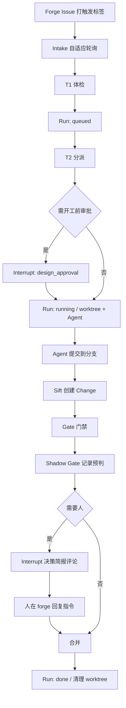

# Sift — 产品需求文档

> **Sift**：本地多 Agent 任务编排与门禁中枢
> **版本：V0.8（PoC / 从 0）** | **日期：2026-07-28**
> **仓库：** https://github.com/xsift/sift

本文档只定义**需求与边界**。技术设计、任务拆解、实现另文跟进。
前序概念验证（内部项目 JANUS）中已验证的方向予以吸收；命名、仓库与实现均不兼容、不迁移。

**V0.2 相对 V0.1 的骨架变更**：事实源从 GitLab 升级为 Forge 抽象（GitHub / GitLab 对等，经 `gh` / `glab` 集成）；事件驱动从 webhook 改为自适应轮询；Brain 从单点分派扩展为 LLM 触点地图；界面收缩为**零自建 UI**（人机接口寄生在 forge 上）；为实时语音预置结构约束；补齐注意力预算（§5.5）、策略漂移防护（§5.7）与威胁模型（§9.1）。

---

## 1. 问题与公理

### 1.1 要解决的问题

**把 Issue 变成已合并的变更：能自动筛过的自动过，必须人类判断的绝不偷懒放过；并在需要人时主动找到人。**

| 资源 | 稀缺性 | 说明 |
|------|--------|------|
| **Human 注意力与判断** | 极稀缺 | 单用户；响应以小时计；审查必须严谨，不能「随便看一眼」 |
| Agent 算力 | 不稀缺 | 订阅制 coding agent，跑满更划算 |
| 机器资源 | 不稀缺 | 单机少量并发远未触顶 |

Sift 不是通用任务管理系统，也不是又一个 coding agent IDE。它是：

1. **筛子（Sift）**：用确定性门禁过滤不合格变更；
2. **注意力调度器**：只在检查点打断人，并主动推送**已经嚼碎的决策**。

### 1.2 为什么不是 Copilot Workspace / Devin / Cursor Cloud Agent

「Issue → PR」这条赛道已经拥挤。不写清差异化，Sift 会在实现中缓慢退化成一个劣质版竞品。

| 维度 | 云端 Agent 产品 | Sift |
|------|----------------|------|
| 执行位置 | 厂商云 | **本机**；代码不出机器 |
| 算力来源 | 按用量另行付费 | **复用你已订阅的 coding agent**（Claude Code / Codex / Cursor…） |
| Agent 绑定 | 绑定自家 harness | Agent 是外部进程，**可替换、可并存** |
| 门禁 | 附属于 PR 流程 | **一等公民**：护栏 / CI / 审查策略 / 自动合并由 Sift 裁定 |
| 人的位置 | 人去平台上找任务 | **系统找人**，带着决策简报主动推送 |

一句话：**别人卖 Agent，Sift 卖「筛子 + 注意力调度」**。凡是让 Sift 更像一个 Agent 产品的需求，都要先过这一节。

### 1.3 命名与术语

| 项 | 约定 |
|----|------|
| 产品名 | **Sift** |
| 含义 | 筛查、分辨优劣后再放行 |
| CLI / 守护进程 | `sift`（含 `sift daemon`） |
| 配置与数据目录 | `~/.sift/`（两平台同一约定，可由 `SIFT_HOME` 覆盖；见 DESIGN §7） |
| **Forge** | 代码托管平台的统称：GitHub、GitLab |
| **Change** | MR / PR 的中性称呼；平台原生词只出现在发给 forge 的文案里 |
| **Checks** | Pipeline / Checks / Statuses 的中性称呼 |
| **Run** | 调度单元；全文不再使用 Task 指代调度单元（Task Spec 仅指下发给 Agent 的规格） |
| **Interrupt** | 一次对人的打扰，见 §5.5 |
| 不使用背书式全称 | 名称即语义，不搞强制缩写展开 |

### 1.4 设计公理

与公理冲突的需求一律砍掉或推迟。

| # | 公理 | 推论 |
|---|------|------|
| **A1** | **LLM 有话语权，没有决定权** | LLM 只产出 recommendation：分类、选 Agent、提取验收标准、风险评分、决策简报、失败分诊。**任何状态转移、门禁通断、合并动作、审批指令解析，一律由确定性代码执行。** |
| **A2** | **Forge 是任务事实源，本地只存运行时状态** | Issue / Label / Change / Checks 以 forge 为准；本地只存 Run 状态、执行档案、进程、worktree、事件、HITL 队列 |
| **A3** | **通知是核心功能** | 进入 HITL 必须主动推送；不能只靠人想起来打开看板 |
| **A4** | **最快闭环优先于架构完备** | 先 1 Agent × 1 项目端到端跑通；用运行数据驱动下一功能 |
| **A5** | **隔离是物理保证，不是约定**——但**仅限 worktree 内** | 每 Run 独立 git worktree；**退出码 + 门禁**裁定结局；Agent 自报仅供时间线。保证的是「一个 Run 不会误伤另一个 Run 的工作副本」，**不是**「Agent 无法触碰系统自身」——worktree 之外没有物理保证，见 §9.1 TM6 |
| **A6** | **每一次打扰必须结构化、选项有限、可朗读** | 任何 HITL 必须能表达为「一句话结论 + ≤4 个互斥选项」。表达不出来，说明这个打扰本身设计错了。这既是打扰质量的度量衡，也是未来接入语音的唯一前置条件 |
| **A7** | **Sift 积累的是可审计的校准证据，不是替人做主的口味模型** | 历史决策只能驱动两类产物：**聚合层的 policy 提案**与**人审后的 context 草稿**。**永不允许**用「你以前都批」去放松单条门禁或抑制单条 HITL。见 §5.9 |

> **A7 是 A1 在时间维度上的延伸。** A1 管的是单次调用——LLM 这一次说了不算；A7 管的是跨时间的累积——**攒了一百次经验也依然说了不算**。两者不重叠：一个学出来的偏好模型并不经过 LLM 调用，A1 管不到它，所以必须单列。

> **A1 的收紧说明**：V0.1 原文为「判断交给 LLM，裁定交给代码」，方向正确。V0.2 大幅扩大了 LLM 的触点数量（§5.3），因此必须把边界写死，否则「AI 原生」会退化成「到处塞 LLM」。

### 1.5 从前序验证中保留 / 丢弃

| 方向 | 处置 |
|------|------|
| Push 下发 Task Spec、双层上报（上报进时间线 + 退出码裁定） | **保留** |
| Worktree 隔离、`protected_paths` 硬/软护栏 | **保留** |
| 5 状态任务机 + HITL reason | **保留**（实现时禁止再叠隐式第二套状态机） |
| 多 Agent 并存（Claude Code / Codex / Cursor 等）via 启动命令适配 | **保留**（但降级为配置可证，见 §3.2） |
| Webhook 事件驱动 | **丢弃**，改自适应轮询（§5.2） |
| 重型规则引擎、自建 Diff 审查、多用户多机 | **不做（V0）** |
| 与前序项目的数据/配置/API 兼容 | **不做** |

---

## 2. 用户与场景

### 2.1 用户

唯一角色：**系统管理员兼唯一 Human 决策者**（熟悉 GitHub / GitLab / CI / CLI）。

V0 范围：单用户、单机、可同时接入 GitHub 与 GitLab 项目。

**「单用户单机」约束的是一个安装内的形态，不是安装数量。** V0 起即以对外分发为目标（§9.3 分发行）：每个使用者在自己的机器上跑一个独立实例，实例之间没有任何协调、共享存储或网络交互——这与「不做分布式与高可用」并不冲突，也不改变本文任何一条功能需求。

初期唯一使用者虽是作者本人，V0 验证的却是**别人能安装并持续运行的本地产品**，不是只有仓库作者环境里能跑的脚本：代码仍不出机器；目标机不预装语言运行时；支持矩阵、安装、升级与恢复从第一版就形成可复现证据。若把这些延后，最容易把路径、进程托管和文件协议中的单平台假设固化进实现，届时再补会横切 Runtime、存储、验证与发布链。技术上为何选 Go 承接这些需求见 [ADR-009](decisions/009-tech-stack-go.md)。

### 2.2 核心场景

| 场景 | Human 做什么 | 在哪做 |
|------|-------------|--------|
| 需要决策时 | 收推送 → 读决策简报 → 一条评论批准或拒绝 | **forge（含手机 App）** |
| 代码审查 | 在 Change 页面看 diff | **forge** |
| 日常巡视 | 看 forge 上的标签视图；或 `sift ps` | forge / CLI |
| 失败处理 | 看保留的 worktree 与日志 → retry / reassign / close | CLI 或 forge 评论 |
| 接入项目 | 登记本地仓库路径、forge 项目、触发标签 | 本地配置文件 |

**关键推论：人不在电脑前时，手机上的 GitHub / GitLab App 就是一个完整的审批终端。** 这不是附加功能，是把审批入口寄生在 forge 上换来的直接收益。

### 2.3 交互原则

- **系统找人，人不找系统。**
- **审批 ≤ 一条评论。**
- **人不在线时安全挂起**，不擅自越过检查点；但挂起必须有超时与升级路径（§4.1）。
- **严谨优先于爽快**：低风险可配置自动合并，但需先通过影子门禁的证据考核（§5.6）。
- **打扰是有成本的资源**，需要被调度且有配额上限，不是有事就喊（§5.3 T6、§5.5 注意力预算）。

---

## 3. 范围

### 3.1 V0 必须具备（PoC 成功标准）

端到端跑通至少一次：

1. Forge Issue（带触发标签）→ 轮询摄入 → 本地创建 Run（queued）
2. Brain：一次 LLM 分派 → 选定 Agent + Goals（可 HITL 开工前审批）
3. Runtime：worktree + 启动 Agent + 进程监督
4. Agent 提交到分支 → **Sift 创建 Change** → Gate：`protected_paths` + Checks + review 策略
5. 需人时生成 Interrupt → 推送通知 + 在 forge 发决策简报评论 → 人一条评论完成审批
6. Change 合并 → Run done；失败可重试 / 人工关闭

另需：**GitHub 与 GitLab 各至少接入 1 个项目并完成 ≥ 1 次摄入到门禁的流程**（证明 Forge 抽象不是口号）。

### 3.2 V0 明确不做

| 不做 | 理由 |
|------|------|
| 本地 Web 看板 / 自建审批 UI | 人机接口寄生在 forge 上（§7） |
| Webhook 接收端点 | CLI 集成是拉取式的；轮询已够，且省掉整个暴露面 |
| Gate 中 CI 失败的自动修复轮次 | V0 一律转 HITL，等有数据再谈 |
| 「两种 Agent 各跑通一次」的硬性 PoC 要求 | 降级为：1 个真 Agent 跑通 + 适配器配置化可证（配置中存在第二个 Agent 定义且能通过校验即可） |
| 替代 forge 的 CI | — |
| 自建 Change diff / 行内评论 | 人已经在 forge 上看 diff 了 |
| 多用户、多机器、权限体系 | 审批鉴权复用 forge |
| Jira 等非代码托管型任务源 | — |
| 实时语音交互 | 仅预置结构约束，见 §11 |
| 嵌入式自研 coding agent 框架 | 不绑定某一 harness；Agent 是外部进程 |

### 3.3 Backlog（有数据再立项）

| 候选 | 立项信号 |
|------|----------|
| 语音播报与语音应答 | Interrupt 结构稳定且 HITL 频次足以让「不在电脑前」成为真实痛点 |
| 任务依赖链自动触发 | 反复出现「等人做完 A 再开 B」 |
| Agent 自主拆子任务 | 单 Run 因过大而高频超时失败 |
| 更强隔离（独立用户 / 容器 / 沙箱） | **已具备立项信号**：TM6（§9.1）是结构性缺口，不必等它酿成真实事故 |
| 澄清升格为持久 context（「记住，以后别再问」） | 同一类 `agent_blocked` 在不同 Run 中反复出现。届时需定：触发方式（显式 `/sift remember` 还是 T7 自动提案）、作用域（项目级 / 全局级）、存储形态（纯文本 / 带触发条件的结构化 resolution）。**账本（§5.9）先把原料存下** |
| 终端 TUI inbox | forge 评论审批在电脑前显得绕 |
| 指标周报与策略校准自动化 | 已稳定跑 ≥ 数周 |

### 3.4 证据获取顺序

> **对 V0.2 自身的批评**：模块表从 V0.1 的 7 项涨到 9 项，与 A4「最快闭环优先于架构完备」存在张力。范围可以增加，但**取证顺序**必须写清楚，否则这份 PRD 就只是「架构漂亮、证据不足」。

三类证据性质不同，**不能排成串行阶段**：

| 证据 | 性质 | 何时开始 |
|------|------|----------|
| 门禁可信度（影子门禁记录） | **被动累积**，需要真实样本与时间 | 第一天就开始记录——它是后台进程，不是一个阶段 |
| Forge 抽象对称性 | 早做便宜，事后重构昂贵 | 与首个闭环同期 |
| 打扰不淹没人 | 只在并发场景显现 | 首次 ≥3 Run 并发时 |

推论：不存在「先跑完影子门禁、再做双平台」这种排法。影子门禁在你做别的事情时自己长数据；双平台是结构决策，越晚改越贵。两者并行。

---

## 4. 状态模型

### 4.1 Run 状态（5 个）

```
queued → running | waiting_human | failed
running → waiting_human | done | failed
waiting_human → running | queued | done | failed
failed → queued（仅人工 retry）
```

其中 `queued → failed` 与 `waiting_human → done` 是 forge 外部事实的直接收敛：前者覆盖排队期间 Issue 关闭或可信 actor 移除触发标签，后者覆盖等待审批期间 Change 被人手工合并。二者都不得伪造中间状态来绕过唯一转移入口。

| 状态 | 含义 |
|------|------|
| `queued` | 等待分派或等待并发槽位 |
| `running` | Agent 进程已启动 |
| `waiting_human` | 卡在 HITL，附 `reason` 与 `expires_at` |
| `done` | **Change 已合并**（外部事实）。门禁结果是独立的审计属性，不参与 `done` 的定义 |
| `failed` | 重试耗尽 / 硬护栏 / 人工关闭 / HITL 过期拒绝 |

约束：

- **`done` 只表示「Change 已合并」这一外部事实，门禁结论另记。** Sift **自己发起**的合并必须门禁全绿（这是 Sift 能保证的部分）；人在 forge 上手工合并属于事实源的既成事实，Run 照样收敛 `done`，但记 `gate_bypassed` 审计属性并按 §10.2 口径单列，**不计入自主闭环**。
  - 为什么不把它判成 `failed`：Run 的结局与 Change 的结局是两件事，而 A2 规定 forge 是事实源——一个已经进了主干的变更，本地记成 `failed` 会让状态与事实脱同步，且 `failed` 的语义（保留 worktree 供排查、可 retry）在这里全是错的。
  - 为什么不新增终态：§1.5 已禁止叠第二套状态机；表达「合并了但门禁没过」用**属性**而非**状态**，5 状态维持不变。
- **重试不是独立状态**（`retry_count` 字段）。
- **Agent 自报 phase 不进状态机**（只进事件时间线）。
- 所有合法转移必须经唯一校验入口（实现约束，防止旁路改状态）；§4.5 的外部事实观测也不例外。
- **`waiting_human` 必须有超时**。V0.1 缺此项，导致「注意力调度器」名不副实——人三天不理，Run 就静默烂在队列里。
- **`waiting_human` 不等于「执行体已停」。** 打扰只表示「需要人裁决」；如果被打扰的原因恰恰是「系统无法证明上一个执行体已消失」（§4.4 例外），那么该执行体可能仍在跑，其迟到的执行事实必须能收敛这条 Run——因此上图的回边不只由 `approve` 触发。事实与人的决定谁先落库谁生效，仲裁规则属实现层，见 DESIGN §10.1。

### 4.2 HITL 超时与升级

每个 `waiting_human` 携带 `expires_at` 与 `on_expire`：

| `on_expire` | 行为 | 默认适用 |
|-------------|------|----------|
| `hold` | 继续等，但降低推送频率，进入「积压」计数 | `code_review` |
| `escalate` | 提升 severity，以当前 Channel 的**强提醒投递档位**再推一次；Channel 不支持优先级时原通道重推，V0 不要求第二 Channel | `agent_blocked`、`merge_conflict`、**`startup_stall`** |
| `auto_reject` | 转 `failed`，保留 worktree 与上下文 | 低价值的 `failure_review` |

**`startup_stall` 禁用 `auto_reject`，且达升级上限后落 `hold` 而非终态。** 理由是终态表达不了这个场景的真实状态：这类打扰的前提就是「系统无法证明上一个执行体已消失」，把 Run 推进 `failed` 只是让系统不再看它，执行体该活着还活着——处置责任就此丢失。宁可让它留在积压里可见，也不要一个「已关闭但可能还在写仓库」的任务。

**永不允许 `on_expire: auto_approve`。** 超时是人没看见，不是人同意了。

`escalate` 会提升 severity，而 severity 由确定性映射产生（**唯一定义在 §5.5**，其输入含「已升级次数」）。两者不冲突——升级本身也是确定性的。

**`escalate` 必须有次数上限与封顶后的去向**，否则一个无人理会的 `agent_blocked` 会反复超时、升级、重推，在撞上 critical 熔断（§5.5）之前就把通知通道耗光。封顶后的去向不一定是 Run 终态：`startup_stall` 必须留在 `hold`：

| 约束 | 规则 |
|------|------|
| `max_escalations` | 每个 Interrupt 的升级次数上限（配置项，见 §12 #14） |
| 达上限后的 severity | **封顶**，不再随次数上升 |
| 达上限后的去向 | 按 reason 落 `auto_reject`（→ `failed`）或 `hold`；后者保持待决，**不得继续 `escalate`** |

熔断是最后一道网，不是第一道。**能在状态机层写死的上限，不要留给熔断去救。**

### 4.3 HITL `reason`（V0）

`min_modality` = 完成这个决策所需的**最低审阅媒介**，严格程度 `voice < text < visual`。这是给未来语音功能画的红线，现在就要写进数据结构（A6）。

| reason | 何时 | `min_modality` |
|--------|------|----------------|
| `design_approval` | 分派认为高风险，开工前需人确认 | `text` |
| `guardrail_violation` | 软护栏命中，等人豁免 | `text` |
| `code_review` | 按项目策略需要人审 Change | **`visual`（硬约束，永不可语音放行）** |
| `agent_blocked` | Agent 上报阻塞 / 需求不清 | **`voice`**（唯一可由语音承载**内容**的一类，不只是分诊——人口述澄清即可解开，见 §11） |
| `merge_conflict` | 合并冲突需人处理 | `voice`（仅分诊） |
| `failure_review` | 失败或 CI 异常后的人工裁决 | `voice`（仅分诊） |
| `startup_stall` | 受控终止无法证明上一个执行体已消失（§4.4 例外） | `text`（需看 attempt 与进程信息才能裁决，且「放弃」有后果，不做语音放行） |

### 4.4 什么不必打扰人

Issue 摄入与分派、worktree 生命周期、Agent 启停监督、Goal 自检汇总、Checks 等待、硬护栏直接失败、被判定为 flaky 的 CI 失败重试（§5.3 T5）、（若项目已通过影子门禁考核）低风险自动合并。

**一处例外：Agent 启停监督不打扰人，但「系统无法证明上一个执行者已经消失」必须打扰。** 系统在这种情形下拒绝自行重启（那等于可能并行跑两个 Agent 写同一 worktree），于是任务会停住；停住而不通知等于把任务静默挂死，与 A3 冲突。因此这一类停滞按 `startup_stall`（§4.3）生成一次打扰交人裁决。**它需要独立 reason 而不能借用 `failure_review`**：后者默认 `auto_reject` 会把 Run 推进终态，而这里执行体可能仍在跑，终态会把处置责任一起丢掉（§4.2）。可选动作与「放弃」的确切含义见 DESIGN §10.1——注意「放弃」只表示人不再管这个 Run，不表示执行体已消失。

### 4.5 反向同步

forge 是事实源，因此 forge 侧的变化必须能收敛本地 Run。但**观测与指令要分开对待**：

| forge 侧发生 | 性质 | Run 收敛为 | 是否 actor 鉴权 |
|-------------|------|-----------|----------------|
| Issue 被关闭 | **事实** | 终止 Agent，`failed`（reason: `closed_upstream`），清理 worktree | 否 |
| Change 被人手动合并 | **事实** | `done`；若门禁未通过或未跑完，附 `gate_bypassed` 审计属性（§4.1） | 否 |
| Change 被人手动关闭 | **事实** | `failed`（reason: `change_closed`） | 否 |
| 触发标签被移除 | **指令** | 终止 Agent，`failed`（reason: `untriggered`） | **是**（§9.2） |

**为什么不能一刀切地给四条都挂 actor 鉴权**：A2 说 forge 是事实源，而**鉴权只能施加于指令，不能施加于观测**。如果因为关 Issue 的人不在 allowlist 就忽略这个观测，Sift 会认为 Run 还在跑、而上游任务其实已经不存在——fail closed 在这里的效果是**与事实源脱同步**，比放行更糟。

真正需要闸门的只有触发标签的增删：它是可逆的、纯控制面的信号，工作产物本身没有任何变化。非 allowlist 的人摘掉标签不该能杀死一个正在跑的 Run。

（若有人越权关闭 Issue 或 Change 来阻断任务，那是 forge 侧的权限问题，应在 forge 上收敛，不由 Sift 用忽略事实的方式对抗。）

---

## 5. 核心概念

### 5.1 Run / Task Spec

调度单元与 forge Issue 通常 1:1（也允许无 Issue 的手工任务）。
启动 Agent 时一次性下发：

```
Task Spec = Description + Goals + Guardrails + Context
```

**Agent 只负责在 worktree 内提交到分支，不负责创建 Change。**

> V0.1 的漏洞：原文写「Agent 产出 MR」。但创建 Change 是确定性动作，交给概率性执行体既违反 A1，又迫使我们向 Agent 分发 forge 凭证。改由 Sift 在取得 Layer 2 的**成功完成证据**、冻结最终 head 且确认分支有提交后创建 Change；运行中的中间提交或失败 attempt 的提交不得触发创建。

### 5.2 Forge 抽象层

#### 集成方式

**以 `gh` / `glab` 官方 CLI 作为唯一的 forge 通道，且优先使用其 `api` 子命令（plumbing）而非 `pr view` 这类 porcelain。**

把 CLI 当作「一个已经鉴权好的 HTTP 传输层」使用：

| 收益 | 说明 |
|------|------|
| 零凭证管理\* | 复用 CLI 自身的 keychain / token 存储。**V0.1 中「Token 仅守护进程持有」的需求消失**。附带一条安全脚注：同用户下的 Agent 也能调用同一个已登录 CLI，见 §9.1 TM6 |
| 稳定契约 | REST/GraphQL 响应结构远比人类可读的 porcelain 输出稳定 |
| 双平台对称 | 两个 CLI 的 `api` 子命令行为高度一致 |
| 免 SDK | 不引入平台 SDK 依赖，不处理分页/重试/鉴权刷新 |

> **\* 「零凭证管理」只指 forge 侧，且不等于「Agent 取不到 forge 凭证」。** Sift 自身不落盘 forge 凭证成立；而同用户下的 Agent 可直接调用同一个已登录 CLI 继承鉴权——这条暴露面见 §9.1 TM6，收口方向（最小凭证沙箱，V0 不实施）见 [decisions/007](decisions/007-tm6-minimal-credential-sandbox-direction.md)。价值主张本身不退化：沙箱内挂的是 agent CLI 自己的凭证。

代价与对策：

| 风险 | 对策 |
|------|------|
| CLI 未安装 / 未登录 / 版本过旧 | **启动期能力探测**，失败即拒绝启动，不做运行时降级。**只探测已配置项目实际引用到的 forge**——只接了 GitHub 却因没装 `glab` 而拒启，是把「PoC 要验双平台」这条验收标准（§10.1）错置成了运行时前置条件 |
| 进程启动开销（每次约 0.1–0.3s） | 轮询频率本就低；批量查询优先用一次 GraphQL |
| 无结构化错误码 | 统一封装：区分「网络/限流可重试」与「语义错误不可重试」 |
| 速率限制 | 见下文预算 |

#### 最小动词集

**只抽象 Sift 需要的动作，不抽象两个平台功能的并集。** 任何新动词都必须先回答「哪个流程节点需要它」。

| 动词 | 用途 |
|------|------|
| `listIssuesByLabel(label, cursor)` | 增量摄入；返回下一不透明游标 |
| `getIssue(id)` | 读详情、正文与 open/closed 事实 |
| `listIssueComments(id, cursor)` | 读审批指令与人工补充；返回下一游标。**必须返回 `author`** |
| `listLabelEvents(targetRef, cursor)` | 读 Issue/Change 标签增删事件及其 **`actor`**，返回下一游标——§9.2 的闸门依赖它 |
| `commentTarget(targetRef, body)` | 向 Issue/Change 发决策简报 / 确认回执 / 告警 |
| `setLabels(targetRef, add[], remove[])` | Issue/Change 状态投影与触发/审批标签管理 |
| `createChange(branch, base, title, body)` | **由 Sift 创建**（§5.1） |
| `findChangeForCreateOperation(opKey, branch, base)` | 为创建操作做崩溃对账；跨开启 / 关闭 / 已合并状态查 operation marker，并返回同 base/head 的无 marker 冲突 |
| `getChange(id)` | 状态、可合并性、head sha、审查状态 |
| `getChangeDiff(id)` | 供 LLM 风险评分（T3） |
| `listChangeComments(id, since)` | 读审批指令。**必须返回 `author`** |
| `getChecks(headSha)` | CI 状态与失败任务清单 |
| `mergeChange(id, expectedHeadSha, method)` | **条件合并**：远端当前 head 必须仍等于 Gate 裁定的 `expectedHeadSha`，否则拒绝并重新过 Gate |

> **`expectedHeadSha` 是门禁契约，不只是幂等键。** 本地在调用前重读 head 只能缩小竞态窗口，不能替代 merge 请求自身的远端条件检查；旧 operation 发现 head 已变化必须收敛为 stale/no-op。适配器无法提供该条件语义时，Sift 不得自动合并。

> **actor 是契约的一部分，不是实现细节。** §9.2 规定所有驱动性事件必须解析 actor 且 fail closed；如果动词集不显式声明 actor 的可得性，实现阶段就会发现「要的闸门，抽象层没给铲子」。`targetRef` 必须携 `issue | change`，因为 GitLab 两类对象端点不同且 `iid` 可重号。两个平台都有对应事件能力，经 `api` 子命令均可取得。字段签名与游标规则见 [`specs/forge.md`](specs/forge.md)。

#### 平台差异清单

不假装两边一样。以下差异必须在抽象层显式处理：

| 概念 | GitHub | GitLab |
|------|--------|--------|
| 变更编号 | `number` | `iid`（且与全局 `id` 不同） |
| 可合并性 | `mergeable` + `mergeable_state` | `merge_status` + `detailed_merge_status` |
| CI | Checks API + Statuses API（两套） | Pipelines |
| 审查通过 | Reviews（`APPROVED`） | Approvals（部分能力依赖版本/套餐） |
| 草稿 | `draft` 布尔字段 | 标题 `Draft:` 前缀 |
| 合并方式 | merge / squash / rebase | merge / squash / ff |
| 增量拉取 | `since` / `updated` 排序 | `updated_after` |
| 标签事件 actor | issue events / timeline | resource label events |

**判定原则：遇到语义差异一律取保守交集。** 凡是两个平台无法都给出确定性答案的问题（典型如「这个 Change 现在真的能合并吗」），Sift 不猜——转 HITL。

#### Intake：自适应轮询

放弃 webhook 是纯收益：**不需要公网端点、不需要密钥校验、不需要绑定非回环地址**，V0.1 §8 中整节「暴露面」需求随之删除。

| 状态 | 轮询间隔 |
|------|----------|
| 空闲（无活跃 Run） | 60s |
| 有活跃 Run | 15s |
| 刚发出 Interrupt（等审批回复） | 10s，持续 5 分钟后回落 |

- **幂等键**：`(forge, project, issue_id)` 唯一；事件游标持久化，进程重启后从游标续拉。
- **条件请求**：尽量使用 ETag / `since` 类参数，避免全量重扫。
- **API 预算**：配置每小时调用上限；接近上限自动降级为慢轮询并发出一次告警级通知。

### 5.3 Brain：LLM 触点地图

> **对 V0.1 的批评**：原设计中 Brain 只做一次分类调用。这是有用的，但把它称作「AI 原生」是慷慨的。真正的洞察是——**稀缺资源是人的注意力，所以 LLM 最高价值的岗位不是分派，而是决定什么该到达人面前、并把决策提前嚼碎。**

每个触点必须写明**确定性兜底**。LLM 不可用、超预算、输出不合 schema 时，系统一律走兜底路径，绝不静默丢任务。

| # | 触点 | 职责 | 输出 | 失败兜底 |
|---|------|------|------|----------|
| **T1** | Intake 体检 | Issue 是否可执行？缺哪些信息？是否与既有 Run 重复/关联 | 可执行性判断 + 待澄清问题 | 跳过体检，直接入队 |
| **T2** | 分派 | 定 kind / agent / goals / 是否开工前审批 | 见下方 schema | `waiting_human`（人工分派） |
| **T3** | 风险评分 | 读 diff 评估变更风险，驱动 `review_policy: risky-only` | 分数 + 风险点清单 | 视为高风险 → 强制人审 |
| **T4** | 决策简报 | 打断人时生成简报。**不是摘要，是简报**：一句话结论 + 该看的 3 个点 + 推荐动作 | Interrupt 的 `headline` / `brief` / `options` | 退化为裸链接 + 原始状态文本 |
| **T5** | 失败分诊 | Checks 变红：flaky / 真错 / 基础设施问题 | 分类 + 建议动作 | 一律转 HITL |
| **T6** | 打扰调度 | 现在打断 / 合批 / 压到明早；在注意力配额内择优（§5.5） | 推送时机与通道 | 按 severity 确定性阈值打断，其余合批；**仍受配额约束** |
| **T7** | 校准提案 | 从校准账本（§5.9）生成两类提案：**policy 提案**（阈值/策略调整）与 **context 草稿提案**（把反复出现的人类判断写成可复用的项目知识） | 提案文本，**只提案不生效**，两类都要人批 | 不做 |

**T5 是 ROI 最高的触点**：flaky 自动重试不惊动人，直接削减 HITL 频次。
**T6 是让「注意力调度器」这个名字成立的触点**：V0.1 中 HITL 即刻推送，其实没有调度。

T2 输出结构（示意）：

```json
{
  "kind": "feature | bug | chore | docs | refactor",
  "agent": "claude-code",
  "hitl_before_start": false,
  "goals": ["…"],
  "risk_notes": "…",
  "rationale": "…"
}
```

代码硬护栏（LLM 不可越过）：

- `max_concurrent`（按 Agent）
- 非 worktree 隔离时的项目互斥
- 未知 Agent 名拒绝启动

**成本预算**：配置每日 token 上限。超限后系统降级为纯确定性模式（等价于所有触点走兜底路径），并通知人。AI 原生产品必须有预算概念，否则「更智能」等于「更贵且更慢」。

注意 token 预算约束的是**机器成本**，注意力配额（§5.5）约束的是**人的成本**。

**两者失效时的方向相反，必须定优先级。** 若不加约束，token 耗尽会让 T6 退化成无差别打断、让 T4 的简报退化成裸链接——也就是说，**机器预算耗尽会用更劣质的打扰去更快地消耗人的预算**。因此定下三条：

- **注意力配额是硬约束，凌驾于任何触点兜底之上。** 任何兜底路径都不得突破配额。
- token 超限时 T6 的兜底不是「无差别立即打断」，而是「按 severity 的确定性阈值打断」，其余合批。
- 三类预算（token / API / 注意力）中，只有注意力配额触发**降级打扰行为**；另两类触发**降级系统行为**。不要混用。

### 5.4 Gate（门禁）

Change 就绪后按序（逻辑顺序，实现可等价）：

1. `protected_paths`（hard → failed；soft → HITL `guardrail_violation`）
2. Checks（pending 超时 → HITL；failed → T5 分诊 → flaky 则重试，否则 HITL）
3. `review_policy`：`always` / `risky-only`（由 T3 驱动）/ `never`
4. `auto_merge`（仅当策略允许、门禁全绿、**且该类任务已通过影子门禁考核**）

软护栏豁免的粒度必须显式：豁免是**一次性**（仅本 Run 本次命中）还是**记住**（写入项目配置的例外清单）。默认一次性；「记住」必须是人显式选择的独立选项，且落盘到仓库内配置以便审计。

#### 默认硬护栏（不可软豁免）

以下路径无论项目配置如何，一律 hard 级。理由见 §9.1：它们是**门禁自身的定义**，允许 Agent 改动等于允许它拆掉自己的锁。

| 路径 | 为什么 |
|------|--------|
| `.sift/**`（项目策略与 Context） | Agent 可借此改写 `protected_paths`、开启 `auto_merge` |
| `.github/workflows/**`、`.gitlab-ci.yml` 及等价 CI 配置 | Checks 是门禁一环，改掉 CI 定义就能让门禁变绿 |

需要改动这些路径时，走一个**单独的、由人发起的变更**，且该变更按旧策略受审（§9.1 TM2）。

### 5.5 Interrupt（打扰对象）

这是「AI 原生 + 零界面 + 未来语音」三件事的共同底座。只要 Interrupt 结构稳定，任何渠道（forge 评论、IM 卡片、语音）都只是渲染器。

```
Interrupt {
  run_id, reason, severity
  headline      // 一句话结论，≤40 字，必须可朗读
  brief         // markdown 决策简报：为什么找你 / 该看的 3 点 / 推荐动作
  options[]     // ≤4 个，互斥，每项含 { id, label, effect, risk }
  min_modality  // "voice" | "text" | "visual"
  expires_at
  on_expire     // "hold" | "escalate" | "auto_reject"
  links         // Issue / Change / 日志 / worktree 路径
}
```

硬约束（源自 A6）：

- `options` 数量 ≤ 4，且互斥、可朗读。
- `headline` 必须独立成立——只听这一句就知道发生了什么、要你做什么。
- **表达不出 ≤4 个选项的打扰，不允许发出。** 这类情况说明门禁设计有缺口，应先补门禁而不是把糊涂问题甩给人。
- **`severity` 由确定性映射产生，不由 LLM 产出。** 全文唯一定义：

  ```
  (reason, gate 阶段, 护栏等级, 已升级次数) → severity
  ```

  LLM 可以建议**降级**（少打扰人是安全方向），**不得建议升级**。「已升级次数」来自 §4.2 的 `escalate`，且**达到 `max_escalations` 后即封顶**，不再随次数上升。

> 最后一条堵的是对 A1 的一处隐性违反：既然 critical 不占注意力配额（见下），那么让 LLM 决定 severity，等于把「绕过配额」的钥匙交给它——把所有 Interrupt 都标成 critical，整个预算机制就架空了。凡是能解除某个约束的字段，都必须是确定性的。

#### 注意力预算

> **补正**：V0.2 初稿定义了每日 token 预算和每小时 API 预算，却没有注意力预算。对一个通篇论证「人的注意力是最稀缺资源」的产品，这是最不该缺的那一项。T6 只决定「什么时候打扰」，不决定「一天最多打扰几次、超了怎么办」。

| 项 | 规则 |
|----|------|
| 配额 | 每日 Interrupt 配额，按 severity 分档；critical 不占配额 |
| **critical 熔断** | critical 虽不占配额，但单窗口 / 单 Run 的 critical 数量有上限，触顶即熔断为一次汇总 HITL |
| 超额行为 | 非 critical 一律合批，降级为每日一次的摘要推送 |
| 借支 | **不允许**。配额用完就是用完，宁可延后也不透支——透支一次就等于承认配额是摆设 |
| 记账口径 | 一次 Interrupt 计一次；升级重推不重复计数 |
| 可观测 | 配额消耗进事件流；`sift ps` 显示今日余量 |

这条把 §10.1 中「并发时打扰次数 ≤ 阈值」从一条**验收标准**变成一个**运行时机制**。能被验收，是因为系统本来就在强制它，而不是碰巧没超。

**critical 熔断防的不是攻击者，是自己。** critical 是唯一不受配额约束的通道（§11 的 `asleep` 也只放它越过），而 severity 现在由确定性映射产生——那么映射表自己的一个 bug，或一次门禁病态循环（例如一起 CI 配置事故连锁触发一串 `guardrail_violation`），就足以量产 critical 把人淹没，而配额机制全程无感。不需要有人恶意。

### 5.6 Shadow Gate（影子门禁）

用于把「从默认全人审过渡到自动合并」从拍脑袋变成有数据支撑。

机制：Gate 在人做决定**之前**先写下「如果由我裁定，我会怎么判」，人决定后记录一致率。

| 项 | 规则 |
|----|------|
| 记录内容 | Gate 预判、人的实际决定、是否一致、Run 特征（kind / 风险分 / 变更规模） |
| 生效条件 | 某类任务的证据未达标前，**禁止该类任务开启 `auto_merge`**；配置里写了也不生效 |
| 成本 | 极低——只是记录与对比，不增加任何打扰 |

对一个叫「筛子」的产品，能证明自己筛得准，比筛得快重要。

#### 阈值必须双向不对称

**不允许用单一「准确率」或「一致率」定阈值。** 门禁面对的是极不平衡的样本：若九成变更本就该放行，一个永远说「通过」的门禁一致率就有九成，而它毫无价值。两个方向的代价根本不同：

| 方向 | 含义 | 代价 | 阈值取向 |
|------|------|------|----------|
| **漏放** | Gate 预判放行，人却拒绝 | 坏代码进主干 | 卡到接近零。**这是唯一致命指标** |
| 误拦 | Gate 预判拦截，人却放行 | 浪费一次注意力 | 可宽松，但**不是独立选的**，见下 |

**误拦率上限由注意力配额反推**，不能拍脑袋定：误拦每发生一次就吃掉一格配额，所以上限约等于「配额 ÷ 单位时间变更量」再留余量。两个阈值必须一起调——放宽误拦就必须同步抬高配额或降低吞吐，否则 §5.6 会和 §5.5 打架。

**样本量约束**：漏放率只能在「本该拒绝」的负样本上估计。若负样本占比约一成，几十次变更里只有个位数负样本——用个位数样本估计唯一致命指标是没有意义的。因此生效条件必须同时约束**负样本的绝对数量下限**，而不只是总样本数与百分比。具体数值见 §12 开放问题 3。

#### 决策回放集

影子门禁的记录即 T7 校准提案的数据源。要求：记录可导出为**离线回放集**，用于在不打扰人的前提下重跑 Gate 逻辑或 Brain 提示词的改动，量化改动带来的漏放 / 误拦变化。没有回放集，T7 就只是在凭感觉提建议。

### 5.7 Context 与策略

#### Context 分层

| 层 | 位置 |
|----|------|
| 全局 | `~/.sift/context.md` |
| 项目 | `{repo}/.sift/context.md` |
| 任务 | 创建时的附注，以及人通过 `/sift ask` 追加的澄清 |

原则：真相在仓库里；全文注入；人写 Agent 读。

**任务层的澄清不会自动升格。** `/sift ask` 注入的内容只活在当前 Run——下一个 Run 看不到。Agent 每次都是全新 worktree、全新进程，跑完即死，**架构上不存在「Agent 自己记住」这回事**，一切记忆只能落在人写的 context。把一次澄清提升为项目级或全局级知识的机制 **V0 不做**（§3.3 Backlog），但校准账本（§5.9）必须把这次澄清记下来，否则日后连生成草稿的原料都没有。

#### 策略分层与漂移防护

策略指 `protected_paths` / `review_policy` / `auto_merge` / 超时与重试参数。它与 Context 的性质完全不同：**Context 写错只是 Agent 干得差，策略写错是门禁失效。**

| 规则 | 说明 |
|------|------|
| 策略随仓库走 | 项目策略落在 `{repo}/.sift/` 内并纳入版本控制，改动有 diff、有作者、可回溯 |
| 全局只给缺省 | `~/.sift/` 提供默认值，不覆盖仓库内的显式声明 |
| 启动期 schema 校验 | 校验不通过的项目**拒绝接入**，不静默套用默认值兜底 |
| 漂移可见 | `sift doctor` 输出各项目策略的横向对比，标出偏离默认值的项 |
| 提权需证据 | 由严改宽（典型如开启 `auto_merge`）必须同时满足影子门禁生效条件，否则配置写了也不生效 |

最后一条是关键：**让策略文件无法单方面绕过门禁证据**。否则多项目下的配置漂移会让影子门禁形同虚设——一个 repo 悄悄打开 `auto_merge`，前面所有的取证工作就白做了。

> **注意「策略随仓库走」自带一个洞**：`{repo}/.sift/` 就在 Agent 的 worktree 里，Agent 改得动。上表「提权需证据」挡的是**人**改配置，挡不住 **Agent** 改配置。补法有两条，缺一不可：`.sift/**` 列入默认硬护栏（§5.4），且**策略一律从 base 分支读取、不读 worktree**（§9.1 TM2）。

### 5.8 双层上报

| 层 | 来源 | 用途 |
|----|------|------|
| Layer 1 | Agent → **`sift report` CLI**（进度 / blocker / goal / 声明完成），Run 作用域 token | 时间线与 HITL 触发 |
| Layer 2 | 进程退出码 + Gate | **最终裁定** |

> **通道形态由 DESIGN 定案**：Layer 1 走 `sift report` 子命令而非 MCP，理由与放弃 MCP 的取舍见 [decisions/006](decisions/006-report-via-cli-not-mcp.md)。本节的要求与 Agent 能力边界不因通道形态改变——**要求约束的是通道的性质，不是它的协议**。

**上报是 Agent 唯一能主动影响系统的通道，因此必须限流。** Agent 可以靠反复上报 blocker 制造 Interrupt 洪水，耗尽注意力配额——这是针对最稀缺资源的可用性攻击（§9.1 TM5）。要求：

- 上报做确定性去重与速率限制，**不由 LLM 判断是否该限**。
- 每个 Run 有 Interrupt 子配额；触顶本身即异常信号，转一次 HITL 或直接 `failed`，而不是继续放行上报。
- Layer 1 永远不得越权：**「Agent 声明完成」不等于完成**，裁定只在 Layer 2。

### 5.9 校准账本（Calibration Ledger）

回答一个直白的问题：**Sift 怎么积累用户偏好与领域知识？** 诚实的答案是——V0 几乎不积累，只有「人写的 context」和「影子门禁攒的证据」两样。这一节定义**账本该记什么**与**账本允许驱动什么**，机制留待后续（§3.3）。

#### 为什么现在就要定，尽管 V0 不做学习

**这是数据采集决策，不是功能决策。** 采集决策无法回溯补录：今天只记 `kind / 风险分 / 变更规模`，半年后想做任何更聪明的事，手里就是半年的无用数据。与 §10.2「指标 V0 就打点」、§3.4「早做便宜、事后昂贵」同源。**写字段很便宜，补历史不可能。**

#### 账本记什么

影子门禁记录（§5.6）的超集。每一次人类决策都记，分两组用途：

| 用途 | 特征 |
|------|------|
| 门禁校准 | Gate 预判、人的实际决定、是否一致、`kind`、风险分、变更规模、**触碰的路径与文件类型**、命中的护栏、Issue 作者 |
| 注意力调度 | 打扰的 `reason` 与 `severity`、送达时段、人的响应间隔、是否被合批、当日配额占用 |
| | ⚠️ 「响应间隔」**仅作调度特征，不得用作 §10.2 的注意力成本口径**——那里已明确否定过它（人睡了八小时会被算成八小时投入）。字段现成不等于口径正确 |
| 语义原料 | `/sift reject <原因>` 与 `/sift ask <文本>` 携带的**自然语言**——这是全系统信息密度最高的数据，目前被直接丢弃 |

最后一行是当前最大的浪费：Sift 正坐在「这个人如何做判断」的最佳数据源上，却什么都不留。

#### 账本允许驱动什么（A7 防火墙）

| 允许 | 禁止 |
|------|------|
| 聚合层的 **policy 提案**（T7，人批，且仍受 §5.6 证据门槛约束） | 放松**单条**门禁 |
| **context 草稿提案**（T7，人审后落进 context.md，仍是「人写 Agent 读」） | 抑制**单条** HITL |
| 观测指标（§10.2） | 任何绕过 §5.6 阈值的自动放行 |

**为什么这条防火墙不能松**：§5.6 已经确立「漏放是唯一致命指标」。一旦允许「系统学到你通常都批，这次替你批了」，等于用个性化悄悄放大漏放风险——一个你本来会拒的坏变更，因为历史一致率高而被放行。这会直接击穿双向不对称阈值。

#### 一个不必回避的事实：这里永远不会有「学出来的口味模型」

防火墙是第一个理由，**样本量是第二个、也是更硬的理由**。§5.6 已经论证过：单用户尺度下，连门禁的二元判断都要靠几十个负样本才能勉强认证。per-repo、per-path 的偏好模型需要的量级远大于此，而 Sift 的吞吐注定给不出来。

所以 Sift 的学习形态**只能**是「机器起草、人类落笔」，不是因为保守，是因为**统计上没有第二个选项**。这不是需要道歉的限制，而是把一个设计选择变成了必然。

---

## 6. 端到端流程（逻辑）

```
Forge Issue（触发标签）
  → Intake（自适应轮询，游标去重）
  → T1 体检
  → Run[queued]
  → T2 Brain 分派
  →（可选）HITL design_approval
  → worktree + 启动 Agent → Run[running]
  → Agent 提交到分支
  → Sift 创建 Change
  → Gate（护栏 → Checks[T5 分诊] → T3 风险评分 → review 策略）
  →（可选）Interrupt → forge 决策简报评论 → 人一条评论审批
  → 合并 → Run[done] → 清理 worktree
```

失败：非 0 退出 / 超时 → 有限次退避重试 → 耗尽则 `failed` + 保留 worktree 供排查 + 通知。



---

## 7. 人机接口：零自建 UI

**「尽简界面」的最优解不是做一个很简的界面，而是不做界面。**

### 7.1 决策面：寄生在 forge 上

Sift 在 Issue 或 Change 下发一条**决策简报评论**（Interrupt 的渲染结果），人直接回复指令。

| 指令 | 含义 |
|------|------|
| `/sift approve` | 批准当前检查点 |
| `/sift reject [原因]` | 拒绝，Run 转 `failed` |
| `/sift retry` | 重新执行 |
| `/sift hold 4h` | 推迟，顺延 `expires_at` |
| `/sift ask <文本>` | 注入澄清到 Task Spec 并继续 |
| 标签 `sift:approved` | 等价于 `/sift approve`，供手机端快捷操作 |

规则：

- **指令解析用严格语法 + 确定性解析器，不用 LLM**（这是裁定，归 A1 管）。只有 `/sift ask` 携带的自然语言才进入 LLM。
- **鉴权由 forge 提供**：评论作者必须在 allowlist 内。V0.1 §8 中「审批动作需防误触（token / 本地绑定）」的需求随之删除。
- **鉴权必须覆盖标签路径，不只是评论。** `sift:approved` 等价于 approve，任何有 triage 权限的人都能打——不校验打标人，手机端快捷通道就是审批绕过通道。统一规则见 §9.2。
- **幂等**：每条 Interrupt 携带 `run_id + nonce`，指令必须匹配当前待决 Interrupt，防止重放历史指令。
- **指令还必须属于该 Interrupt 的 `options[]`，nonce 匹配只是第一道。** 上表是全集，不是每条 Interrupt 都接受全集：例如「无法证明执行体已消失」（`startup_stall`）这类 Interrupt 不提供 `approve`——通用 approve 会把 Run 直接推回 `running`，而那正是当下无法保证的事实。校验动作是否在 options 内属服务端职责，评论路径与标签路径同一实现（§9.2）。
- **审计**：Sift 对每条已执行指令回一条确认评论，形成完整留痕。
- 标签是**状态投影**，不是权威。Run 状态权威在本地（A2）；标签只为让人在 forge 列表里一眼看到。

### 7.2 运维面：本地 CLI

只做 forge 上没有语义的事：

```
sift ps                 # 当前 Run 与进程
sift logs <run>         # Agent 输出
sift kill <run>
sift retry <run>
sift worktree <run>     # 打印 worktree 路径
sift doctor             # 能力探测、策略 schema 校验与漂移对比
```

### 7.3 通知面

抽象为 **Channel**，V0 只实现一个（IM webhook 或系统通知）。语音只是未来的一个 Channel 实现，不是一套并行架构。

---

## 8. 功能模块（需求视角）

| 模块 | 职责 |
|------|------|
| **Forge** | `gh` / `glab` 封装、最小动词集、平台差异归一、能力探测、速率预算 |
| **Intake** | 自适应轮询、游标、幂等去重、反向同步 |
| **Brain** | LLM 触点 T1–T7 + 硬护栏 + token 预算 |
| **Runtime** | worktree、Agent 启动（tmux / subprocess 等）、监督、超时、重试 |
| **Gate** | 护栏、Checks、review 策略、自动合并判定、影子门禁记录与回放集导出、策略 schema 校验与漂移检测 |
| **Ledger** | 校准账本（§5.9）：富特征决策记录、语义原料留存、供 T7 生成两类提案 |
| **Attention** | Interrupt 生成、超时与升级、打扰调度、**注意力配额与超额降级**、Channel 推送 |
| **Command** | forge 驱动性事件（指令评论 / 标签）的确定性解析、actor 鉴权、幂等、回执 |
| **Report** | Agent 上报通道（进度、goal、blocker、完成声明等）+ 确定性限流与去重。V0 通道形态见 §5.8 |
| **CLI** | 本地运维命令与 `sift doctor` |

实现阶段补充：配置 schema、数据表、技术选型——**不在本需求文档展开**。

---

## 9. 信任边界与非功能需求

### 9.1 威胁模型

> **补正**：V0.2 前稿把「防 Agent 犯错」想得很细，却几乎没有「输入本身不可信」的设防。**门禁防的是能力不足，威胁模型防的是恶意**，两者不能互相替代。

核心风险链必须先摆明：**任何能在 forge 上开 Issue 的人 → 文本进入 T1/T2 的提示词与 Task Spec → 本机 coding agent 的写权限。**

| # | 威胁 | 对策 |
|---|------|------|
| **TM1** | **Prompt injection**：Issue 正文、评论文本操纵 LLM 或 Agent | 只有可信 actor 打标才能让 Issue 进入系统（§9.2）；worktree 隔离；硬护栏不可豁免；Sift 不向 Agent 传递 forge 凭证（**但见 TM6：这不等于 Agent 取不到**） |
| **TM2** | **Agent 改写自己的门禁**：`{repo}/.sift/` 就在它的 worktree 里 | `.sift/**` 列入默认硬护栏（§5.4）；且**策略一律从 base 分支读取，不读 worktree** |
| **TM3** | **Agent 改写 CI 定义**让 Checks 变绿 | CI 配置路径列入默认硬护栏（§5.4）。Checks 是门禁一环，定义 Checks 的文件就必须受保护 |
| **TM4** | **审批绕过**：`sift:approved` 标签等价于 approve，但打标人未鉴权 | 所有驱动性事件解析 actor 并校验 allowlist（§9.2） |
| **TM5** | **注意力耗尽攻击**：Agent 经上报通道刷 blocker 制造 Interrupt 洪水 | 上报确定性限流与去重；每 Run 设 Interrupt 子配额，触顶即异常信号（§5.8） |
| **TM6** | **worktree 之外的一切都不受保护**（展开见下） | V0 只能缓解、无法闭合；边界如实声明 |

**「策略从 base 分支读取」是 TM2 的关键**，比单纯保护路径更强：一个提议修改 `.sift/` 的变更，**仍然按旧策略受审**。配置变更由它所要替换的那份配置来把关，Agent 无法在同一次提交里既放宽护栏、又享受放宽后的护栏。

#### TM6 展开：未闭合的边界（如实声明）

TM1–TM5 管住的都是「Agent 经由 Change 与 forge 施加影响」的路径。但 **Agent 进程以当前用户身份运行在本机，worktree 是 git 层的组织方式，不是操作系统层的沙箱**。对 worktree 以外的路径，A5 所说的「物理保证」并不存在。

| 暴露路径 | 后果 | 为何比 TM2 更短 |
|---------|------|----------------|
| `~/.sift/`（allowlist、配额、Agent 定义、全局缺省策略、DB） | 改 allowlist 即可自我授权；关配额；注册新的「可信 Agent」 | 不过 Change、不过评审、不在 forge 留痕 |
| **已登录的 `gh` / `glab`** | 无需窃取 token——**同用户下直接调用 CLI 即可继承鉴权** | 同上 |
| 共享的 `.git`（各 worktree 共用主仓库 git 目录） | 写 hooks 或 `core.hooksPath`，在 Sift 自己执行 git 操作时取得执行 | 同上 |
| 其他 Run 的 worktree | 跨 Run 干扰 | 同上 |

**两处必须修正的过度声明：**

1. **「Agent 不持有 forge 凭证」应理解为「Sift 不主动向 Agent 传递凭证」，而不是「Agent 取不到凭证」。** 这是选择 `gh` / `glab` 作为集成通道所付的代价：§5.2 记的「零凭证管理」这项收益，附带这条安全脚注。
2. **A5 的「物理保证」只覆盖 worktree 内的相互隔离**，即「一个 Run 不会误伤另一个 Run 的工作副本」；它不保证「Agent 无法触碰系统自身」。

V0 缓解措施（都不闭合，只提高代价与可见性）：

- 敏感配置（allowlist、配额、Agent 定义、全局策略）**启动期一次性读入并做指纹校验，运行期不热加载**；发现磁盘变更即告警并拒绝生效。**隐含代价要写明：改这些配置必须重启 `sift daemon` 才生效**——单用户 V0 完全可接受，但实现阶段容易被当成 bug 去「修」。
- **hooks 指纹的对象是「解析后的有效 hooks 配置」，不是默认目录。** 只对 `.git/hooks/` 做指纹会被一种手法绕过：Agent 不动目录内容，改 `.git/config` 把 `core.hooksPath` 指向别处——旧路径的指纹纹丝不动，新路径下的恶意 hook 完全不在监控内。因此指纹必须覆盖 `core.hooksPath` 的**取值**、其**最终指向目录的内容**，以及 `.git/config` 本身。每次 Agent 结束后复核。
- `~/.sift/` 权限收紧到仅属主——但要清楚它防的是**别的用户**，防不了**同属主的 Agent 进程**。

**彻底解是让 Agent 跑在独立用户 / 容器 / 沙箱下。** 相应地，§3.3 Backlog 中「更强隔离」的立项信号需要修正：不必等「worktree 外写文件成为真实事故」——TM6 是结构性缺口，本条声明本身即立项信号。

#### 这个分叉不必二选一

表面上看，TM6 的彻底解与本产品的价值主张（§1.2「复用你已订阅的本机 coding agent、零额外 key」）正面冲突：沙箱里的独立用户拿不到你本机已登录的订阅凭证。

但**两类凭证可以分开处理**：沙箱要切断的是 Agent 到 `~/.sift/`、forge CLI 鉴权、共享 `.git` 的通路；而「复用订阅」只需要把 **agent CLI 自己的凭证**挂进沙箱，**forge 凭证不挂**。这样 §5.2「零凭证管理」的收益（指 forge 侧）基本保留，同时闭合 TM6 的大部分暴露面。

两条必须一并考虑的现实约束，否则这个中间解会在实现时落空：

1. **共享 `.git` 是三者中最难切的**，因为 worktree 的定义就是共享主仓库的 git 目录——不挂它 worktree 根本不工作。真正的选择是「沙箱内改用完整 clone、由 Sift 在两侧同步」，这会动到 A5 的 worktree 设计，不是挂载参数能解决的。
2. **中间解的可行性依赖具体 agent 的鉴权形态**：凭证以文件形式存放的可挂载，绑 OS keychain 或设备指纹的挂不进去。**这决定了「复用订阅」在沙箱下对哪些 Agent 仍然成立**，必须逐个验证，不能假设。

在此之前，本节即为**已知未闭合边界的如实声明**。不假装威胁模型是完整的。

Agent 能力边界（V0 实际状态）：Sift 不向 Agent 传递 forge 凭证、不授予 Sift 配置的写权限、期望其写操作限于自身 worktree——但以上是**约定与缓解**，不是强制。强制要等沙箱。

### 9.2 驱动性事件的 actor 鉴权

统一原则：**所有能驱动 Sift 的 forge 事件都必须解析 actor 并校验 allowlist；actor 无法确定时一律忽略（fail closed）。**

| 驱动性事件 | 为什么它是驱动性的 |
|-----------|------------------|
| 打上触发标签 | 决定一条外部 Issue 是否进入系统——**不可信输入的第一道闸** |
| `sift:approved` 等审批标签 | 等价于 approve |
| `/sift *` 指令评论 | 直接改变 Run 状态或 Task Spec |

实现约束：轮询看到的是标签的**当前状态**，不是谁改的。必须经 events / timeline 接口回溯 actor；**取不到 actor 就当作没发生**。

推论：**触发标签本身就是信任闸门。** Issue 正文可以由任何人撰写，但只有可信 actor 打标才会进入系统——这把 TM1 的暴露面从「全世界」收敛到「allowlist 成员的一次判断失误」。进一步：Issue 作者不在 allowlist 内时，即使被可信 actor 打标，也强制 `hitl_before_start`。

### 9.3 非功能需求（V0）

| 项 | 要求 |
|----|------|
| 部署 | 单机单实例守护进程（每个安装一个实例，实例间无协调，§2.1）。macOS 由 launchd user agent 托管；采用 systemd 的 Linux 由 systemd user unit 托管；无 systemd 的 Linux 仍须支持前台运行，但 V0 不承诺自动常驻 |
| **兼容性** | **macOS 与 Linux，arm64 与 amd64 四种运行组合**，不能只证明“能编译”。每组合至少跑安装与二进制级冒烟，每个 OS 至少跑一次完整闭环与恢复矩阵。平台差异只允许出现在常驻托管与沙箱后端两处；路径、文件契约、恢复逻辑两平台同行为 |
| **分发** | `sift`、`sift-agent-wrapper` **两个同版本、自包含的原生二进制组成一个发布归档**，附版本 manifest 与校验和，目标机不需要安装语言运行时；Homebrew tap 与 Release 归档两条安装路径。安装与升级以整套归档为原子单位，校验后切换版本目录并重启托管单元；禁止逐文件覆盖。迁移只能前向执行，遇到比自己新的库版本拒绝启动 |
| 依赖 | **被已配置项目引用到的** forge CLI 需已安装并登录；未被引用的不作要求。探测不通过则拒绝启动 |
| 持久化 | 进程重启不丢 Run 状态与轮询游标；重启后核对 running 进程 / worktree |
| 安全 | 无监听端口；Sift 自身不落盘 **forge 凭证**（由 `gh` / `glab` 持有）；本地 operator / run / bootstrap capability 的落盘、权限与生命周期见 DESIGN，且同属主 Agent 可读取的边界归 TM6；驱动性事件一律 actor 鉴权（§9.2）；默认硬护栏不可豁免（§5.4）；敏感配置不热加载 + 指纹校验（§9.1 TM6）。**权限收紧防的是别的用户，防不了同属主的 Agent——该边界 V0 不闭合** |
| 暴露面 | **零**。守护进程不监听任何网络端口 |
| 延迟 | Issue 打标 → Agent 启动 **P50 < 60s**（含轮询等待与一次分派调用） |
| 成本 | 三类预算并存：每日 LLM token 上限、每小时 forge API 调用上限、**每日注意力（Interrupt）配额**；均超限即降级并通知 |
| 配置 | 项目策略必须通过启动期 schema 校验方可接入；校验失败即拒绝，不套默认值 |
| 可观测 | append-only 事件流；可按 Run 查看时间线；影子门禁记录可导出为离线回放集；注意力配额消耗与策略漂移可查 |

---

## 10. 成功标准与指标

### 10.1 PoC 成功标准

> **对 V0.1 的批评**：原标准是「至少 1 条 Issue 跑通」。这只证明**管道通**，不证明**筛子有用**。筛子的价值只在并发与拦截中显现。

| 标准 | 定义 |
|------|------|
| 闭环 | 真实项目上至少 1 条 Issue 经 Sift 产出并合并 Change（允许人工审批，不允许手工替 Agent 改完代码冒充） |
| **双平台** | GitHub 与 GitLab 各至少 1 个项目完成摄入 → 门禁流程 |
| **并发** | ≥3 个 Run 并行期间，打扰次数不突破注意力配额（§5.5），且触及配额时确实降级为合批摘要而非照发 |
| **负样本** | 至少 1 次 Sift 拦下了一个本不该合并的变更（硬护栏或人审拒绝） |
| 安全（**仅 repo 级**） | 至少验证一次 TM2/TM3：Agent 改动 `.sift/**` 或 CI 配置被硬护栏拦下，且不可软豁免。**注意：本条通过 ≠ 威胁模型闭合**——TM6 的全局级暴露（`~/.sift/`、已登录 CLI、共享 `.git`）V0 明确不闭合 |
| 门禁 | **Sift 发起的合并**中，硬护栏违规任务一律不得合并（因此不进入 `done`）。人在 forge 上手工合并是 Sift 管不到的外部事实，以 `gate_bypassed` 审计属性与指标反映，**不作为本条的失败**——把 Sift 控制不了的事写成验收标准，只会换来一条永远无法诚实勾选的项 |
| 注意力 | 至少一类 HITL 能推送并通过一条 forge 评论完成审批（含手机端验证一次） |
| 多 Agent | 配置中存在 ≥2 个 Agent 定义且均通过校验；其中 1 个真实跑通 |
| 恢复 | 重启 `sift daemon` 后不出现「幽灵 running」，轮询游标不回退不丢事件 |
| **发布** | 在干净的 macOS 与采用 systemd 的 Linux 机器上分别从发布归档安装整套两个二进制并跑通一次；四种 OS/架构组合均有安装与冒烟证据 |

> **「负样本」在本文有两个不同含义，别混。** 这里的 PoC 负样本是**演示门禁会拦**，一次即可；§5.6 影子门禁生效条件里的负样本绝对数量下限是**统计意义上的阈值认证**，需要几十个量级。**PoC 拦下一次 ≠ `auto_merge` 可以开了**；开启 `auto_merge` 永远只看 §5.6 的硬门槛。

### 10.2 指标（V0 就打点，不等 PoC 之后）

| 指标 | 定义 | 地位 |
|------|------|------|
| **Human 分钟数 / 已合并 Change** | 人在该 Change 上的实际投入。**代理口径**见下 | **北极星** |
| **误放行率** | 自动合并后被 revert 或紧急修复的比例。**分母只含 Sift 发起的合并**；带 `gate_bypassed` 的手工合并不计入 | **质量红线**——对一个叫筛子的产品，这比自主闭环率重要 |
| **门禁绕过率** | 带 `gate_bypassed` 的 `done` 占全部 `done` 的比例（§4.1） | 观察。它测的是**人绕过筛子的频率**，不是筛子失效——但若持续偏高，说明门禁太慢或太吵，是产品信号 |
| **Gate 漏放率** | Gate 预判放行但人拒绝的比例，**仅在负样本上计算**（影子门禁产出） | 决定能否放开自动合并的唯一致命指标 |
| Gate 误拦率 | Gate 预判拦截但人放行的比例 | 与注意力配额权衡 |
| HITL 率 | 需人介入的 Run 占比 | 观察 |
| 注意力配额消耗率 | 每日 Interrupt 数 / 配额 | 观察打扰是否在收敛 |
| 分派准确率 | T2 选择的 Agent 未被人改写的比例 | 观察，**并作为 T7 提案的输入**；不构成回写 T2 的自动反馈环（A7） |
| LLM 成本 / 已合并 Change | — | 成本约束 |

**北极星的代理口径必须现在就定，否则 V0 打点的第一条指标就是空列**——人不打卡，「分钟数」采不到。

- **不要用「Interrupt 推送 → 审批回复」的时间差**。人睡了八小时会被算成八小时投入，那测的是响应延迟，不是注意力消耗。
- 采用**加权打扰次数 / 已合并 Change**：按 `reason` 给出典型耗时权重（人工标定一次，写进配置），`code_review` 显著高于 `merge_conflict` 分诊。
- 真实分钟数保留为**人工抽样校准项**，每隔一段时间手工记录若干次，用来校正权重表。

### 10.3 影子门禁的取证节奏

回放集（§5.6）是 T7 的唯一数据源，且它是典型的「实现阶段容易被挤掉的隐性工作」。**需求级约束：回放集导出必须与 Gate 同期落地，不得延后。** 缺了它，T7 就退化成凭感觉提建议，§5.6 的阈值认证也无从复核。

---

## 11. 实时语音路线图（不进 V0）

**立场：语音的杀手场景是「口述上下文」，不是「口头审批」。**

让人批准一个自己没看过 diff 的合并，是这个产品最该防的事，而不是最该做的事。真正高价值的场景是：Agent 卡在需求不清（`agent_blocked`），人在路上口述两句澄清，转文本注入 Task Spec，任务继续跑。

| 阶段 | 内容 | 前置条件 |
|------|------|----------|
| **0（V0 内）** | 落地 `min_modality` 字段与 `headline` 可朗读约束；用 schema、渲染快照与人工抽样 dogfood 可朗读性，**不交付 TTS 命令** | 无 |
| 1 | 本地单向播报：`sift speak <run>`；macOS / Linux 的 TTS backend、依赖与发布形态先单独裁决 | 阶段 0 的结构稳定 + 两平台能力 spike |
| 2 | 单向播报：Interrupt 转语音推到手机 | 阶段 1 证明 headline 确实可朗读 |
| 3 | 有限选项的语音应答，仅对 `min_modality == voice` 的 Interrupt 开放（`agent_blocked` / `failure_review` / `merge_conflict` 分诊） | 阶段 2 + 语音识别置信度门槛 + 二次确认 |
| 4 | 双向实时对话：口述澄清注入 Task Spec | 阶段 3 |

**永久红线：`min_modality: visual` 的 Interrupt（含全部 `code_review`）永不开放语音放行。**

红线从阶段 0 就进入 renderer 契约：任何未来的 TTS renderer 遇到 `min_modality: visual` 必须**拒绝朗读**并提示改用文字/视觉渠道。一个无差别朗读的 renderer，等于给 `code_review` 开了语音通道。

配套 **Availability 模型**（作为 T6 打扰调度的输入）：

| 状态 | 行为 |
|------|------|
| `available` | 正常推送 |
| `focus` | 仅 severity 高的推送，其余合批 |
| `away` | 推送但降级为可异步处理的形态；优先推可语音处理的 Interrupt |
| `asleep` | 全部 hold，次日早间合批推送；仅 critical 越过 |

---

## 12. 开放问题

| # | 问题 | 决策时机 | 状态 |
|---|------|----------|------|
| 1 | Brain 走本机 agent CLI 还是 API | — | **已结案：走本机 agent CLI**（如 `claude -p`）。与「订阅制算力不稀缺，跑满更划算」自洽，零额外 key 管理，且与 gh/glab 的集成哲学一致 |
| 2 | `review_policy` / `auto_merge` 默认值 | — | **已结案：`review_policy = always`、`auto_merge = off`。** 保守默认值不需要等「第一次接真实项目」才定；放宽走 §5.6 的证据门槛 |
| 3 | 影子门禁生效条件的三个数值：漏放率上限、误拦率上限、**负样本绝对数量下限** | 首次考虑开启 `auto_merge` 前 | 开放。**形式已定为双向不对称（§5.6），仅数值待定**；禁止退化为单一一致率百分比 |
| 4 | 每日注意力配额初值与 severity 分档 | 首次 ≥3 Run 并发前 | 开放 |
| 5 | 策略 schema 的字段集与 `sift doctor` 的漂移判定口径 | 实现 Gate 时 | 开放 |
| 6 | Agent 无事件超时阈值 | 有两周运行数据后校准 | 开放 |
| 7 | 通知 Channel 的具体实现 | 接 Attention 时按现有基础设施 | 开放 |
| 8 | 触发标签命名与 Sift 状态标签集 | 实现 Intake 时 | 开放 |
| 9 | 审批者 allowlist 的配置形式（用户名 / 组织成员 / 仓库权限） | 实现 Command 时 | 开放 |
| 10 | 默认硬护栏中 CI 配置路径的完整清单（两平台的等价路径） | 实现 Gate 时 | 开放 |
| 11 | 北极星代理口径中各 `reason` 的耗时权重初值 | 首次抽样校准时 | 开放 |
| 12 | critical 熔断的窗口与阈值 | 首次 ≥3 Run 并发前 | 开放 |
| 13 | **TM6 的收口方案**：候选含「完全沙箱」与「**最小凭证沙箱**」（只挂 agent CLI 凭证、不挂 forge 凭证，§9.1）。需一并回答共享 `.git` 如何处置、以及哪些 Agent 的鉴权形态可挂载 | DESIGN | **已结案（[DESIGN §9.1](DESIGN.md) / [ADR-007](decisions/007-tm6-minimal-credential-sandbox-direction.md)）**：方向定为最小凭证沙箱，**V0 不实施**，只留 launcher 接缝并如实声明；共享 `.git` 的处置（沙箱内完整 clone）随沙箱立项再答；凭证形态 spike 是本方向的证伪条件。§5.2「零凭证管理」已加星号 |
| 14 | `max_escalations` 的取值与达上限后各 reason 的默认去向 | 实现状态机时 | 开放（§4.2） |
| 15 | 技术栈（倾向 Bun + TypeScript 单进程，可推翻） | DESIGN 文档 | **已结案（[ADR-009](decisions/009-tech-stack-go.md)）**：**Go** + SQLite(WAL)，单模块两个发布二进制（`sift` / `sift-agent-wrapper`）。原结案为 Bun + TypeScript（[ADR-001](decisions/001-tech-stack-bun-typescript.md)，已 `superseded`）；推翻原因是本次新增的分发与多平台需求（§9.3）使原决策的前提与其风险退路同时失效 |

---

## 13. 文档地图（后续）

完整目录结构、命名约定与上下文加载规则由 [docs/README.md](README.md) 统一维护，此处只列顶层文档状态。

| 文档 | 状态 |
|------|------|
| `docs/PRD.md` | **本稿** |
| [`docs/DESIGN.md`](DESIGN.md) | **D0.10 · active · 已通过**。review-16 修订见 DESIGN §14.13；[review-18](reviews/2026-07-28-design-review-kimi-k3-06.md) 已独立核销全部阻断并允许进入 WBS，唯一非阻断遗留及后续处置见 DESIGN §14.14。§3.4 的并行取证模型已落成架构约束——影子门禁随 Gate 落地即常驻无开关 |
| `docs/WBS.md` | **D0.3 · active**（已落地）。M1 实现可派工。回放集导出与 Gate 同期，见 §10.3 |

### 13.1 已采纳的架构约束（PRD 层拍板，DESIGN 只展开不重议）

本文声明「技术设计另文跟进」，但有若干实现选择因为**承载了需求层的约束**而必须在此拍板。它们不是 DESIGN 的自由度，列出以免 PRD 与 DESIGN 重复叙述并各自漂移：

| 约束 | 出处 | 它承载的需求 |
|------|------|-------------|
| Forge 集成走 CLI 的 `api` 子命令（plumbing），不用 porcelain | §5.2 | 契约稳定性、零凭证管理 |
| Change 由 Sift 在成功完成证据后创建，Agent 只提交分支 | §5.1 | A1：确定性动作不交给概率性执行体；失败 attempt 的中间提交不外泄为 Change |
| merge 由 forge 对 Gate 裁定的 expected head 做条件检查 | §5.2 | 旧 Gate 结论不得合并后来更新的 head |
| 策略从 base 分支读取，不读 worktree | §9.1 TM2 | Agent 不能改写自己的门禁 |
| actor 经 events / timeline 接口回溯，取不到即忽略 | §9.2 | 驱动性事件的鉴权闸门 |
| 敏感配置启动期读入 + 指纹校验，运行期不热加载 | §9.1 TM6 | 缓解 worktree 外的暴露 |

这些仍是 DESIGN 层的裁决范围，而不是 PRD 约束：技术栈（§12 #15）、存储形态、进程模型、Channel 实现。其中技术栈已由 ADR-009 结案；TM6 收口方向已由 DESIGN §9.1 / ADR-007 结案但 V0 不实施；其余现行结论以 DESIGN 与 ADR 为准，PRD 不复制。

### 13.2 文档卫生

正文中「> 对 V0.x 的批评 / 补正」这类 callout 目前有多处，它们承载的是**设计理由**（为什么某条约束必须存在），不是 changelog。V1.0 时把其中纯历史对比的部分沉淀为独立的修订记录节，正文只留当前结论，避免文档越长越像考古现场。

---

_文档版本：V0.8 | 2026-07-28_（版本间变更见 [CHANGELOG.md](CHANGELOG.md)）
